# SWIMMÔN Wild Swimming Events Website

SWIMMÔN is a website for swimmers on The Isle of Anglesey / Ynys Môn to find and set up wild swimming meet ups around the island. It also provides information about places to go wild swimming around the island. The live Website can be found [here](https://swim-mon.herokuapp.com/).

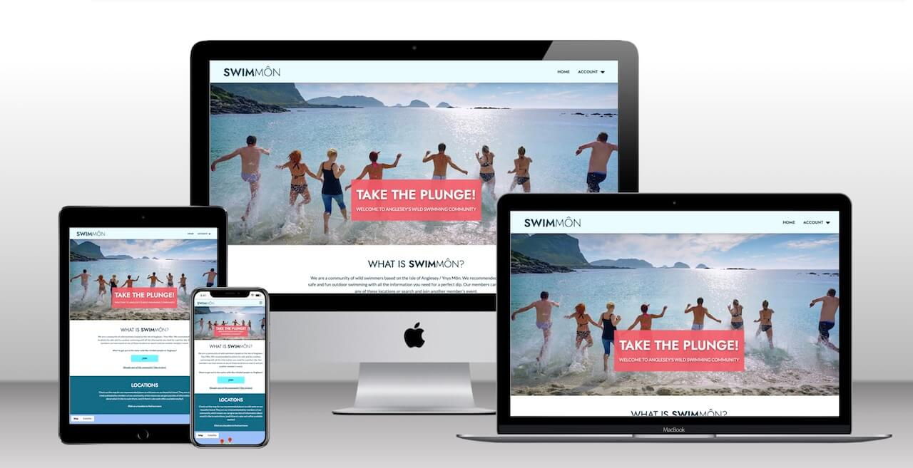

---

## Table of Contents

- [User Experience (UX)](#user-experience-design)
  - [Strategy Plane](#strategy-plane)
  - [Scope Plane](#scope-plane)
  - [Structure Plane](#structure-plane)
  - [Skeleton Plane](#skeleton-plane)
  - [Surface Plane](#surface-plane)
- [Features](#Features)
- [Technologies](#Technologies)
- [Testing](#Testing)
  - [Test Results & Bugs](#test-results--bugs)
- [Deployment](#Deployment)
- [Credits](#Credits)

---

## User Experience Design

### **Strategy Plane**

#### Site Goals

- To give wild swimmers on Anglesey the opportunity to arrange or join wild swimming events / meet-ups
- To provide information about wild swimming locations on Anglesey

#### User stories

1. As a user:
  - 1.1: I want to be able to find what I need immediately and for the navigation to be easy to follow & intuitive
  - 1.2: I want to be able to view the site on any device and for it to be fully responsive
  - 1.3: I want to be able to contact the site to suggest additional swim locations or ask questions
  - 1.4: I want to be able to return to the main site without having to use the browser buttons if I end up on a non-existent page or the site throws an error
2. As a user without an account:
  - 2.1: I want to understand the purpose of the site immediately upon entering
  - 2.2: I want to be able to view information about places to go wild swimming on Anglesey
  - 2.3: I want to be able to set up an account so that I can view and create events
3. As a user with an account:
  - 3.1: I want to be able to sign in to my account
  - 3.2: I want to be able to browse wild swimming events and find all the information I need to join one
  - 3.3: I want to be able to search & filter wild swimming events to find one that suits me
  - 3.4: I want to be able to set up a new event
  - 3.5: I want to be able to view, edit and delete the events I have set up
  - 3.6: I want to be able to log out of my account easily
4. As an admin of the site:
  - 4.1: I want to be able to add, edit or delete swimming locations for members to choose between for their event
  - 4.2: I want to be able to edit or delete events created by other users for site management purposes

---

### **Scope Plane**

**Features planned:**

- General
  - Responsive design
  - MongoDB databases to store location, event, event categorisation (challenge level & who-for) & user information
- All users (no log in required)
  - Navigation
  - Home page with explanatory text & list of locations for swimming
    - Google Maps API with clickable location links
  - Location page for each location in the database with detailed information
  - Sign in form
  - Sign up form
  - Custom Error Code Pages (404, 500)
- Signed in (registered users)
  - Sign out functionality
  - Profile Page with user's own events (with edit/delete links)
  - Events page with all events summary cards (with edit/delete links for user's own events)
  - Events page search filters
  - Event page with full event information (with edit/delete links for user's own events)
  - Add event form
  - Edit even form & Delete event functionality for user's own events
- Admin only
  - Manage locations page (with edit/delete links)
  - Add location form
  - Edit location form
  - Delete location functionality
  - Edit / Delete other users' events

The table shows the importance and difficulty of these features - I will prioritise them based on this during the development process.

| **User**   | **Feature**                                                                            | **Difficulty** | **Importance** |
| ---------- | -------------------------------------------------------------------------------------- | -------------- | -------------- |
| General    | Responsive Design                                                                      | 2              | 5              |
| General    | MongoDB database to store required data                                                | 5              | 5              |
| All Users  | Navigation                                                                             | 1              | 5              |
| All Users  | Home Page - branding & Explanatory Text                                                | 1              | 5              |
| All Users  | Home Page - list of swimming locations on map (Google Maps API) with clickable markers | 5              | 1              |
| All Users  | Individual Location Info page                                                          | 5              | 2              |
| All Users  | Sign In Functionality                                                                  | 5              | 5              |
| All Users  | Sign Up Functionality                                                                  | 5              | 5              |
| All Users  | Custom Error Pages                                                                     | 1              | 4              |
| Signed In  | Sign Out Functionality                                                                 | 5              | 5              |
| Signed In  | Profile Page with user's own events                                                    | 4              | 3              |
| Signed In  | Events Page with summary info of all events & edit/delete links for user's own events  | 4              | 5              |
| Signed In  | Events Page search filters                                                             | 5              | 3              |
| Signed In  | Event Page with full info & edit/delete links for user's own events                    | 5              | 5              |
| Signed In  | Add Event functionality                                                                | 5              | 5              |
| Signed In  | Edit / Delete functionality for user's own events                                      | 5              | 5              |
| Admin Only | Manage Locations Page (with edit/delete links)                                         | 4              | 3              |
| Admin Only | Add location form                                                                      | 5              | 3              |
| Admin Only | Edit location form                                                                     | 5              | 3              |
| Admin Only | Delete location functionality                                                          | 5              | 3              |
| Admin Only | Edit / Delete other users' events                                                      | 3              | 3              |

---

### **Structure Plane**

Based on the features and the user stories I developed a flow chart for the site

This site structure targets the user stories as follows:

User Story:

> I want to be able to find what I need immediately and for the navigation to be easy to follow & intuitive

Implementation:

- Navigation menu to be displayed on all pages with relevant nav links (change based on whether user is registered / admin)
- All navigation links go to the correct pages
- User is led through site in an intuitive way
  - Locations page links to individual location pages
  - Events page links to individual event pages
  - Sign in leads to user profile
  - All main functionality visible in nav when required e.g. (add event, log out, management locations)

The following navigation links will be included in the site

- Home (index.html)
- Events (events.html)
- Add Event (add-event.html)
- Manage Locations (manage-locations.html)
- Account - Dropdown List
  - Join (join.html)
  - Sign In (sign-in.html)
  - Profile (profile.html)
  - Sign Out (redirects to home page)

These nav links will be displayed based on who the user is and whether they're logged in:

| **Logged Out** | **Logged In (non-admin)** | **Logged In (admin)** |
| -------------- | ------------------------- | --------------------- |
| Home           | Home                      | Home                  |
| ---            | Events                    | Events                |
| ---            | Add Event                 | Add Event             |
| ---            | ---                       | Manage Locations      |
| Join           | ---                       | ---                   |
| Sign In        | ---                       | ---                   |
| ---            | Profile                   | Profile               |
| ---            | Sign Out                  | Sign Out              |

User Story:

> I want to be able to view the site on any device and for it to be fully responsive

Implementation:

- The site will be built using a combination of Materialize and custom CSS and fully tested during and after development to make sure it is fully responsive on different size devices.

User Story:

> I want to be able to contact the site to suggest additional swim locations or ask questions

Implementation:

- The site footer will contain a link to an email address for the user to contact the site admins. There will also be an email link for a user to suggest a new location when filling in the 'add event' form in a popover element. This will help explain to the user that only approved locations are allowed for events and give them an option to get in touch should they wish to make a suggestion for an additional location.

User Story:

> As a user, I want to be able to return to the main site without having to use the browser buttons if I end up on a non-existent page

Implementation:

- Custom 404 & 500 pages will be created which will include the main navigation bar and footer so that the user can navigate back to the relevant page without using the browser back button.

User Story:

> As a user without an account, I want to understand the purpose of the site immediately upon entering

Implementation:

- The Home page will include some explanatory text about the site and its purpose. All pages will include the site logo within the navbar which will also be a clickable link back to the homepage. There will also be an eye-catching hero text box with a relevant image at the top of the home page more text to reinforce the purpose of the site.

User Story:

> As a user without an account, I want to be able to view information about places to go wild swimming on Anglesey

Implementation:

- The Home page will contain information about swimming locations on Anglesey with clickable links to a page which contains more detailed information about that location. If time allows this information will be displayed on a map using Google Maps API and clickable cluster markers with pop up summary boxes.

User Story:

> As a user without an account, I want to be able to set up an account so that I can view and create events

Implementation:

- The nav bar will contain a dropdown called "account" which will contain a link for user to 'join'. There will also be a clickable button on the homepage as a call to action to guide users to the join page. Both of these will only be visible to users who are not logged in.

User Story:

> As a user with an account, I want to be able to sign in to my account

- The nav bar will contain a dropdown called "account" which will contain a link for user to 'sign in'. There will also be a text link on the homepage as a call to action to guide users to the sign-in. Both of these will only be visible to users who are not logged in.

User Story:

> As a user with an account, I want to be able to browse wild swimming events and find all the information I need to join one

Implementation

- The events page will contain summary boxes containing basic information about all the upcoming events. These boxes will be clickable to take the user to a page about that event containing more detailed information about the event and the location.

User Story:

> As a user with an account, I want to be able to find a wild swimming event that suits me

Implementation

- The event summary boxes on the events page will have be well designed with key information about location, challenge level and who it is for clearly visible. All of this information will have been selected by the user when creating the event and contained within the database. The who-for & challenge-level will use a colour key to make them easy to visually scan, providing a good user experience. If time allows during the development process the events will also be searchable / filterable by location, who they are for (women, men, all) and challenge level (fun, intermediate, challenging.)

User Story:

> As a user with an account, I want to be able to set up a new event

Implementation

- The nav bar will contain a link to 'add event' as well as call to action links/buttons on the home page (for logged in users), the events page, the location info page & the user profile page. These will take the user to a form to fill in with details of their event.
- The form will contain the following fields:
  - Event name (text)
  - Location (dropdown with list of admin created locations)
  - Event description (textarea)
  - Date (date picker)
  - Time (time picker)
  - Who For (dropdown with list of options - women-only, men-only, all-welcome)
  - Challenge Level (dropdown with list of options - fun, intermediate, challenging)
- Upon submission this event will appear in the events page, the user's profile page & on the relevant location's page

User Story:

> As a user with an account, I want to be able to view, edit and delete the events I have set up

Implementation

- The user will be able to view the events they have created on their profile page, on the main events page and in the location page (with events for that location). The user's events will have buttons to edit & delete, both on the summary boxes and in the event's full page.
  - Edit: The edit button will take the user to a pre-filled form containing the event information which will be editable.
  - Delete: The delete button will trigger a warning to the user before they delete it. This functionality will only be available to the user who created the event and the admin.

User Story:

> As a user with an account, I want to be able to log out of my account easily

Implementation

- The navigation will contain an 'account' dropdown containing a link for the user to sign-out which will log the user out and return them to the home page.

User Story:

> As an admin of the site, I want to be able to add, edit or delete swimming locations for members to choose between for their event

Implementation

- The admin will have a page visible only to them, accessible from the main nav bar, to manage locations, which will list all the locations with clickable links to view the location information as well as buttons to edit & delete that location.
  - Add: There will be an add location button which will take the admin to a form to add a new location which contain the following fields:
    - Location Name (text)
    - Latitude & Longitude (with either an explanatory popover box to guide the admin on how to access this information & the correct format or an interactive map picker)
    - Location Description (textarea)
    - Parking Description (textarea)
    - Facilities Description (textarea)
    - Image URL (with either an explanatory popover box to guide the admin on how to find and input or the ability to upload an image)
  - Edit: The location boxes will have an edit button which will take the admin to a pre-filled form containing the location information which will be editable.
  - Delete: The location boxes will have a delete button which will trigger a warning to the admin before they delete it. When an admin deletes a location all events set to that location will also delete.

User Story:

> As an admin of the site, I want to be able to edit or delete events created by other users for site management purposes

Implementation

- The admin will be able to edit or delete events created by any user both in the event summary boxes and on the event page.

---

### **Skeleton Plane**

[For wireframes see Surface Plane](#wireframes)

#### Database Design

MongoDB Object format examples:

**Collection: events**

Example Event 
{ 
&nbsp;&nbsp;&nbsp;&nbsp;\_id : unique-value, 
&nbsp;&nbsp;&nbsp;&nbsp;name : "Sunday Swim", 
&nbsp;&nbsp;&nbsp;&nbsp;description : "A relaxed dip with friendly people to get our Sundays off to a good start.", 
&nbsp;&nbsp;&nbsp;&nbsp;date : "2023-06-13T10:00:00.000+00:00", 
&nbsp;&nbsp;&nbsp;&nbsp;location_id : (location-id), 
&nbsp;&nbsp;&nbsp;&nbsp;challenge : "fun", 
&nbsp;&nbsp;&nbsp;&nbsp;who : "All-Welcome", 
&nbsp;&nbsp;&nbsp;&nbsp;created-by : session[user], 
}

Notes

- location_id is the ID for the event's location - this pulls in all the data from the location to populate the event information
- the time & date will be collected separately to improve UX but then combined and converted to the format above to allow the events to be sorted chronologically
- the 'who' and 'challenge' fields are strings rather than object ids, but populated by giving the user a multiple choice from the relevant collections below. This is because they only supply a simple string value and don't need to link back to those other collections
- the created_by field takes its value from the session cookie for the user who is logged in when they are created
  - this allows the events to be filtered by user and to offer edit/delete functionality to the event creator only

**Collection: locations**

Example Location 
{ 
&nbsp;&nbsp;&nbsp;&nbsp;\_id : unique-value, 
&nbsp;&nbsp;&nbsp;&nbsp;name : "llanddwyn", 
&nbsp;&nbsp;&nbsp;&nbsp;latitude : "53.14466044027234", 
&nbsp;&nbsp;&nbsp;&nbsp;latitude : "-4.385204789999572", 
&nbsp;&nbsp;&nbsp;&nbsp;description : "A large sandy beach with beautiful views of the mountains", 
&nbsp;&nbsp;&nbsp;&nbsp;parking : "Paid parking available on an hourly basis. Pay on exit. Height restriction of 2.1m.", 
&nbsp;&nbsp;&nbsp;&nbsp;facilities : "Toilets open from sunrise until sunset. On site freshwater outdoor shower. Food & drink vans.", 
&nbsp;&nbsp;&nbsp;&nbsp;image_url : "https://www.fotovue.com/wp-content/uploads/2016/10/IMGP1890-scaled.jpg" 
}

Notes

- the location name is used to populate a dropdown select input on the add/edit-event forms
- the \_id value of the chosen location is sent to the events collection on event creation to connect the data in the location to the event
- the location name is converted to lower case to make searching easier
- the latitude & longitude need to be in the correct format to be read by Google Maps
  - this could be achieved by either:
    - providing the user detailed information about how to get these values from an external resource (easier/quicker, worse UX)
    - providing a map where the user can select the location (better UX, more challenging/time-consuming)
  - which of these is implemented will depend on time and during development & how challenging & time consuming they turn out to be
- the image_url will need to be a reasonably high quality image linked to a location online
  - this could be achieved by either:
    - providing the user with detailed information about what is needed and how to input the url (easier/quicker, worse UX, more room for errors and missing images)
    - allowing the user to upload an image to be hosted in a location under the site's control (better UX, more challenging/time-consuming)
  - which of these is implemented will depend on time and during development & how challenging & time consuming they turn out to be
- this collection is also used in the 'events' page search filters, to filter by the event location

**Collection: users**

Example User 
{ 
&nbsp;&nbsp;&nbsp;&nbsp;\_id: unique-value, 
&nbsp;&nbsp;&nbsp;&nbsp;username: "admin", 
&nbsp;&nbsp;&nbsp;&nbsp;password : "ab123bn548", 
}

Notes

- the username is converted to lower case to make searching easier
- the username is used to populate the created_by field in the 'events' collection as a string value
- the password is protected using the Werkzeug module's 'generate_password_hash' & 'check_password_hash' to enhance security and protect user data

**Collection: who_for**

Example: who-for 
{ 
&nbsp;&nbsp;&nbsp;&nbsp;\_id: unique-value, 
&nbsp;&nbsp;&nbsp;&nbsp;name: "Women-Only", 
}

Notes

- the name is used to populate a dropdown select input on the add/edit-event forms
- the chosen name is passed to the event's 'who' field as a string value
- this collection is also used in the 'events' page search filters, to filter by who the event is for

**Collection: challenge**

Example: challenge 
{ 
&nbsp;&nbsp;&nbsp;&nbsp;\_id: unique-value, 
&nbsp;&nbsp;&nbsp;&nbsp;name: "Intermediate", 
}

Notes

- the name is used to populate a dropdown select input on the add/edit-event forms
- the chosen name is passed to the event's 'challenge' field as a string value
- this collection is also used in the 'events' page search filters, to filter by the challenge-level of the event

#### Security

Database connection details are set up in an [env.py](https://pypi.org/project/env.py/) for development, for
security reasons this is not uploaded to GitHub so that database and connection details are not visible to
users. In production these are stored in Heroku.

The API key for Google Maps has been restricted to only work on the development and the deployed versions of this site and if copied and used elsewhere it will not work.

__Site Security__

Parts of the site will require user log in to access and the site will implement both front end and back end security to stop users accessing parts of the site they do not have permission to visit. Full details of security, form validation & back end functionality are available below in [Features](#features) but as a general overview these measures will mean the following:

- Location information & pages are visible to everyone
- Events are only visible to users who are logged in
- Events can only be created by users who are logged in
- Only the user who created an event can edit or delete it (unless they are an admin)
- Locations can only be added, edited & deleted by an admin
- A user can only see their own profile page, not anyone else's
- Users' passwords will be hashed and not readable in the database to protect user privacy
- Signed in users cannot visit 'join' or 'sign-in' pages.
- Signed out users cannot 'sign-out'.

---

### **Surface Plane**

#### Wireframes

I created fully designed wireframes in [Figma](https://www.figma.com/). This allows me to make all major design decisions including colours, fonts, layout, spacing and the visual user experience before commencing coding. Below are my original designs, there have been some changes to these during the course of development which I will detail below.

**Wireframes / Site Design**

HOME

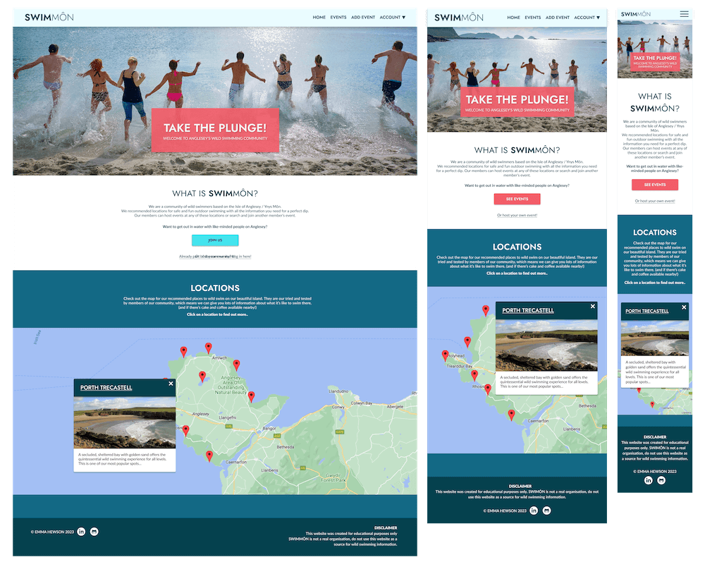

JOIN

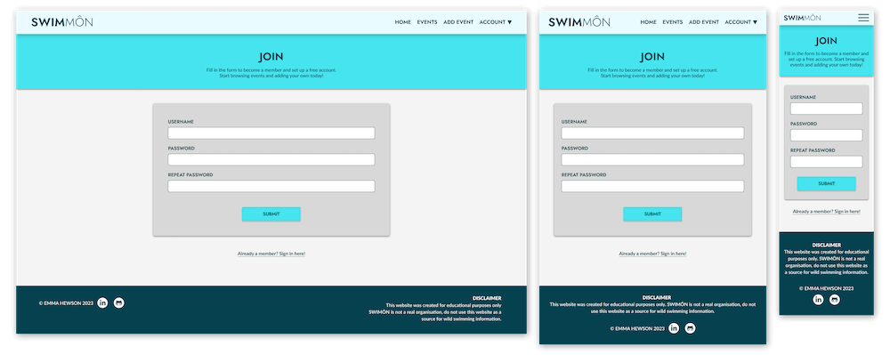

SIGN IN

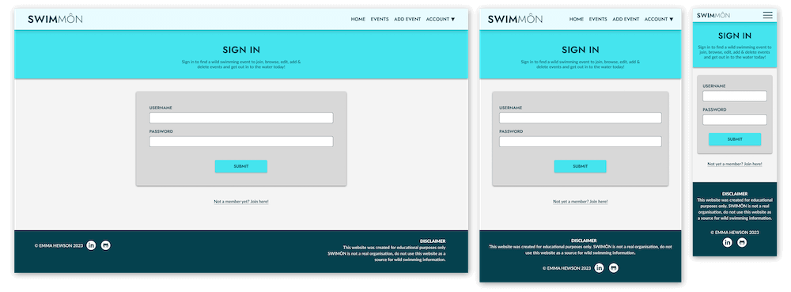

PROFILE

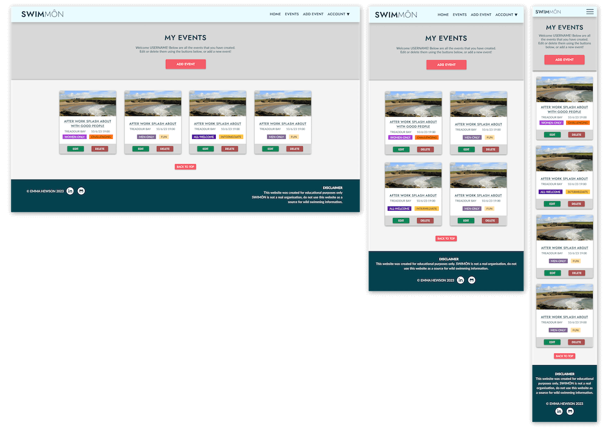

EVENTS

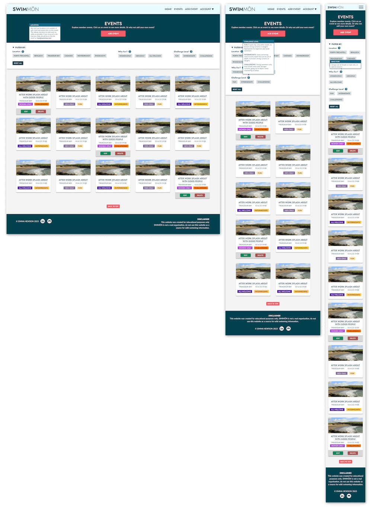

EVENT

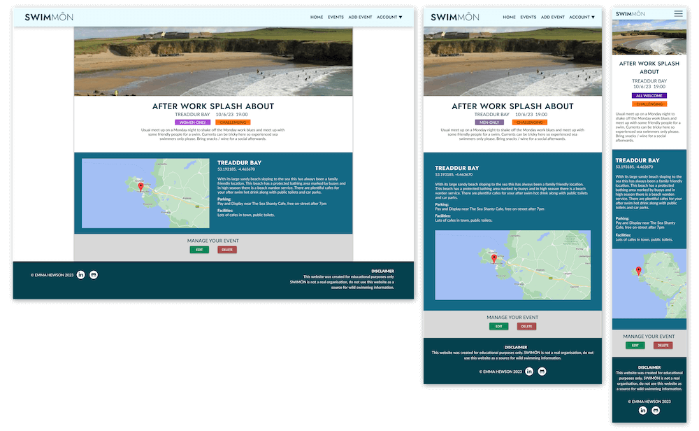

ADD/EDIT EVENT

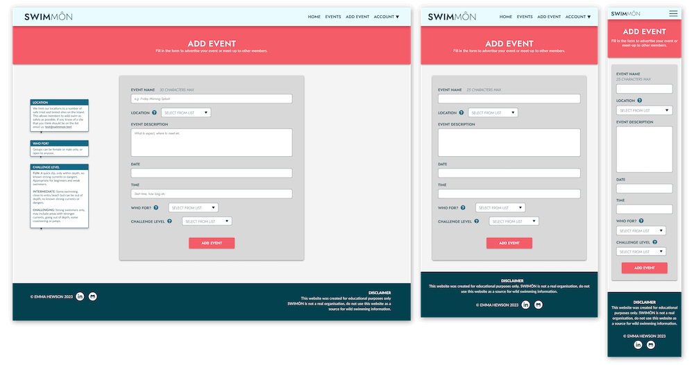
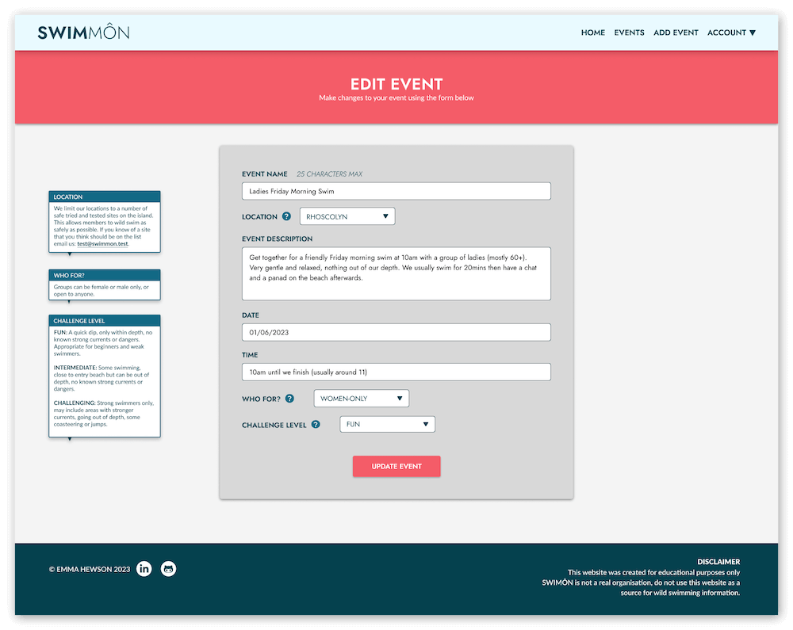

_For edit-event tablet & mobile designs see add-event designs_

LOCATION

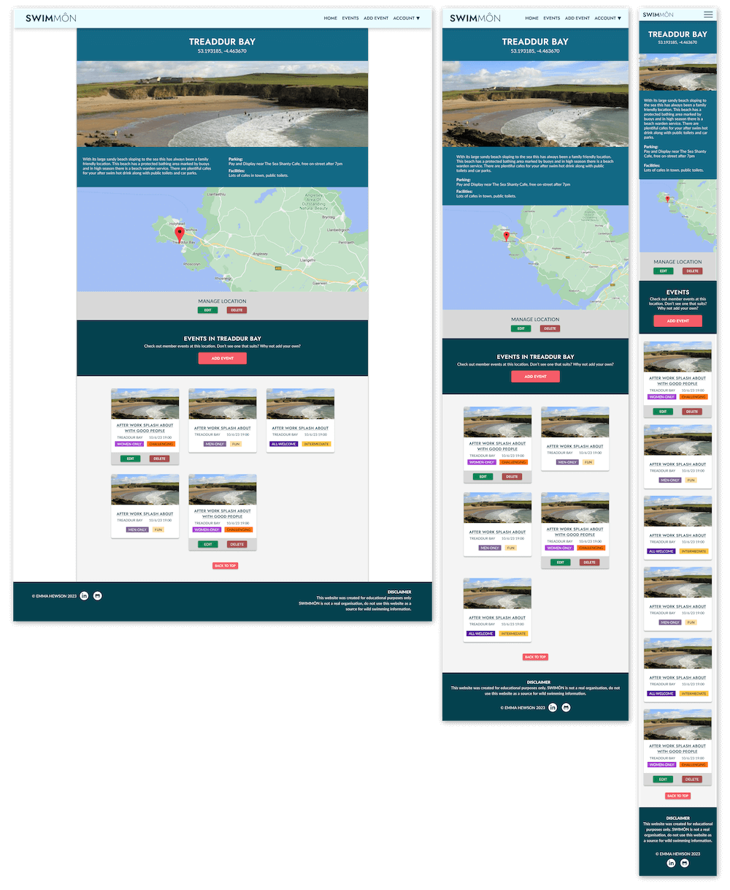

MANAGE LOCATIONS

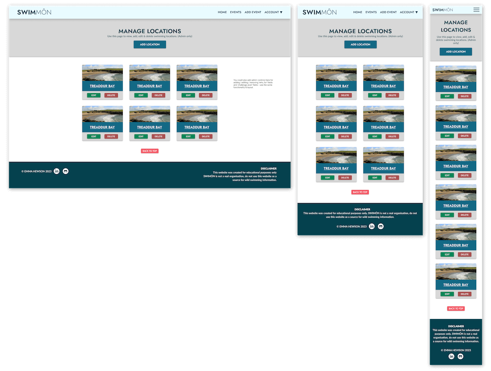

ADD/EDIT LOCATION

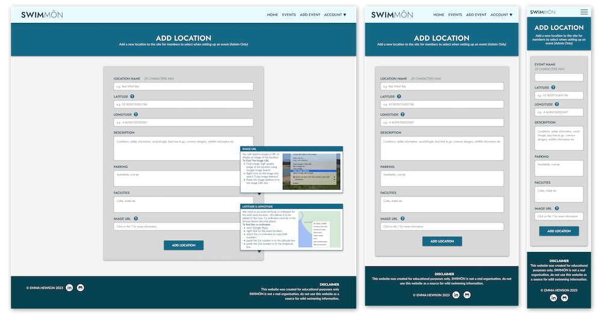
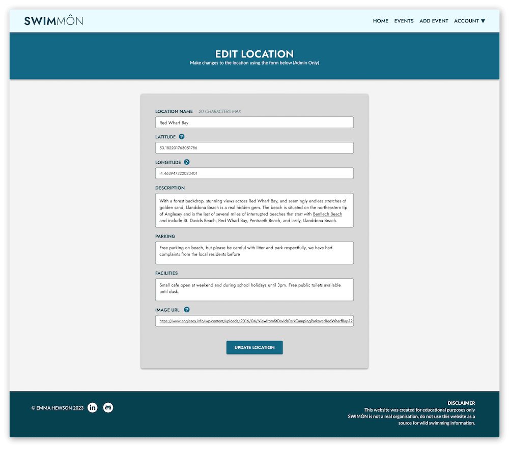

_For edit-location tablet & mobile designs see add-location designs_

ERROR PAGES

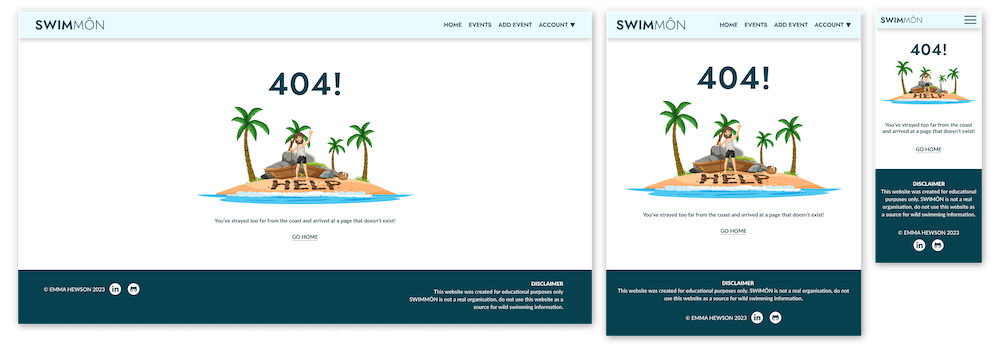

_This design is replicated across the error pages with just the text content changing_

#### Design

##### Colour Scheme

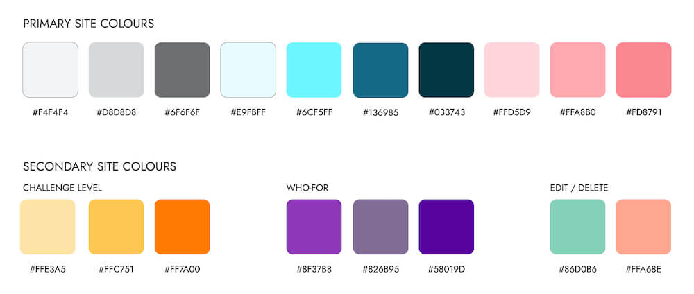

The above colour scheme is based on the final site after changes were made during the development process and accessibility validation. See [changes to design](#changes-to-design) for more information.

The primary site colour scheme is made up of mostly blue tones to reflect the sea-swimming theme, with a contrasting bright orange/pink. The colours come in a number of shades to create contrast and make the website easy to read and accessible. The colours are loosely used to represent different parts of the site:
  - Pink - Events
  - Mid-Blue - Locations
  - Highlight-Blue - Sign in / Join
  - Grey - site administration / profile

There are also some secondary colours which represent specific functions and categories:
- edit / delete button colours which are consistent throughout the site and provide user's with clarity and conform to their expectations by using traditional green/red for edit/delete
- category colours on event cards for challenge level / who-for. These help the user to scan the event cards and find the category they're looking for quickly and easily.

##### Typography

The website uses 2 typefaces that I felt worked well together and complemented each other:
- [Jost](https://fonts.google.com/specimen/Jost) for headings & the site logo
- [Lato](https://fonts.google.com/specimen/Lato) for the main body text

##### Graphics / Imagery

- The logo & Favicon were created in [Adobe Illustrator](https://www.adobe.com/uk/products/illustrator.html)

- The home page image and the placeholder image were taken from Unsplash full credits in the [image credits](#images--text)

- The error page cartoon graphic was taken from Freepik full credits in the [image credits](#images--text)

---

##### Changes to Design

During the development process there were a number of minor changes to the original designs:
- Colour changes
    - Some minor aesthetic changes during site development
    - Significant changes to some of the pink/blue shades to increase contrast. This was based on the accessibility testing results
- Some minor text/copy changes across the site - the wireframes contained placeholder text that I intended to improve upon.
- Event Page: Added a link to the location page to help users to navigate to different areas of the site easily
- Location Page: Included a 'call to action' JOIN button for users who weren't logged in to encourage users to join the site to see events
- Add Location Form:
    - Latitude/Longitude inputs: these were originally going to be text-based with an explanatory popover which helped users to find the co-ordinates on Google Maps and to paste them in. This was my back up option as I wasn't sure I would have time to add an interactive location-picker using a map, however I was able to build this and so the user no longer has to enter values themselves, they are populated using the map picker, providing a much better user experience. [See Add Location in Features](#add-location)
    - Image URL input: I had originally planned to have users find an image online and paste the URL in here. I wasn't sure how else to achieve this functionality but during the development I managed to implement a file upload system using Cloudinary, which provided a much better user experience and also limited the chance of missing or broken image links. [See Add Location in Features](#add-location)
    - The content of the popovers for both the above inputs also changed accordingly.
- Events Page: I removed the popovers from the search filters. I felt that this section needed to be as uncluttered as possible to allow for a smooth search experience, also that the filters were fairly self-explanatory.

---

## Features

Details of all features on the finished site, expanding on the broader features listed above, including content, functionality & security.

### All Pages

#### All Pages - Features - Details & Description

Layout

- The site has a max-width of 1750px. This helps to maintain the quality of the hero image on the home page on wider-screen devices. The area around this max-width is set to a branded blue to maintain the site's brand colours.

General Responsiveness

- The site is fully responsive across all pages to help all features appear correctly and look their best on all devices. This includes:
  - Changes to font size
  - Image size adjustments
  - Changes to padding & margins
  - Changes to the height of div's/sections
  - Layout changes
- Details of more specific changes can be found in the feature sections below.

Favicon

- The site has a Favicon using an S to represent SWIMMON. This helped to build the brand and continue the site design in the user's browser tab.

Navbar

- Based around Materialize's inbuilt navbar
- Includes a clickable logo of the name of the site which takes the user back to the home page
- The navbar sticks to the top of the screen to aid navigation on longer pages
- Includes menu items with a hover effect
  - These vary based on whether a user is logged in or not, or whether they are an admin (who have access to more areas of the site)
  - All the account-specific functionality is stored in a dropdown menu to help keep the navbar uncluttered
- The navbar is fully responsive, on smaller screens the navbar is shorter and the menu items are replaced with a burger menu and a side-nav

Site Main Buttons

- The site utilizes a repeating button design for major navigation or form submission functionality. In general the button colours are themed according to their purpose (along with the associated page explanatory header sections):
  - Pink - Events
  - Mid-Blue - Locations
  - Highlight-Blue - Sign in / Join
- Other secondary buttons are used across the site too - details in the features sections below

Footer

- Appears on all pages
- Contains a clickable link to a 'contact us' email address
- Contains a disclaimer to tell people that the site has been made for educational purposes and not to be used for sea swimming advice (due to the inherent dangers involved of sea swimming).
- The footer contains the text "Made By Emma Hewson" and links to my relevant social media sites so that it can be used as a portfolio project
- The footer social icons have aria labels to make them accessible
- The footer social icons have a hover effect with a smooth colour transition
- The footer is responsive, the layout adjusts on different sized devices

---

### Home Page

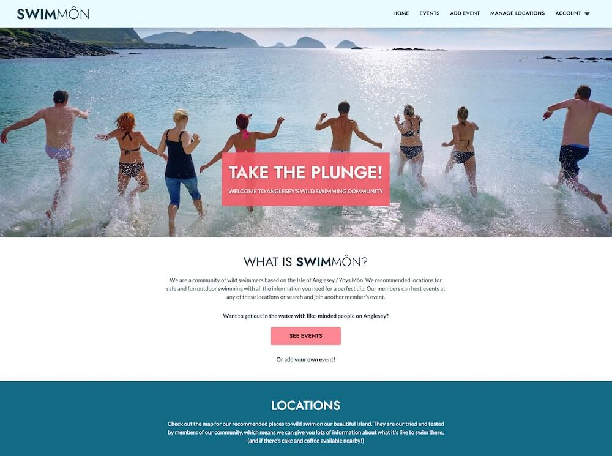

Screen Recording Video

https://github.com/emmahewson/mp3-swimmon/assets/116887840/aafcd7fd-af9c-4f13-8349-2d232017c17b

#### Functionality, Validation, Security & Routing

| Attribute | Details |
|---|---|
| **Visible To** | All Users |
| **Template** | index.html |
| **Front End Functionality** | Interactive map with clickable markers built using Google Maps API & JavaScript. Markers show each location and are clickable to reveal Info-Windows with summary info of the location - these cards are clickable & lead to the location page with full information. |
| **Back End Functionality** | Sends locations collection as JSON data via a fetch function to allow the data to be used in creating the map using JavaScript & Google Maps API. |
| **Front End Security** | Contents of info text div change based on whether user is logged in |
| **Back End Security** | None |
| **Routing** | None |

#### Page Features - Details & Description

Hero

- A large, powerful hero image to grab people's attention and create a strong sense of what the site is for
- A bright pink text box with compelling text building allowing users to immediately know what the purpose of the site is
- Fully responsive
  - There are 3 versions of the image selected based on screen size to improve the site's performance and load speed

'WHAT IS SWIMMÔN?' Section

- Explanatory Text helping to clearly explain the purpose of the site and what the site can offer a user.
- The content of this section varies depending on whether a user is logged in - offering different paths through the site to either
  1. encourage a non-logged in user to sign up (primary) or log in (secondary) to enjoy the site's features
  2. encourage a logged in user to go to the events page (primary) or add an event (secondary)

Locations Map - Multiple Location Markers

- Includes explanatory text on a colour themed background (mid-blue for locations)
- Google Maps API containing clickable markers of all locations from the locations collection
  - Pulls data from the location collection - all locations in the collection are represented on the map
  - The map has full Google Maps functionality including:
    - Choice of map or satellite
    - Streetview
    - Full screen
    - Google Places
    - Zoom buttons
    - Touchscreen zoom & scroll
  - Markers are clickable and bring up a custom Info-Window containing summary info about the location
    - The image is sourced from the image_url field
        - this image is a url to where the site's images are stored on Cloudinary after being uploaded by the admin when creating or editing a location
        - the image has an animated zoom hover effect
    - The text is truncated using JavaScript in the map function to show just the first 150 characters
    - Info-Window have a hover effect, underlined name and truncated description text followed by an ellipsis `...` to indicate that they are clickable
  - Info-Windows are clickable and lead to the relevant location page for full information
  - Marker / Info-Window click functionality
    - when clicking on a marker
      - the map will scroll to show the whole Info-Window if needed
      - any other Info-Window that is open will close
    - clicking outside the Info-Window or on the cross icon will close it
  - The map is responsive
    - zoom level varies based on screen-size to make sure all locations are visible
    - the map container size reduces on smaller devices to avoid users getting stuck on the map and not being able to scroll past
  - If something goes wrong and the map fails to load Google has a built in error message to handle the problem in a user-friendly way

#### Value to User

This page is an introduction to the site, clearly telling the user what the site is for and what they can expect to find. They can find information and links to sea swimming locations. It also sign-posts the user to either joining or signing in if they are not yet logged in, or to see events or add an event if they are logged in.

---

### Join

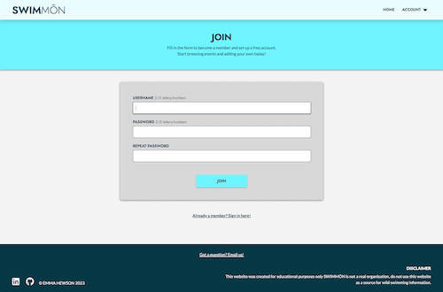

Screen Recording Video

https://github.com/emmahewson/mp3-swimmon/assets/116887840/0e49e4ef-0d69-4924-bac8-a515bf573d77

#### Functionality, Validation, Security & Routing

| Attribute | Details |
|---|---|
| **Visible To** | **All Users** |
| **Template** | join.html |
| **Front End Functionality** | The top input on the form has an 'autofocus' attribute to allow the user to begin typing immediately on page load, rather than having to select the first input manually. |
| **Back End Functionality** | Creates new user in db. Adds user to session cookie (log in). Welcomes user with flash message on submission. |
| **Front End Form Validation** | All fields are required. Fields must match correct type, format and length using built in HTML validation. |
| **Back End Form Validation** | Username must not already exist and passwords must match |
| **Front End Security** | Navbar link only visible to logged-out users |
| **Back End Security** | User password is hashed using Werkzeug's 'generate_password_hash' to protect user data |
| **Routing - log in** | If a user is already logged in, redirects to 'my-profile' with a flash message. Redirects to 'events' on submission. |

#### Page Features - Details & Description

- A page for users to set up an account
- Link to 'sign-in' page for users who are already registered
- Brief intro text to explain to a user what the purpose of the page is and what they need to do
- Intro text box & submit buttons are in the site's branded 'highlight blue' - used across the account-related pages
- Forms are fully responsive on all devices
- Flash messages welcome the user on successful submission, styled using custom CSS
    
#### Value to User

This page allows users to easily set up an account and become a member of the site, giving them access to full CRUD functionality for events.

---

### Sign In 

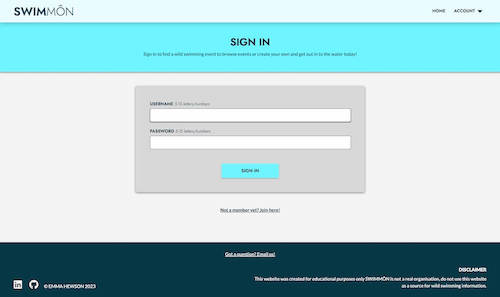

Screen Recording Video

https://github.com/emmahewson/mp3-swimmon/assets/116887840/dbc9f3b7-5e22-4063-a169-29dfad9cdac2

#### Functionality, Validation, Security & Routing

| Attribute | Details |
|---|---|
| **Visible To** | All Users |
| **Template** | sign-in.html |
| **Front End Functionality** | The top input on the form has an 'autofocus' attribute to allow the user to begin typing immediately on page load, rather than having to select the first input manually. |
| **Back End Functionality** | Adds user to session cookie (log in). Welcomes user with flash message on submission. |
| **Front End Form Validation** | All fields are required. Fields must match correct type, format and length using built in HTML validation. |
| **Back End Form Validation** | Password & username must exist & be correct - uses Werkzeug's 'check_password_hash' to protect user data |
| **Front End Security** | Navbar link only visible to logged-out users|
| **Back End Security** | None |
| **Routing - log in** | If a user is already logged in, redirects to 'my-profile' with a flash message. Any page visible to logged in users only redirects here if user not logged in. On log in returns user to the previous page they attempted to visit, or if none is stored in session to 'profile'. |

#### Page Features - Details & Description

- A page for users to sign in to their account
- Link to 'join' page for users who aren't yet registered
- Brief intro text to explain to a user what the purpose of the page is and what they need to do
- Intro text box & submit buttons are in the site's branded 'highlight blue' - used across the account-related pages
- Forms are fully responsive on all devices
- Flash messages welcome the user on successful submission, styled using custom CSS

#### Value to User

This page allows users to sign in to their account giving them access to full CRUD functionality for events.

---

### Sign Out

Screen Recording Video

https://github.com/emmahewson/mp3-swimmon/assets/116887840/505bdd59-ebf4-4c79-a810-78fb13c993b2

#### Functionality, Validation, Security & Routing

| Attribute | Details |
|---|---|
| **Visible To** | Logged In Users |
| **Template** | None |
| **Back End Functionality** | Removes user & any stored url from session cookie. Confirmation flash message on sign out. |
| **Front End Security** | Navbar link only visible to users who are logged in |
| **Back End Security** | User must be logged in |
| **Routing - log in** | If a user isn't signed in & attempts to sign-out, flash message & redirects to 'sign-in'. Redirects to 'sign-in' on sign-out. |

#### Page Features - Details & Description

- Nav link only visible to logged in users
- Logs user out & takes them to 'sign-in' page
- Flash messages appears confirming successful sign out, styled using custom CSS

#### Value to User

This page allows users to easily sign out of their account once they are finished on the site, protecting their information and the events they have set up.

---

### Events

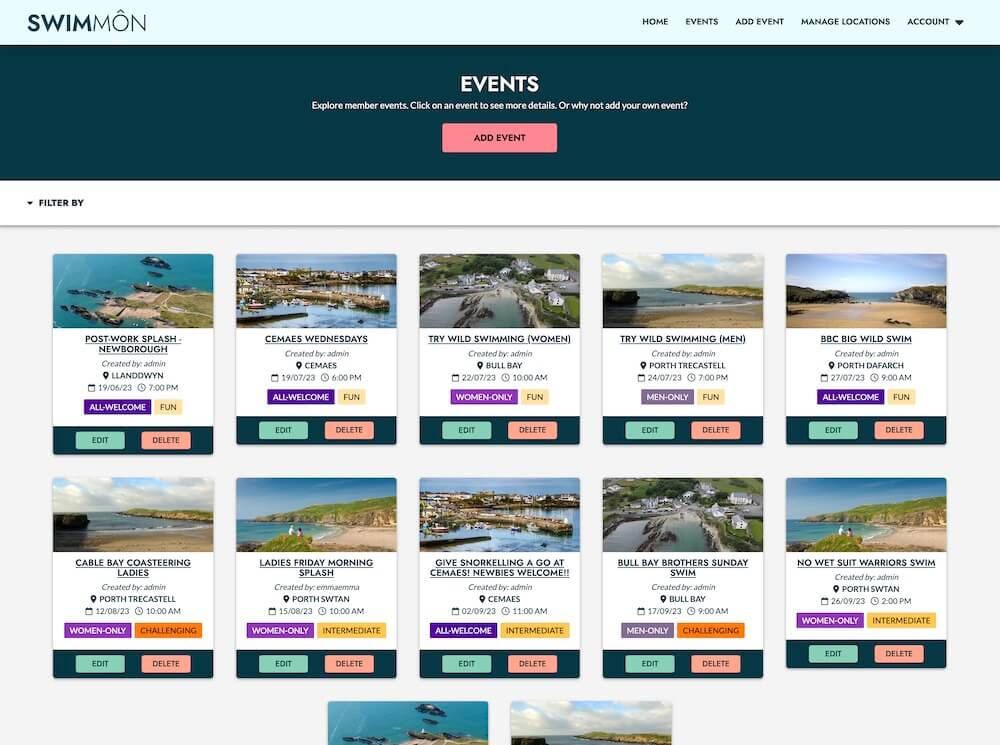

Screen Recording Video

https://github.com/emmahewson/mp3-swimmon/assets/116887840/5467cfdc-e9f9-4314-9282-42c7ec173fd6

#### Functionality, Validation, Security & Routing

| Attribute | Details |
|---|---|
| **Visible To** | Logged In Users |
| **Template** | events.html |
| **Front End Functionality** | Search buttons filter the event cards using JavaScript. Search filters contained in an animated collapsible dropdown. Jinja used to dynamically set the colour of the Who/Challenge text background. Jinja filters convert the time & date to a user-friendly format that matches the format on the add event form. Confirmation modal triggered by delete buttons. Scroll to Top button to take user back to the top of the page. If no events returned from database or filters 'no results' message and link to 'add-event' show.|
| **Back End Functionality** | Populates page with events including event & location details from database. Events filtered by future only & sorted by date. Location, who & challenge collections are used to populate the search filters. |
| **Front End Security** | Navbar link only visible to users who are logged in. Edit / Delete Buttons only visible on user's own events (or all events if admin). Confirmation modal prior to delete to avoid accidental deletion. |
| **Back End Security** | User must be logged in |
| **Routing - log in** | If user not logged in re-routes to 'sign-in' & stores session url to redirect here post log-in. |
| **Routing - other** | Session url stored to redirect back here after editing or deleting an event via this page. |

#### Page Features - Details & Description

Intro Section

- Title and text explaining the purpose of the page and that event cards are clickable
- Add Event button (in branded event pink) to encourage users to add their own event

Event Cards

- Summary cards of all events happening in future (filtered by present time onwards)
    - Card container is fully responsive, cards stack vertically on smaller screens
    - Cards are designed to fit on even the narrowest devices without compromising the design or content
    - Cards are clickable and link to event info page
    - Cards have a hover effect and underlined title to make it clear they are clickable
    - Cards contain information pulled from events and locations collections in database:
        - Location image
            - taken from the location object associated with the event via the location_id field in the event object
            - uploaded by admin when creating location & stored on Cloudinary
            - if image fails to load a placeholder image will appear with Swimmon logo
        - Event name
        - Created by
        - Location name
        - Date & Time (converted to a user-friendly format using Jinja filters)
        - Who event is for
        - Challenge level of event
    - Who & Challenge categories have coloured backgrounds which change based on their content to make them easy to visually scan & find what a user is looking for
        - This is set dynamically using Jinja to add a bespoke class name in the HTML file
    - Cards have edit & delete buttons for CRUD functionality
        - These buttons are only visible if the event was created by the current user or if the current user is an admin
        - Edit button leads to edit-event page
        - Delete button brings up a modal to confirm the user definitely wants to delete event
            - modal uses Materialize's in-built animations
    - If no results are returned from the database a 'no results' message containing a link to 'add-event' appears in the event cards container.

Event Filters

- Filter buttons to narrow down events based on categorised selections
- Contained within a collapsible dropdown to take up less space in the site - this is particularly important on smaller screens. Uses JavaScript.
    - The collapsible animates open and closed using a transform effect.
- The filter section is fully responsive with buttons stacking vertically on smaller screens
- Results are filtered using JavaScript to allow user to filter events instantly without having to reload the page
    - Better user experience than a backend search as it allows users to get immediate feedback about what's available and quickly change their search criteria depending on the results
    - Uses the DOM text content to filter the events as all the filter buttons target text are contained in the events cards
    - Filter buttons have a hover effect (disabled on non-hover devices as this causes confusion between the hover and selected effects)
    - Selected buttons change to pink by adding a custom CSS class
    - Multiple selections can be made within a category e.g. choosing 2 locations local to a user will show results from both locations
    - When selections are made within multiple categories results must match a selection from each active category to appear
    - When a user deselects all the buttons all the event cards reappear
    - The 'reset all' button deselects all the buttons & reveals all the event cards 

Back To Top Button

- Button at the bottom of all the event cards to take user back to the top of the page
- This is particularly useful on smaller screens where event cards are stacked vertically
- The button triggers a smooth scroll to improve the user experience and avoid jarring motion

#### Value to User

This page allows users to view events on summary cards, allowing them to scan through and find what they need easily with the help of the colour-coded categories and a clear legible design. The search filters allow users to filter the events quickly and easily, responding immediately to a user's filter selection without the need to refresh the page. A user can also easily edit or delete their own events, or create a new one via the page buttons/links.

---

### Event Page

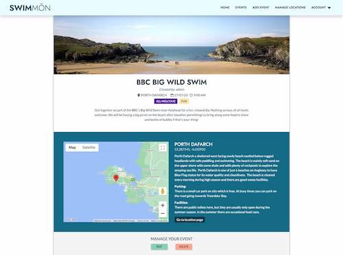

Screen Recording Video

https://github.com/emmahewson/mp3-swimmon/assets/116887840/d57cebed-c534-490e-aa92-69d928b9c86c

#### Functionality, Validation, Security & Routing

| Attribute | Details |
|---|---|
| **Visible To** | Logged In Users |
| **Template** | event.html |
| **Front End Functionality** | Header image has backup placeholder incase of failure to load. Jinja used to dynamically set the colour of the Who/Challenge text background. Location map uses Google Maps API and pulls the co-ordinates directly from the DOM content (rather than linking via a fetch function in the backend). Jinja Filters truncate the latitude & longitude values for display & converts the time & date to a user-friendly format that matches the format on the add event form. |
| **Back End Functionality** | Populates page with event based on the event id provided. Pulls in location information from the locations collection using the location_id field on the event document. If event id is not found in database aborts and re-routes to 404 page with an 'event not found' flash message. |
| **Front End Security** |  No direct link to page in nav - all links to this page are visible to logged in users only. Edit / Delete Buttons only visible if event created by current user (or user is admin). Confirmation modal prior to delete to avoid accidental deletion. |
| **Back End Security** | User must be logged in |
| **Routing - log in** | If user not logged in re-routes to 'sign-in' & stores session url to redirect here post log-in. |
| **Routing - other** | Session url stored to redirect back here after editing an event via this page. |

#### Page Features - Details & Description

Whole Page

- Event information is contained within a div with a max-width of 1200px
    - This helps to mitigate issues with image quality as the image is selected and uploaded by the site admin when creating a location.

Event Page - Location Image

- A header image of the event's location
- Fully responsive, resizes on smaller screens
- Image source is from the url in the location object associated with the event via the event field 'location_id', the admin of the site uploads an image when creating or editing a location.
    - These images are stored on Cloudinary to minimise the possible disruption of sourcing an image from an external URL that the site owners don't have control of
    - If the image fails to load for any reason a placeholder image will appear containing the SWIMMON logo

Event Information

- Page displays information pulled from events and locations collections in database:
    - Event name
    - Created by
    - Location name
    - Date & Time (converted to a user-friendly format using Jinja filters)
    - Who event is for
    - Challenge level of event
    - Event description (full)
- Who & Challenge categories have coloured backgrounds which change based on their content to make them easy to visually scan & find what a user is looking for
    - This is set dynamically using Jinja to add a bespoke class name in the HTML file

Location Information

- Page displays information pulled from the locations collection in database (from the location whose ID matches the event's location_id)
    - Location name
    - Latitude & Longitude (truncated using Jinja filters in the HTML file)
    - Location description
    - Parking information
    - Facilities information
- A link to the full location page showing the same location information and all events at that location
    - This makes the site easy & intuitive to navigate for a user
    - The link has a different style to the rest of the text and a hover effect to make it clear it is clickable
- Map of the location shown by a marker set using the latitude & longitude
    - Map is created using Google Maps API
    - Location is taken from the lat/long text in the DOM, rather than from the back end via a fetch function
    - The map is zoomed in and centered on the location marker
    - Map has all standard Google Maps functionality
        - Choice of map or satellite
        - Streetview
        - Full screen
        - Google Places
        - Zoom buttons
        - Touchscreen zoom & scroll

Edit/Delete Buttons

- If the user created the event or is an admin they will also see edit & delete buttons for CRUD functionality
    - These are secured in the front end using Jinja to make sure they're only visible to the authorised people
    - Edit button leads to edit-event page
    - Delete button brings up a modal to confirm the user definitely wants to delete event
        - modal uses Materialize's in-built animations

#### Value to User

This page allows the user to get more detailed information about an event, it also gives more detailed information about the location with a link to the locations' page to allow them to navigate easily and find other events at that location.

---

### Add Event

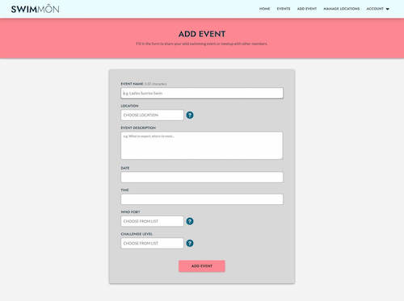

Screen Recording Video

https://github.com/emmahewson/mp3-swimmon/assets/116887840/97a7b6af-790b-468d-9ea0-437ade45d856

#### Functionality, Validation, Security & Routing

| Attribute | Details |
|---|---|
| **Visible To** | Logged In Users |
| **Template** | add-event.html |
| **Front End Functionality** | Uses Materialize's Timepicker & Datepicker to give a user-friendly way of selecting a time & date and making sure they are in a consistent format. Hover/click effect popovers created ith JavaScript give more information to users filling in the form. The top input on the form has an 'autofocus' attribute to allow the user to begin typing immediately on page load, rather than having to select the first input manually. |
| **Back End Functionality** | Populates form with locations, whos & challenge-levels from relevant collections for user selection. Submission: combines time & date values from pickers & converts date & time to UTC format, adds location id to event to connect it to the locations collection, gets created_by value from `session['user']`, populates 'who' & 'challenge' fields with string values taken from dropdowns, adds event to database. Flash message confirms successful submission. |
| **Front End Form Validation** | All fields required. Fields must match type and length (HTML validation). Location, Who-For & Challenge Level - dropdown lists (not directly editable). Date & Time populated using pickers (not directly editable). Event must not be in the past (event-form.js). Additional validation popup messages on dropdown/select inputs added to Materialize template (event-form.js) |
| **Back End Form Validation** | None |
| **Front End Security** | Navbar link only visible to users who are logged in. |
| **Back End Security** | User must be logged in |
| **Routing - log in** | If user not logged in re-routes to 'sign-in' & stores session url to redirect here post log-in. |
| **Routing - other** | None |

#### Page Features - Details & Description

All Page Features

- Intro Text
    - Brief intro text to explain to a user what the purpose of the page is and what they need to do
    - Intro text box & Submit buttons are in the site's branded 'highlight pink' - used across the event-related pages
- Forms are fully responsive on all devices
- The top input has an autofocus attribute so the user can begin typing without selecting it.
- Popovers 
    - Popover info circles with hover/click effect to give a user more information about some of the inputs
    - Location - popover contains link to site email address for user to suggest a new location to site admins
    - Who For - gives information about the categories
    - Challenge Level - gives more detail about what the different categories mean
- Dropdown Select Inputs
    - Locations, Who-For's & Challenge-Levels are populated from the relevant collections in the database
- Date/Time Pickers
    - The date & time are selected using Materializes built in date & time pickers
    - Colours match site's branding
    - Format of time matches event information
    - Both inputs are not directly editable - keeps the data a consistent format
    - Users can only select from the current day onwards
        - Additional bespoke JavaScript validation checks if a user selects today's date & a time in the past. If an event were submitted like this it would not display on the site as the events are filtered from now onwards, the user would have to create a new event as they wouldn't not be able to access the event to edit it. [See bug 10 (opens TESTING.md).](TESTING.md/#10-possible-for-a-user-to-create-an-event-in-the-past-and-lose-access-to-it)
- Flash Messages   
    - On submission a flash message displays telling the user their submission has been successful. Flash messages are styled using custom CSS

#### Value to User

Create event functionality. By using the location dropdown & database collection to automatically populate the event with location information it allows users to select a location without having to fill in all the location information too, which makes adding an event quicker and more user-friendly. The date and time pickers provide a really nice user experience and the challenge/who categories help the user to easily provide more information for their event. The pop-up box also provides additional, user-friendly, information.

---

### Edit Event

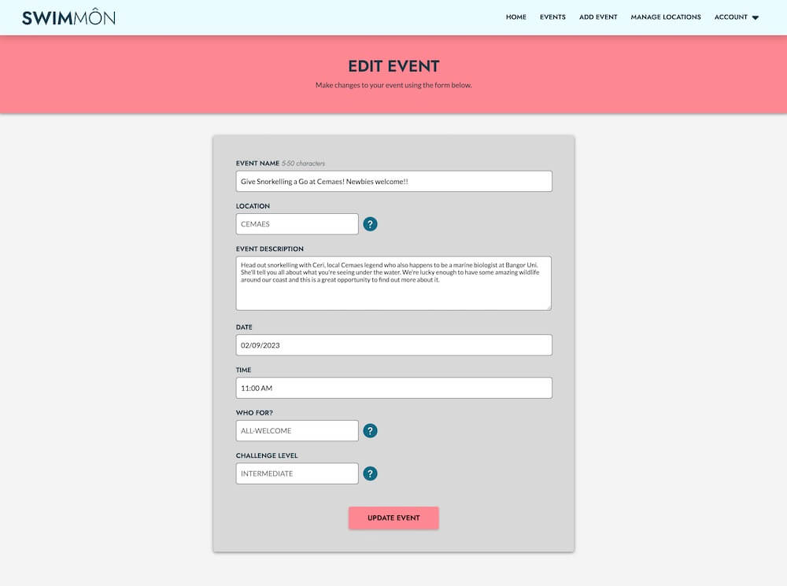

Screen Recording Video

https://github.com/emmahewson/mp3-swimmon/assets/116887840/a80eca03-9c64-41fa-af44-82bac5e87a17

#### Functionality, Validation, Security & Routing

| Attribute | Details |
|---|---|
| **Visible To** | Logged In Users - own events only. Admin - all events. |
| **Template** | edit-event.html |
| **Front End Functionality** | Uses Materialize's Timepicker & Datepicker to give a user-friendly way of selecting a time & date and making sure they are in a consistent format. Datepicker is set to the existing event date (event-form.js). Hover/click effect popovers created ith JavaScript give more information to users filling in the form. |
| **Back End Functionality** | Populates form with locations, whos & challenge-levels from relevant collections for user selection. Pre-fills form with event information from event object in database.  If event id is not found in database aborts and re-routes to 404 page with an 'event not found' flash message. Submission: combines time & date values from pickers & converts date & time to UTC format, adds location id to event to connect it to the locations collection, gets created_by value from `session['user']`, populates 'who' & 'challenge' fields with string values taken from dropdowns, updates event on database. Flash message confirms successful submission. |
| **Front End Form Validation** | All fields required. Fields must match type and length (HTML validation). Location, Who-For & Challenge Level - dropdown lists (not directly editable). Date & Time populated using pickers (not directly editable). Event must not be in the past (form.js). Additional validation popup messages on dropdown/select inputs added to Materialize template (event-form.js) |
| **Back End Form Validation** | None |
| **Front End Security** | No direct link to page in nav - all links to this page are visible to logged in users only. |
| **Back End Security** | User must be logged in & event must be user's own (or user is admin) |
| **Routing - log in** | If user not logged in re-routes to 'sign-in' & stores session url to redirect here post log-in. Id for session url is taken from page url. If not user's event re-routes to 'profile' and flash message shows. |
| **Routing - other** | Redirects to previous page after editing unless session url is this page (from login redirect). Defaults to 'events' page. |

#### Page Features - Details & Description

All Page Features

- Form is populated with the existing event information
- Intro Text
    - Brief intro text to explain to a user what the purpose of the page is and what they need to do
    - Intro text box & Submit buttons are in the site's branded 'highlight pink' - used across the event-related pages
- Forms are fully responsive on all devices
- The top input doesn't have autofocus like the add-event form as the user may not want to access all of the inputs in order on the edit form.
- Popovers 
    - Popover info circles with hover/click effect to give a user more information about some of the inputs
    - Location - popover contains link to site email address for user to suggest a new location to site admins
    - Who For - gives information about the categories
    - Challenge Level - gives more detail about what the different categories mean
- Dropdown Select Inputs
    - Locations, Who-For's & Challenge-Levels are populated from the relevant collections in the database
- Date/Time Pickers
    - Additional JavaScript code added to make the date picker show the previously selected date
    - The date & time are selected using Materializes built in date & time pickers
    - Colours match site's branding
    - Format of time matches event information
    - Both inputs are not directly editable - keeps the data a consistent format
    - Users can only select from the current day onwards
        - Additional bespoke JavaScript validation checks if a user selects today's date & a time in the past. If an event were submitted like this it would not display on the site as the events are filtered from now onwards, the user would have to create a new event as they wouldn't not be able to access the event to edit it. [See bug 10 (opens TESTING.md).](TESTING.md/#10-possible-for-a-user-to-create-an-event-in-the-past-and-lose-access-to-it)
- Flash Messages   
    - On submission a flash message displays telling the user their submission has been successful. Flash messages are styled using custom CSS

#### Value to User

The user can make changes to their events quickly and easily. The form is populated automatically so the user doesn't have to re-enter information. The form is really user friendly and quick to complete [see add-event](#add-event) for additional value of the event forms.

---

### Delete Event

Screen Recording Video

https://github.com/emmahewson/mp3-swimmon/assets/116887840/53143504-2b54-46f2-ac0c-ac97af5ae67a

#### Functionality, Validation, Security & Routing

| Attribute | Details |
|---|---|
| **Visible To** | Logged In Users - own events only. Admin - all events. |
| **Template** | None |
| **Back End Functionality** | Removes event from database. If event id is not found in database aborts and re-routes to 404 page with an 'event not found' flash message. |
| **Front End Security** |  No direct link to page in nav - all links to this page are visible to logged in users only. Delete buttons on other pages only visible for admin or on user's own events. Modal appears to confirm delete prior to deletion on page containing delete button. |
| **Back End Security** | User must be logged in & event must be user's own (or user is admin) |
| **Routing - log in** | If user not logged in re-routes to 'sign-in' & stores session url for 'events' page rather than 'delete-event' to redirect there post log-in. This adds a layer of protection when deleting events. If not user's event re-routes to 'profile' and flash message shows.|
| **Routing - other** | Redirects to previous page after deleting unless session url is for the deleted 'event' page.  Defaults to 'events' page. |

### Features - Details & Description

- Delete event buttons only visible to event creator & admin
- Additional back-end security to prevent others deleting events
- Modal confirms whether the user is sure they want to delete the event (on page with delete button)
- Flash messages confirms successful event deletion

#### Value to User

The delete event functionality allows user to quickly delete their events and remove them from the site. The pop-up modal on the preceding page gives a level of protection should a user accidentally click delete and checks they're sure they want to proceed. 

---

### Profile Page

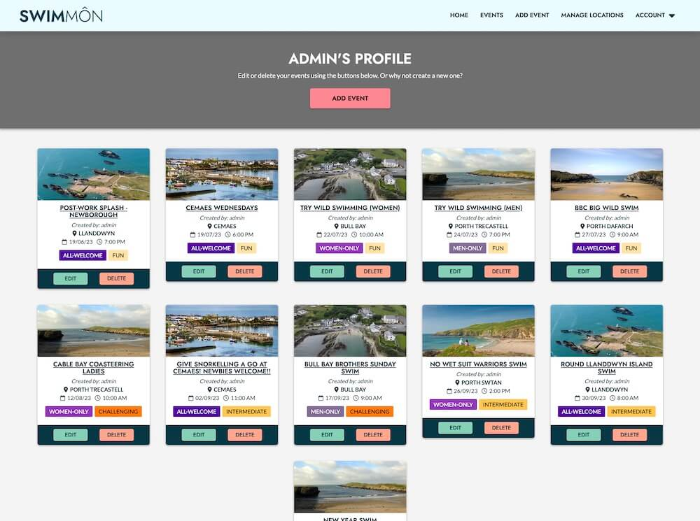

Screen Recording Video

https://github.com/emmahewson/mp3-swimmon/assets/116887840/ded26bd7-34c6-4eb0-ae63-23ba3bca85b7

#### Functionality, Validation, Security & Routing

| Attribute | Details |
|---|---|
| **Visible To** | Logged In Users |
| **Template** | my-profile.html |
| **Front End Functionality** | Jinja used to dynamically set the colour of the Who/Challenge text background. Jinja filters convert the time & date to a user-friendly format that matches the format on the add event form. Confirmation modal triggered by delete buttons. Scroll to Top button to take user back to the top of the page. If no events returned from database 'no results' message and link to 'add-event' show.|
| **Back End Functionality** | Populates page with current user's details. Populates event cards with events filtered using the 'created_by' field of the event to show only events created by the current user using the `session['user']` value, pulls in location information for the event using the location_id field & connecting the locations collection. Events filtered by future only & sorted by date. If username in session is not found in database aborts and reroutes to 404 page. |
| **Front End Security** | Navbar link only visible to users who are logged in. Edit / Delete Buttons only visible on user's own events (or all events if admin) (Only user events should be visible but this adds another layer of security). Confirmation modal prior to delete to avoid accidental deletion. |
| **Back End Security** | User must be logged in. Page is automatically populated with user's own data, user cannot visit another user's profile page |
| **Routing - log in** | If user not logged in re-routes to 'sign-in' (session url not stored for logged-out users as this is default redirect after sign in) |
| **Routing - other** | Session url stored for logged in users to redirect back here after editing or deleting an event via this page. |

#### Page Features - Details & Description

Intro Section

- Title and text explaining the purpose of the page and actions that the user can undertake
- Add Event button (in branded event pink) to encourage users to add their own event

Event Cards & Back To Top Button

- Summary cards of events filtered by current user & present time onwards  & sorted chronologically
- If no results are returned from the database a 'no results' message containing a link to 'add-event' appears in the event cards container.
- User will be able to see edit/delete buttons on all cards as they are all their own events
    - However additional front end security is in place to limit these to the user events only as another layer of protection
- For content & functionality of cards see [Events](#events)
- For content & functionality of back to top button see [Events](#events)

#### Value to User

The profile page is the first place a user will see when they log in to the site (if they haven't tried to access a page whilst logged out - in which case they will be re-directed there). This page lets them see all their own events in one place to quickly and easily view, edit or delete them.

---

### Location Page

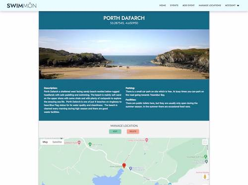

Screen Recording Video

https://github.com/emmahewson/mp3-swimmon/assets/116887840/4ae1f6be-5628-4de0-a583-fc308120a189

#### Functionality, Validation, Security & Routing

| Attribute | Details |
|---|---|
| **Visible To** | All Users |
| **Template** | location.html |
| **Front End Functionality** | Header image has backup placeholder incase of failure to load. Jinja used to dynamically set the colour of the Who/Challenge text background on event cards. Location map uses Google Maps API and pulls the co-ordinates directly from the DOM content (rather than linking via a fetch function in the backend). Jinja Filters truncate the latitude & longitude values for display & converts the time & date on event cards to a user-friendly format that matches the format on the add event form. If no events returned from database 'no results' message and link to 'add-event' show. |
| **Back End Functionality** | Populates page with location information based on the location id provided. Populates page with events at that location by filtering using location_id field on events. Events also filtered by future only & sorted by date. If location id is not found in database aborts and re-routes to 404 page with a 'location not found' flash message. |
| **Front End Security** | Location Edit / Delete Buttons only visible for admin. Events only visible for logged in users, non-logged in users see a call to action to the 'JOIN' page instead. Event Edit / Delete Buttons only visible on user's own events (or all events if admin). Confirmation modal prior to delete to avoid accidental deletion. |
| **Back End Security** | None |
| **Routing - log in** | None |
| **Routing - other** | Session url stored to redirect back here after editing location/event or deleting an event accessed via this page. |

#### Page Features - Details & Description

Whole Page

- Location information & event cards are contained within a div with a max-width of 1200px
    - This helps to mitigate issues with image quality as the header image is selected and uploaded by the site admin when creating a location.

Location Information

- Page displays information pulled from the locations collection in database filtered by the relevant location's 'id'
    - Location name
    - A header image of the location
        - For full feature information on images see [Event Page](#event-page)
    - Latitude & Longitude (truncated using Jinja filters in the HTML file)
    - Location description
    - Parking information
    - Facilities information

Edit/Delete Buttons

- If the user is an admin they will see edit & delete buttons for CRUD functionality
    - These are secured in the front end using Jinja to make sure they're only visible to the authorised people
    - Edit button leads to edit-location page
    - Delete button brings up a modal to confirm the user definitely wants to delete location
        - modal uses Materialize's in-built animations

Location Map

- Map of the location shown by a marker set using the latitude & longitude
    - Map is created using Google Maps API
    - Location is taken from the lat/long text in the DOM, rather than from the back end via a fetch function
    - The map is zoomed in and centered on the location marker
    - Map has all standard Google Maps functionality
        - Choice of map or satellite
        - Streetview
        - Full screen
        - Google Places
        - Zoom buttons
        - Touchscreen zoom & scroll

Events Section

- Events section is only visible to logged in users. If a user is not logged in they see a call to action to encourage them to join & a button leading to the 'join' page.
- Intro Section
    - Title and text explaining the purpose of the section and actions that the user can undertake
    - Add Event button (in branded event pink) to encourage users to add their own event
- Summary cards of events filtered by matching location & present time onwards & sorted chronologically
- Events Cards
    - If no results are returned from the database a 'no results' message containing a link to 'add-event' appears in the event cards container.
    - If the user created the event or is an admin they will be able to see edit/delete buttons on relevant event cards
    - For content & functionality of cards see [Events](#events)
- Back To Top Button
    - For content & functionality of back to top button see [Events](#events)

#### Value to User

The location page provides all users with easy to read accessible information about the a swimming location on Anglesey. Users who are not logged in can view the information and are encouraged to join making it easy for them to navigate to setting up an account. Users who are logged in can also see events specific to that location, giving them really tailored event information based on their chosen location. Users can also link to the event pages, add an event or edit/delete their own events, making the site easy and intuitive to navigate.

---

### Manage Locations

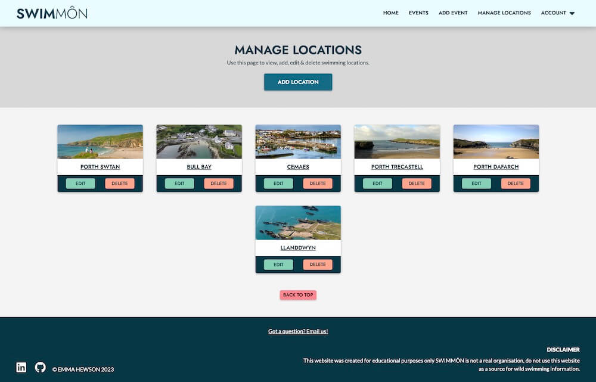

Screen Recording Video

https://github.com/emmahewson/mp3-swimmon/assets/116887840/bc773019-5ca3-4351-a2b5-1d8a75676d48

#### Functionality, Validation, Security & Routing

| Attribute | Details |
|---|---|
| **Visible To** | Admin Only |
| **Template** | manage-locations.html |
| **Back End Functionality** | Populates page with all location documents in the locations collection. |
| **Front End Security** | Navbar link only visible to admin. Confirmation modal prior to delete to avoid accidental deletion. |
| **Back End Security** | User must be logged in and 'admin' |
| **Routing - log in** | If user not logged in re-routes to 'sign-in', flash message shows & site stores session url to redirect here post log-in. If user not admin re-routes to 'profile' and flash message shows. |
| **Routing - other** | Session url stored to redirect back here after editing or deleting a location via this page. |

#### Page Features - Details & Description

Intro Section

- Title and text explaining the purpose of the page and actions that the user can undertake
- Add Location button (in branded location mid-blue) - this is the only place that an admin can add a new location

Location Cards

- Summary cards of all locations
    - Card container is fully responsive, cards stack vertically on smaller screens
    - Cards are designed to fit on even the narrowest devices without compromising the design or content
    - Cards are clickable and link to location page
    - Cards have a hover effect and underlined title to make it clear they are clickable
    - Cards contain information pulled from events and locations collections in database:
        - Location image
            - taken from the location image_url field
            - uploaded by admin when creating location & stored on Cloudinary
            - if image fails to load a placeholder image will appear with Swimmon logo
    - Cards have edit & delete buttons for CRUD functionality
        - These buttons are always visible as this page is only accessible to a site admin protected with back-end security
        - Edit button leads to edit-location page
        - Delete button brings up a modal to confirm the user definitely wants to delete location
            - Modal warns that deleting a location also deletes all events at that location (connected using the location_id field on the event)
            - modal uses Materialize's in-built animations
    - If no results are returned from the database a 'no results' message containing a link to 'add-location' appears in the event cards container.
- Back To Top Button
    - For content & functionality of back to top button see [Events](#events)

#### Value to User

The manage locations page gives the admin a single point from which they can view, edit or delete locations when doing site administration. The summary cards condense the information and make it easy to see how many and which locations are on the site.

---

### Add Location

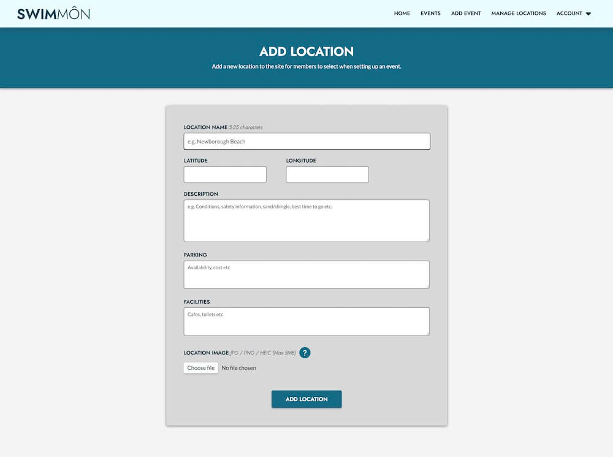

Screen Recording Video

https://github.com/emmahewson/mp3-swimmon/assets/116887840/ccce8947-07b4-4f92-9cbd-716d49d350b2

#### Functionality, Validation, Security & Routing

| Attribute | Details |
|---|---|
| **Visible To** | Admin Only |
| **Template** | add-location.html |
| **Front End Functionality** | Bespoke location picker used to populate Latitude & Longitude inputs, built using JavaScript & Google Maps API (map-picker.js). Hover/click effect popovers created ith JavaScript give more information to users filling in the form. The top input on the form has an 'autofocus' attribute to allow the user to begin typing immediately on page load, rather than having to select the first input manually. |
| **Back End Functionality** | Submission: converts location name to lowercase to make searching easier, uploads image to Cloudinary & adds image url to location data. Adds location to database. |
| **Front End Form Validation** | All fields required. Fields must match type and length (HTML validation). Latitude & Longitude populated using Map Picker (not directly editable to make sure they're in the correct format) with JavaScript & HTML validation to check selected location is in correct area by setting min/max latitude/longitude values. Uploaded image checks: under 5mb (JavaScript file-validation.js) and correct format (HTML validation). |
| **Back End Form Validation** | Checks image is under 5MB & in accepted format - redirects to 413/415 page if not. |
| **Front End Security** | No direct link to page in nav - all links to this page are visible to admin only. |
| **Back End Security** | User must be logged in and admin. |
| **Routing - log in** | If user not logged in re-routes to 'sign-in', flash message shows & site stores session url to redirect here post log-in. If user not admin re-routes to 'profile' and flash message shows. |
| **Routing - other** | None |

#### Page Features - Details & Description

All Page Features

- Intro Text
    - Brief intro text to explain to a user what the purpose of the page is and what they need to do
    - Intro text box & Submit buttons are in the site's branded 'mid blue' - used across the location-related pages
- Forms are fully responsive on all devices
- The top input has an autofocus attribute so the user can begin typing without selecting it
- Popover
    - Popover info circles with hover/click effect to give a user more information about the image url input
    - Tells user the best practice for selecting a photo
    - This is in addition to the validation
- Lat/Long
    - Latitude & Longitude inputs trigger a location picker popup window where the user can drag a marker to their chosen location
    - This is designed to offer the best user experience possible & to gather the lat/long values in a readable, valid format.
    - The map is centered on Anglesey (unless the user has previously selected a location)
    - The zoom level changes depending on screen size to help make the whole of the island visible when the map appears
    - The map has the full screen option disabled as this hides the error message when selecting a location outside Anglesey and causes a bad user experience.
    - The map includes validation checks to stop the user selecting a location far outside of Anglesey by limiting the range of the lat/long values
        - If a user selects a location outside this range an custom error message appears.
    - The lat/long inputs are not directly editable to avoid users adding invalid data. This uses a bespoke readonly style to allow the inputs to retain their 'required' attribute/validation [See bug 4 (opens TESTING.md).](TESTING.md/#4-location-picker-map---mobile-keyboard-popup)
    - The map has a save button to log the location to the form inputs
    - The map has a reset button to reset the map back to its original state
        - On the add-location form this would reset back to the centre of Anglesey
        - On the edit-location form this would reset back to the location's existing co-ordinates
    - The map is closed by either selecting 'save' or clicking outside the map box
- Image Upload
    - Allows the user to upload an image for the location
    - This uses Cloudinary to store the photo and provide a URL to the image
    - This avoids using external images from sources that the site admin has no control of, minimising broken images and missing content
    - Front & Back end validation is in place for the image upload
        - JavaScript validation to disable the submit button & show an error message if a user tries to upload a file larger than 5MB
        - HTML validation on the accepted file types
        - Back end validation also checks that the file is under 5MB (if not - aborts and reroutes to a [413 page](#error-pages)) and is of the correct type (if not - aborts and reroutes to a [415 page](#error-pages)). This is in place in case the front end validation is bypassed and to protect against large or malicious files being uploaded, giving additional protection to the site.
    - At this stage there are no checks on image dimensions or quality and so nothing to stop a user uploading a low quality or inappropriate image. This is something I would like to address in the future.
- Flash Message
    - On submission a flash message displays telling the user their submission has been successful. Flash messages are styled using custom CSS

#### Value to User

The add location form is a really intuitive user-friendly way for a site admin to add a new location. The features such as the bespoke location-picker and the image upload have made it a quick & easy form to fill in, avoiding sourcing image URLs and location co-ordinate values which could be tricky and time-consuming. There is clear and user-friendly validation on the form, making it easy for a site admin to know when they need to adjust their inputted information. The pop-up box also provides additional, user-friendly, information.

---

### Edit Location

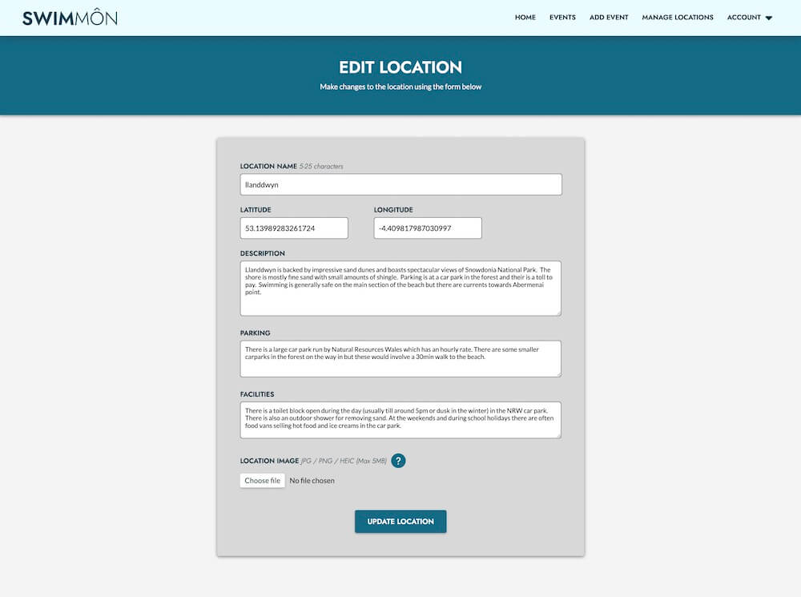

Screen Recording Video

https://github.com/emmahewson/mp3-swimmon/assets/116887840/9784abc3-5b39-4fe5-a12a-bf4dd1299d1c

#### Functionality, Validation, Security & Routing

| Attribute | Details |
|---|---|
| **Visible To** | Admin Only |
| **Template** | edit-location.html |
| **Front End Functionality** | Bespoke location picker used to populate Latitude & Longitude inputs, built using JavaScript & Google Maps API (map-picker.js). Map set to previously selected location (map-picker.js). Hover/click effect popovers created ith JavaScript give more information to users filling in the form. |
| **Back End Functionality** | Populates form with location data using object id. Submission: converts location name to lowercase to make searching easier, checks if new image uploaded & if so replaces it. Uploads image to Cloudinary & adds image url to location data. Updates location on database. If location id is not found in database aborts and re-routes to 404 page with a 'location not found' flash message. |
| **Front End Form Validation** | All fields required except image upload (to keep old image). Fields must match type and length (HTML validation). Latitude & Longitude populated using Map Picker (not directly editable to make sure they're in the correct format) with JavaScript & HTML validation to check selected location is in correct area by setting min/max latitude/longitude values. Uploaded image checks: under 5mb (JavaScript file-validation.js) and correct format (HTML validation). |
| **Back End Form Validation** | Checks image is under 5MB & in accepted format - redirects to 413/415 page if not. |
| **Front End Security** | No direct link to page in nav - all links to this page are visible to admin only. |
| **Back End Security** | User must be logged in and admin. |
| **Routing - log in** | If user not logged in re-routes to 'sign-in', flash message shows & site stores session url to redirect here post log-in. Id for session url is taken from page url. If user not admin re-routes to 'profile' and flash message shows. |
| **Routing - other** | Redirects to previous page after editing unless session url is this page (from login redirect). Defaults to 'manage-locations' page. |

#### Page Features - Details & Description

All Page Features

- Intro Text
    - Brief intro text to explain to a user what the purpose of the page is and what they need to do
    - Intro text box & Submit buttons are in the site's branded 'mid blue' - used across the location-related pages
- Forms are fully responsive on all devices
- Form is populated with the existing location information
- Location picker map show the previously selected location when opened
- The location image on this form is not 'required.' This allows the user to retain the old image by not uploading a new one. The popover contains additional information to explain this to the user
- The top input is not 'focused' on the edit form - this is because a user may not automatically want to edit the first input.
- Popover
    - Popover info circles with hover/click effect to give a user more information about the image url input
    - Tells user the best practice for selecting a photo
    - This is in addition to the validation
- Lat/Long
    - Latitude & Longitude inputs trigger a location picker popup window where the user can drag a marker to their chosen location
    - This is designed to offer the best user experience possible & to gather the lat/long values in a readable, valid format.
    - The map is centered on Anglesey (unless the user has previously selected a location)
    - The zoom level changes depending on screen size to help make the whole of the island visible when the map appears
    - The map has the full screen option disabled as this hides the error message when selecting a location outside Anglesey and causes a bad user experience.
    - The map includes validation checks to stop the user selecting a location far outside of Anglesey by limiting the range of the lat/long values
        - If a user selects a location outside this range an custom error message appears.
    - The lat/long inputs are not directly editable to avoid users adding invalid data. This uses a bespoke readonly style to allow the inputs to retain their 'required' attribute/validation [See bug 4 (opens TESTING.md).](TESTING.md/#4-location-picker-map---mobile-keyboard-popup)
    - The map has a save button to log the location to the form inputs
    - The map has a reset button to reset the map back to its original state
        - On the add-location form this would reset back to the centre of Anglesey
        - On the edit-location form this would reset back to the location's existing co-ordinates
    - The map is closed by either selecting 'save' or clicking outside the map box
- Image Upload
    - Allows the user to upload an image for the location
    - This uses Cloudinary to store the photo and provide a URL to the image
    - This avoids using external images from sources that the site admin has no control of, minimising broken images and missing content
    - Front & Back end validation is in place for the image upload
        - JavaScript validation to disable the submit button & show an error message if a user tries to upload a file larger than 5MB
        - HTML validation on the accepted file types
        - Back end validation also checks that the file is under 5MB (if not - aborts and reroutes to a [413 page](#error-pages)) and is of the correct type (if not - aborts and reroutes to a [415 page](#error-pages)). This is in place in case the front end validation is bypassed and to protect against large or malicious files being uploaded, giving additional protection to the site.
    - At this stage there are no checks on image dimensions or quality and so nothing to stop a user uploading a low quality or inappropriate image. This is something I would like to address in the future.
- Flash Message
    - On submission a flash message displays telling the user their submission has been successful. Flash messages are styled using custom CSS

#### Value to User

Building on the value to user of the [Add Location](#add-location) form, the edit location form is prefilled so a user doesn't need to re-input information. The image upload function is no longer required so a user can leave the previous image and there is a friendly pop-up box to explain this, creating a great user-experience.

---

### Delete Location

Screen Recording Video

https://github.com/emmahewson/mp3-swimmon/assets/116887840/510fc807-da9f-4254-8680-6c8fdba829c5

#### Functionality, Validation, Security & Routing

| Attribute | Details |
|---|---|
| **Visible To** | Admin Only |
| **Template** | None |
| **Back End Functionality** | Removes location from database & deletes all events at that location. If location id is not found in database aborts and re-routes to 404 page with a 'location not found' flash message. |
| **Front End Security** | No direct link to page in nav - all links to this page are visible to admin only. |
| **Back End Security** | User must be logged in & admin. |
| **Routing - log in** | If user not logged in re-routes to 'sign-in' & stores session url for 'manage-locations' page to redirect there post log-in. This adds a layer of protection when deleting locations. If user not admin re-routes to 'profile' and flash message shows. |
| **Routing - other** | Redirects to manage-locations page. |

### Features - Details & Description

- Delete location buttons only visible to admin
- Additional back-end security to prevent others deleting locations
- Modal confirms whether the user is sure they want to delete the location (on page with delete button)
    - Warns that this will also delete associated events
- Deleting a location will also delete any events at that location (connected via the location_id on the event objects)
    - This has been written in to the backend as MongoDB doesn't do this automatically as it is not a relational database
    - This avoids causing errors on the site as the event information pages and cards depend upon the location existing in the database
- Flash messages confirms successful event deletion

#### Value to User

The delete location functionality allows the user to quickly and easily delete a location. There is built in functionality that removes all events at that location meaning the user doesn't have to remove those manually. The preceding page shows the user a modal checking that they want to proceed with the deletion and warning them that all associated events will also be deleted, to avoid them accidentally deleting a location.

---

### Error Pages

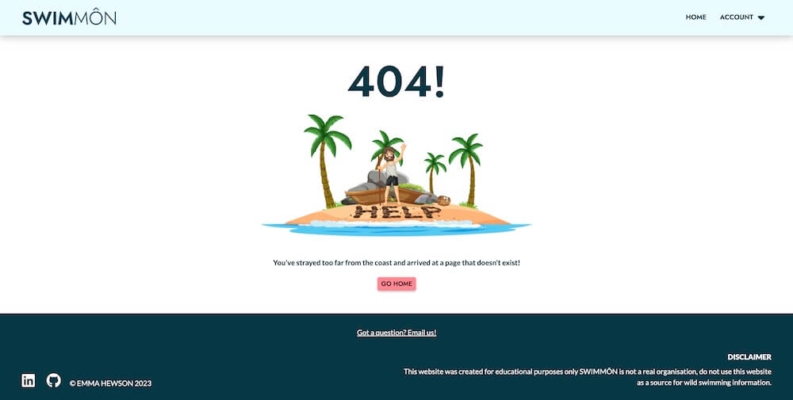

Screen Recording Videos

https://github.com/emmahewson/mp3-swimmon/assets/116887840/094a18eb-0330-4b62-9aab-adfe39940e04

413

  

https://github.com/emmahewson/mp3-swimmon/assets/116887840/9861ab35-34df-459e-8a03-289c33cd698d

  

415

  

https://github.com/emmahewson/mp3-swimmon/assets/116887840/d26deda7-1047-40b3-9101-31ad11b01d55

  

500

  

https://github.com/emmahewson/mp3-swimmon/assets/116887840/f2bf409d-0504-4b37-b706-5608761558fc

  

#### Functionality, Validation, Security & Routing

__404 ERROR PAGE__

| Attribute | Details |
|---|---|
| **Visible To** | All Users |
| **Template** | 404.html |
| **Routing - other** | Redirects here when user enters a non-existent page |

__413 ERROR PAGE__

| Attribute | Details |
|---|---|
| **Visible To** | All Users |
| **Template** | 413.html |
| **Routing** | Redirects here if user uploads an image larger than 5MB (if they have bypassed frontend validation) |

__415 ERROR PAGE__

| Attribute | Details |
|---|---|
| **Visible To** | All Users |
| **Template** | 415.html |
| **Routing - other** | Redirects here if user uploads a file in the wrong format (if they have bypassed frontend validation) |

__500 ERROR PAGE__

| Attribute | Details |
|---|---|
| **Visible To** | All Users |
| **Template** | 500.html |
| **Routing - other** | Redirects here if there is a server error |

#### Page Features - Details & Description

All Page Features

- The Error pages handle any errors that occur in a user friendly way by directing the user to a custom error page
- All pages contain the site navbar and footer
    - This keeps a sense of still being on the site and not having left, improving user experience
    - This also allows users to easily navigate to where they want to be
- All pages contain a navigation button to take the user back in to the site (see below)
- Pages contain the error number, a brief description of the problem, written in a light-hearted, user friendly way and a cartoon of a man on a desert island, keeping with the theme of wild swimming.
- The 413 & 415 were not included in the original planned features but came about as I learned how to include validation on uploaded files.
- 404 Page
    - if a user navigates to a page that doesn't exist
    - button navigates to home page
- 413 Page
    - if a user tries to upload a file larger than 5mb (and bypasses the front end validation)
    - button navigates back to the previous page (either add-location or edit-location forms)
- 415 page
    - if a user tries to upload a file in a format that isn't accepted (and bypasses the front end validation)
    - button navigates back to the previous page (either add-location or edit-location forms)
- 500 Page
    - if there is a server error
    - button navigates to home page

#### Value to User

The error pages take the user to a branded, friendly page that tells them that something has gone wrong. It means they feel like they are still within the site, encouraging them to return to another part of the site rather than go elsewhere. There is a convenient button to take users back to where they were or to the homepage, making the navigation intuitive and user-friendly.

---

### Future Features

I would like to expand the site in the future with the following features:

**Mark self as 'Going' to an Event:** give the user the ability to mark themselves as 'going' to an event. The event could then include information on who is going.

**Comments / Chat on Event page:** functionality for users to be able to discuss the event in a comments or chat section on the Event page, where they could ask questions, make plans etc.

**Expand Personal Profile:** users can add more information about themselves on their profile, which could include 'home swim-spot' with their closest beach (and tailored event suggestions based on this), a list of events they are marked as 'going' to, and a profile photo or avatar.

**Improve log in functionality:** add a password reset for users who've forgotten theirs, and gather user email addresses in order to implement this. Improve security with security questions or authentication.

**Recurring Events:** The ability to make an event 'recurring' for users who hold regular swim meetings (e.g. every week), saving them time creating new events.

**Location Images:** Implementing additional validation on location images, checking for quality, dimensions and to protect against inappropriate images.

---

## Technologies

### Languages

- [HTML](https://en.wikipedia.org/wiki/HTML5)
  - Used to build the main structure of the site
- [CSS](https://en.wikipedia.org/wiki/Cascading_Style_Sheets)
  - Used to style the website
- [Vanilla JavaScript](https://en.wikipedia.org/wiki/JavaScript)
  - Events page search bar collapsible (search.js)
  - Events page filters (search.js)
  - Time & date validation (event-form.js)
  - Google Maps API
    - Home page map with all location & clickable markers (map.js)
    - Event page map (map-event.js)
    - Location page map (map-location.js)
    - Location picker on add location form (map-picker.js)
  - Info box 'popovers' on forms (popover.js)
- [JQuery](https://jquery.com/)
  - Mobile Side Nav (script.js)
  - Navbar Dropdown Menu (script.js)
  - Materialize modal (script.js)
  - Footer Year (script.js)
  - Scroll to Top button (scroll-top.js)
  - Back button on error pages (back.js)
  - Validating image upload (file-validation.js)
  - Form dropdown select inputs (event-form.js)
  - Validation message on select inputs (event-form.js)
  - Initiating time & date pickers on event form (event-form.js)
- [Python](<https://en.wikipedia.org/wiki/Python_(programming_language)>)
  - Used to build the core of the backend of the project as well as the running/viewing of the website
  - Python Modules Used:
    - blinker==1.6.2
    - click==8.1.3
    - cloudinary==1.33.0
    - dnspython==2.3.0
    - Flask==2.3.2
    - Flask-PyMongo==2.3.0
    - itsdangerous==2.1.2
    - pymongo==4.3.3
    - Werkzeug==2.3.3

### Tools

- [Git](https://git-scm.com/)
  - Used for version control via Code Anywhere by using the terminal to Git and Push to GitHub
- [GitHub](https://github.com/)
  - Used to store the project code
- [Code Anywhere](https://codeanywhere.com/)
  - Used to create, edit & preview the project's code
- [Heroku](https://dashboard.heroku.com/apps)
  - Used to deploy the live site
- [Figma](https://www.figma.com/)
  - Used to develop the wireframes in to a full site design including colours, fonts, proportions etc
- [Materialize](https://materializecss.com/)
  - Used to help with the responsiveness of the site in much of the structural layout
  - Used date and time picker for the add event form
- [Google Fonts](https://fonts.google.com/)
  - Used to select & import the fonts to the project (Jost & Lato)
- [Font Awesome](https://fontawesome.com/)
  - Used to add icons to the site to help with UX and to add more character
- [Adobe Illustrator](https://www.adobe.com/uk/products/illustrator.html)
  - Used to create the site logo
- [Adobe Photoshop](https://www.adobe.com/uk/products/photoshop.html)
  - Used to crop, adjust and resize the photos to optimise them for the site
- [Image Resizer](https://imageresizer.com/)
  - Used to crop, resize & convert images 
- [Tiny PNG](https://tinypng.com/)
  - Used to further optimise the images for the site and reduce file size
- [ezGIF](https://ezgif.com/)
  - Creating GIFs for the README
- [tableconvert.com](https://tableconvert.com/csv-to-markdown)
  - Converting CSV files to Markdown tables for README
- [Favicon.io](https://favicon.io/favicon-converter/)
  - Used to create and add the favicon to the browser tab
- [Google Chrome Dev Tools](https://developers.google.com/web/tools/chrome-devtools)
  - Used to inspect page elements, debug issues with the site & test responsiveness on different mockup devices
- [Techsini](http://techsini.com/multi-mockup/index.php)
  - Website mockup image generator for images in this README.
- [Google Maps API](https://developers.google.com/maps)
  - Linked to Google Maps API to load the relevant country map and create clickable markers

---

## Testing

The whole site has been thoroughly tested as follows:

- Automated Validation / Testing
    - HTML Validation: [W3C Markup Validation](https://validator.w3.org/nu/)
    - CSS Validation: [W3C CSS Validation](https://jigsaw.w3.org/css-validator/)
    - JavaScript Linting: [JS Hint](https://jshint.com/)
    - Python Linting: [pep8ci](https://pep8ci.herokuapp.com/) & Code Anywhere's inbuilt Linting
    - Accessibility: [Wave WebAIM](https://wave.webaim.org/)
    - Performance: [Google Chrome's Dev Tools](https://developer.chrome.com/docs/devtools/)
- Feature Testing
    - Full feature testing on all pages
    - Testing of CRUD functionality
    - Checking consistency between database & app content
    - Site tested across different browsers
    - Site tested across different devices
- User Stories Testing
    - Full app testing for each user story

---

### Test Results & Bugs

The full test results and details of any bugs and their fixes can be found in the [TESTING document](TESTING.md)

---

## Deployment

### Project Creation
I used the [CI MongoDB Code Anywhere Full Template](https://github.com/Code-Institute-Org/ci-mongo-template) to create this project and used Code Anywhere as my IDE.

From the CI Mongo template above the steps to create this project were:
1. Click on 'Use this template' and select 'Create a new repository'
2. Enter your chosen repo name
3. Click 'Create Repository'
4. From the new GitHub repo copy the the page URL
5. Open Code Anywhere and navigate to the 'workspaces' page
6. Click on 'New Workspace'
7. Paste the GitHub repo URL in to the 'Repository URL' box
8. Click 'Create'

### Deployment to Heroku
I used Heroku to deploy this project.

To deploy to Heroku:
1. In Code Anywhere CLI from the main directory run `pip3 freeze > requirements.txt` to create/update a requirements.txt file containing project dependencies.
2. In Code Anywhere CLI from the main directory run `echo web: python app.py > Procfile` to create a Procfile. Check that the file contains the text 'web: python app.py' and delete any blank lines at the bottom.
3. Push the 2 new files to the GitHub repository
4. Login to Heroku, select 'Create New App', create a unique name for the app and select your nearest region. Click 'Create App'
5. Navigate to the Deploy tab on Heroku dashboard and select Github, search for your repository by name and click 'connect'.
6. Navigate to 'settings', click reveal config vars and input the the following:

| Key | Value |
| :---: | :---: |
| CLOUD_API_KEY | _Cloudinary API key_ |
| CLOUD_API_SECRET | _Cloudinary API secret_ |
| CLOUD_NAME | _Cloudinary Name_   |
| IP | 0.0.0.0 |
| PORT | 5000 |
| MONGO_DB | _Mongodb Database Name_ |
| MONGO_URI | mongodb+srv://<_USERNAME_>:<_PASSWORD_>@<_CLUSTER_>.tfci8tb.mongodb.net/<_DATABASE_>?retryWrites=true&w=majority |
| SECRET_KEY | _Secret Key From env.py required for 'Session' & 'Flash' functions of Flask_ |

7. Go back to the Deploy tab and click on 'Enable Automatic Deploys'
8. Click deploy branch
9. Once build is complete click on 'View' to launch the new app

### Local Development
__NB: This project will not run locally with database connections unless hte user sets up an env.py file configuring the above environment variables as these are not included in the GitHub files for security reasons.__

To Run Locally:
1. Navigate to the [GitHub Repository](https://github.com/emmahewson/mp3-swimmon)
2. Click on 'Code' & select 'Download Zip' to download the files locally and open with an IDE or Copy the URL from the top box
3. If copying the code open your development editor & in the terminal use the 'Git Clone' command followed by the above URL to create a clone of the project locally.

To Fork Project:
1. Navigate to the [GitHub Repository](https://github.com/emmahewson/mp3-swimmon)
2. Click on the 'Fork' button at the top right of the page
3. This will duplicate the project for you to work on

---

## Credits

### Code

Details of any projects or online sources that I have learned from or adapted in developing this website. All relevant code is also credited in comments above the code itself.

- [Lee Martina - Sagacity CI Project](https://github.com/isntlee/Sagacity/blob/master/templates/home.html): Fetch function to send JSON data from MongoDB
- [Karina Finegan - Snapathon CI Project](https://github.com/kairosity/mp3-snapathon/tree/master): Image size & format backend validation & error handling
- [https://github.com/Dogfalo/materialize - Issue](https://github.com/Dogfalo/materialize/issues/1861): Validation message on form dropdowns
- [https://github.com/Dogfalo/materialize - Issue](https://github.com/Dogfalo/materialize/issues/5974): Date input format conversion
- [https://www.tutorialspoint.com - Article](https://www.tutorialspoint.com/converting-12-hour-format-time-to-24-hour-format-in-javascript): Converting AM/PM time string to 24hr string
- [https://www.geeksforgeeks.org - Article](https://www.geeksforgeeks.org/validation-of-file-size-while-uploading-using-javascript-jquery/): Front end validation on image upload
- [https://www.aspsnippets.com - Article](https://www.aspsnippets.com/Articles/Google-Maps-API-V3-Open-Show-only-one-InfoWindow-at-a-time-and-close-other-InfoWindow.aspx): Bug 3 Solution [multiple Info-Windows on map](TESTING.md/#3-google-maps-info-windows---multiple-windows-opening-at-once)
- [https://codepen.io - Sample Code](https://codepen.io/chocochip/pen/zYxMgRG): Popover Info Boxes

### Images & Text

- Homepage Hero Image [Vidar Nordli-Mathisen on Unsplash](https://unsplash.com/photos/AvnXCFX25GA)
- Location Backup Image [Lopez Robin on Unsplash](https://unsplash.com/photos/apax4M-4kFI)
- Llanddwyn: [Fotovue](https://www.fotovue.com/wp-content/uploads/2016/10/IMGP1890-scaled.jpg)
- Bull Bay: [Wales Tourists Online](https://www.walestouristsonline.co.uk/pictures/mainpics/2338_DGG72M57DCQ5.jpg)
- Porth Dafarch: [Anglesey Outdoors]()
- Porth Trecastell: [Holidays Anglesey](https://www.holidaysanglesey.co.uk/perch/resources/porth-trecastell-beach-1-corrected-w720pxh520px.jpg)
- Porth Swtan: [Visit Anglesey](https://www.visitanglesey.co.uk/ImageGen.ashx?image=/media/445871/church-bay-1280-x-618.jpg&width=1280&height=618)
- Cemaes Bay: [Clued In With Kids](https://www.cluedinwithkids.co.uk/wp-content/uploads/2019/05/AdobeStock_52856375.jpeg-1600.jpeg)

### Graphics

- Desert Island Cartoon [Image by brgfx on Freepik](https://www.freepik.com/free-vector/deserted-island-with-broken-boat-lying-beach-with-help-si_24093188.htm#from_view=detail_alsolike)

### Acknowledgements

- My mentor [Daisy McGirr](https://github.com/Daisy-McG) for all her help and advice throughout the project
- The whole team at [Code Institute](https://codeinstitute.net/) for their teaching and support

---

---

[Go to Top](#swimmôn-wild-swimming-events-website)

---
