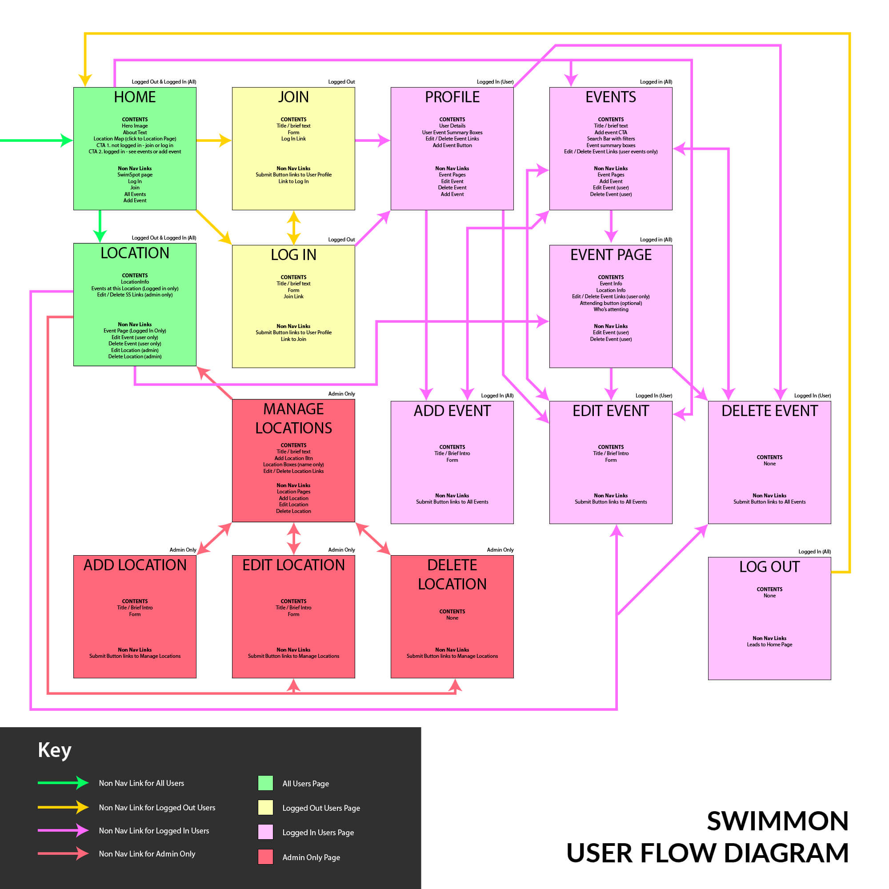

# SWIMMÔN Wild Swimming Events Website

THIS PROJECT IS A WORK IN PROGRESS

SWIMMÔN is a website for swimmers on The Isle of Anglesey / Ynys Môn to find and set up wild swimming meet ups around the island. The live Website can be found [here](https://swim-mon.herokuapp.com/).


****
## Table of Contents

* [User Experience (UX)](#user-experience-design)
    * [Strategy Plane](#strategy-plane)
    * [Scope Plane](#scope-plane)
    * [Structure Plane](#structure-plane)
    * [Skeleton Plane](#skeleton-plane)
    * [Surface Plane](#surface-plane)
- [Features](#Features)
    * [Current Features](#Current-Features)
    * [Future Features](#future-features)
* [Technologies](#Technologies)
* [Testing](#Testing)
    * [Bugs]()
* [Deployment](#Deployment)
* [Credits](#Credits)


****

## User Experience Design
### **Strategy Plane**


#### Site Goals
* To give wild swimmers on Anglesey the opportunity to arrange or join wild swimming events / meet-ups
* To provide information about wild swimming locations on Anglesey

#### User stories
* As a user:
    * I want to be able to find what I need immediately and for the navigation to be easy to follow & intuitive
    * I want to be able to view the site on any device and for it to be fully responsive
    * I want to be able to contact the site to suggest additional swim locations or ask questions
    * As a user, I want to be able to return to the main site without having to use the browser buttons if I end up on a non-existent page or the site throws an error
* As a user without an account:
    * I want to understand the purpose of the site immediately upon entering
    * I want to be able to view information about places to go wild swimming on Anglesey
    * I want to be able to set up an account so that I can view and create events
* As a user with an account:
    * I want to be able to sign in to my account
    * I want to be able to browse wild swimming events and find all the information I need to join one
    * I want to be able to search & filter wild swimming events to find one that suits me
    * I want to be able to set up a new event
    * I want to be able to view, edit and delete the events I have set up
    * I want to be able to log out of my account easily
* As an admin of the site:
    * I want to be able to add, edit or delete swimming locations for members to choose between for their event
    * I want to be able to edit or delete events created by other users for site management purposes


****
### **Scope Plane**

**Features planned:**
* General
    * Responsive design
    * MongoDB databases to store location, event, event categorisation (challenge level & who-for) & user information
* All users (no log in required)
    * Navigation
    * Home page with explanatory text & list of locations for swimming
        * Google Maps API with clickable location links
    * Location page with detailed location information
    * Sign in functionality
    * Sign up functionality
    * Custom Error Code Pages (404, 500)
* Signed in (registered users)
    * Sign out functionality
    * Profile Page with user's own events (with CRUD functionality links)
    * Events page with all events (summary cards) and search/filter functionality
    * Event page with full event information (with CRUD functionality links for user's own events)
    * Add event functionality
    * Edit / Delete event functionality for user's own events
* Admin only
    * Manage locations page (with CRUD functionality links)
    * Add / Edit / Delete location functionality
    * Edit / Delete other users' events

The table shows the importance and difficulty of these features - I will prioritise them based on this during the development process.


| **User** | **Feature** | **Difficulty** | **Importance** |
|-------------|------------|------------|------------|
| General | Responsive Design | 2 | 5 |
| General | MongoDB database to store required data | 5 | 5 |
| All Users | Navigation | 1 | 5 |
| All Users | Home Page - branding & Explanatory Text | 1 | 5 |
| All Users | Home Page - list of swimming locations on map (Google Maps API) with clickable markers | 5 | 1 |
| All Users | Individual Location Info page | 5 | 1 |
| All Users | Sign In Functionality | 5 | 5 |
| All Users | Sign Up Functionality | 5 | 5 |
| All Users | Custom 404 Page | 1 | 4 |
| Signed In | Sign Out Functionality | 5 | 5 |
| Signed In | Profile Page with user's own events | 4 | 3 |
| Signed In | Events Page with summary info of all events | 4 | 5 |
| Signed In | Event Page with full info & CRUD functionality links for user's own events | 5 | 5 |
| Signed In | Add Event functionality | 5 | 5 |
| Signed In | Edit / Delete functionality for user's own events | 5 | 5 |
| Admin Only | Manage Locations Page (with CRUD functionality links) | 4 | 3 |
| Admin Only | Add / Edit / Delete location functionality | 5 | 3 |
| Admin Only | Edit / Delete other users' events | 3 | 3 |

****
### **Structure Plane**
Based on the features and the user stories I developed a flow chart for the site




This site structure targets the user stories as follows:

User Story:
> I want to be able to find what I need immediately and for the navigation to be easy to follow & intuitive

Implementation:
* Navigation menu to be displayed on all pages with relevant nav links (change based on whether user is registered / admin)
* All navigation links go to the correct pages
* User is led through site in an intuitive way
    * Locations page links to individual location pages
    * Events page links to individual event pages
    * Sign in leads to user profile
    * All main functionality visible in nav when required e.g. (add event, log out, management locations)

The following navigation links will be included in the site
* Home (index.html)
* Events (events.html)
* Add Event (add-event.html)
* Manage Locations (manage-locations.html)
* Account - Dropdown List
    * Join (join.html)
    * Sign In (sign-in.html)
    * Profile (profile.html)
    * Sign Out (redirects to home page)

These nav links will be displayed based on who the user is and whether they're logged in:

| **Logged Out** | **Logged In (non-admin)** | **Logged In (admin)** |
|-------------|------------|------------|
| Home | Home | Home |
| --- | Events | Events |
| --- | Add Event | Add Event |
| --- | --- | Manage Locations |
| Join | --- | --- |
| Sign In | --- | --- |
| --- | Profile | Profile |
| --- | Sign Out | Sign Out |


User Story:
> I want to be able to view the site on any device and for it to be fully responsive

Implementation:
* The site will be built using a combination of Materialize and custom CSS and fully tested during and after development to make sure it is fully responsive on different size devices.

User Story:
> I want to be able to contact the site to suggest additional swim locations or ask questions

Implementation:
* The site footer will contain a link to an email address for the user to contact the site admins. There will also be an email link for a user to suggest a new location when filling in the 'add event' form in a popover element. This will help explain to the user that only approved locations are allowed for events and give them an option to get in touch should they wish to make a suggestion for an additional location.

User Story:
> As a user, I want to be able to return to the main site without having to use the browser buttons if I end up on a non-existent page

Implementation:
* A custom 404 page will be created which will include the main navigation bar and footer so that the user can navigate back to the relevant page without using the browser back button.

User Story:
> As a user without an account, I want to understand the purpose of the site immediately upon entering

Implementation:
* The Home page will include some explanatory text about the site and its purpose. All pages will include the site logo within the navbar which will also be a clickable link back to the homepage. There will also be an eye-catching hero text box with a relevant image at the top of the home page more text to reinforce the purpose of the site.

User Story:
> As a user without an account, I want to be able to view information about places to go wild swimming on Anglesey

Implementation:
* The Home page will contain information about swimming locations on Anglesey with clickable links to a page which contains more detailed information about that location. If time allows this information will be displayed on a map using Google Maps API and clickable cluster markers with pop up summary boxes.

User Story:
> As a user without an account, I want to be able to set up an account so that I can view and create events

Implementation:
* The nav bar will contain a dropdown called "account" which will contain a link for user to 'join'. There will also be a clickable button on the homepage as a call to action to guide users to the join page. Both of these will only be visible to users who are not logged in.


User Story:
> As a user with an account, I want to be able to sign in to my account
* The nav bar will contain a dropdown called "account" which will contain a link for user to 'sign in'. There will also be a text link on the homepage as a call to action to guide users to the siggin. Both of these will only be visible to users who are not logged in.

User Story:
> As a user with an account, I want to be able to browse wild swimming events and find all the information I need to join one

Implementation
* The events page will contain summary boxes containing basic information about all the upcoming events. These boxes will be clickable to take the user to a page about that event containing more detailed information about the event and the location.

User Story:
> As a user with an account, I want to be able to search & filter wild swimming events to find one that suits me

Implementation
* The event summary boxes on the events page will be searchable / filterable by location, who they are for (women, men, all) and challenge level (fun, intermediate, challenging.) All of this information will have been selected by the user when creating the event and contained within the database.

User Story:
> As a user with an account, I want to be able to set up a new event

Implementation
* The nav bar will contain a link to 'add event' as well as call to action links/buttons on the home page (for logged in users), the events page, the location info page & the user profile page. These will take the user to a form to fill in with details of their event.
* The form will contain the following fields:
    * Event name (text)
    * Location (dropdown with list of admin created locations)
    * Event description (textarea)
    * Date (date picker)
    * Time (time picker)
    * Who For (dropdown with list of options - women-only, men-only, all-welcome)
    * Challenge Level (dropdown with list of options - fun, intermediate, challenging)
* Upon submission this event will appear in the events page, the user's profile page & on the relevant location's page

User Story:
> As a user with an account, I want to be able to view, edit and delete the events I have set up

Implementation
* The user will be able to view the events they have created on their profile page, on the main events page and in the location page (with events for that location). The user's events will have buttons to edit & delete, both on the summary boxes and in the event's full page. 
    * Edit: The edit button will take the user to a pre-filled form containing the event information which will be ediable.
    * Delete: The delete button will trigger a warning to the user before they delete it. This functionality will only be available to the user who created the event and the admin.

User Story:
> As a user with an account, I want to be able to log out of my account easily

Implementation
* The navigation will contain an 'account' dropdown containing a link for the user to signout which will log the user out and return them to the home page.

User Story:
> As an admin of the site, I want to be able to add, edit or delete swimming locations for members to choose between for their event

Implementation
* The admin will have a page visible only to them, accessible from the main nav bar, to manage locations, which will list all the locations with clickable links to view the location information as well as buttons to edit & delete that location.
    * Add: There will be an add location button which will take the admin to a form to add a new location which contain the following fields:
        * Location Name (text)
        * Latitude & Longitude (with an explanatory popover box to guide the admin on how to access this information & the correct format)
        * Location Description (textarea)
        * Parking Description (textarea)
        * Facililties Description (textarea)
        * Image URL (with an explanatory popover box to guide the admin on how to find and input)
    * Edit: The location boxes will have an edit button which will take the admin to a pre-filled form containing the location information which will be editable.
    * Delete: The location boxes will have a delete button which will trigger a warning to the admin before they delete it.


    TBC - WHAT HAPPENS TO ASSOCIATED EVENTS?!


User Story:
> As an admin of the site, I want to be able to edit or delete events created by other users for site management purposes

Implementation
* The admin will be able to edit or delete events created by any user both in the event summary boxes and on the event page.

****
### **Skeleton Plane**
[For wireframes see Surface Plane](#wireframes)

#### Database Design
MongoDB Object format examples:

**Collection: events**<br>
{<br>
&nbsp;&nbsp;&nbsp;&nbsp;_id : unique-value,<br>
&nbsp;&nbsp;&nbsp;&nbsp;name : "Sunday Swim",<br>
&nbsp;&nbsp;&nbsp;&nbsp;description : "A relaxed dip with friendly people to get our Sundays off to a good start.",<br>
&nbsp;&nbsp;&nbsp;&nbsp;date : "2023-06-13T10:00:00.000+00:00",<br>
&nbsp;&nbsp;&nbsp;&nbsp;location_id : (location-id),<br>
&nbsp;&nbsp;&nbsp;&nbsp;challenge : "fun",<br>
&nbsp;&nbsp;&nbsp;&nbsp;who : "All-Welcome",<br>
&nbsp;&nbsp;&nbsp;&nbsp;created-by : session[user],<br>
}

**Collection: locations**<br>
{<br>
&nbsp;&nbsp;&nbsp;&nbsp;_id : unique-value,<br>
&nbsp;&nbsp;&nbsp;&nbsp;name : "Llanddwyn",<br>
&nbsp;&nbsp;&nbsp;&nbsp;latitude : "53.14466044027234",<br>
&nbsp;&nbsp;&nbsp;&nbsp;latitude : "-4.385204789999572",<br>
&nbsp;&nbsp;&nbsp;&nbsp;description : "A large sandy beach with beautiful views of the mountains",<br>
&nbsp;&nbsp;&nbsp;&nbsp;parking : "Paid parking available on an hourly basis. Pay on exit. Height restriction of 2.1m.",<br>
&nbsp;&nbsp;&nbsp;&nbsp;facilities : "Toilets open from sunrise until sunset. On site freshwater outdoor shower. Food & drink vans.",<br>
&nbsp;&nbsp;&nbsp;&nbsp;image_url : "https://www.fotovue.com/wp-content/uploads/2016/10/IMGP1890-scaled.jpg"<br>
}

**Collection: users**<br>
{<br>
&nbsp;&nbsp;&nbsp;&nbsp;_id: unique-value,<br>
&nbsp;&nbsp;&nbsp;&nbsp;username: "Admin",<br>
&nbsp;&nbsp;&nbsp;&nbsp;password : "ab123bn548",<br>
}

**Collection: who_for**<br>
{<br>
&nbsp;&nbsp;&nbsp;&nbsp;_id: unique-value,<br>
&nbsp;&nbsp;&nbsp;&nbsp;name: "Women-Only",<br>
}

**Collection: challenge**<br>
{<br>
&nbsp;&nbsp;&nbsp;&nbsp;_id: unique-value,<br>
&nbsp;&nbsp;&nbsp;&nbsp;name: "Intermediate",<br>
}

#### Security

Database connection details are set up in an [env.py](https://pypi.org/project/env.py/) for development, for 
security reasons this is not uploaded to GitHub so that database and connection details are not visible to 
users. In production these are stored in Heroku. 

****
### **Surface Plane**
#### Wireframes

I created fully designed wireframes in [Figma](https://www.figma.com/). This allows me to make all major design decisions including colours, fonts, layout, spacing and the visual user experience before commencing coding.

**Wireframes / Site Design**

* [Home]()
* [Join]()
* [Sign In]()
* [Profile]()
* [Events]()
* [Event Page]()
* [Add Event]()
* [Edit Event]()
* [Location Page]()
* [Manage Locations]()
* [Add Location]()
* [Edit Location]()


### Design

#### Colour Scheme


#### Typography


****
## Features

As well as the features listed in the planned features above this section breaks down the smaller features and the functionality of the site.

### All Sections/Pages

#### **Layout**

<details><summary>Screenshots</summary>


*Max-Width of site*

</details>

* The site has a max-width of 1750px. This helps to maintain the quality of the hero image on the home page on wider-screen devices. The area around this max-width is set to a branded blue to maintain the site's brand colours.


#### **General Responsiveness**

<details><summary>Screenshots</summary>


*Caption*

</details>

* The site is fully responsive across all pages to help all features appear correctly and look their best on all devices. This includes:
    * Changes to font size
    * Image size adjustments
    * Changes to padding & margins
    * Changes to the height of divs/sections
    * Layout changes
* Details of more specific changes can be found in the feature sections below.


#### **Favicon**

<details><summary>Screenshots</summary>


*Favicon*

</details>

* The site has a Favicon using an S to represent SWIMMON. This helped to build the brand and continue the site design in the user's browser tab.

#### **Navbar**

<details><summary>Screenshots</summary>


*Responsive navbar*


*Hover effect*


*Dropdown Menu*


*Navbar changes based on log-in status*

</details>

* Based around Materialize's inbuilt navbar
* Includes a clickable logo of the name of the site which takes the user back to the home page
* The navbar sticks to the top of the screen to aid navigation on longer pages
* Includes menu items with a hover effect
    * These vary based on whether a user is logged in or not, or whether they are an admin (who have access to more areas of the site)
    * All the account-specific functionality is stored in a dropdown menu to help keep the navbar uncluttered
* The navbar is fully responsive, on smaller screens the navbar is shorter and the menu items are replaced with a burger menu and a sidenav


#### **Site Main Buttons**

<details><summary>Screenshots</summary>


*Button Colour Variety with Hover Effects*

</details>

* The site utilizes a repeating button design for major navigation or form submission functionality. In general the button colours are themed according to their purpose (along with the associated page explanatory header sections):
    * Pink - Events
    * Mid-Blue - Locations
    * Highlight-Blue - Sign in / Join
* Other secondary buttons are used across the site too - details in the features sections below


#### **Footer**

<details><summary>Screenshots</summary>


*Responsive Footer*

</details>


* Appears on all pages
* Contains a clickable link to a 'contact us' email address
* Contains a disclaimer to tell people that the site has been made for educational purposes and not to be used for sea swimming adice (due to the inherant dangers involved of sea swimming).
* The footer contains the text "Made By Emma Hewson" and links to my relevant social media sites so that it can be used as a portfolio project
* The footer social icons have aria labels to make them accessible
* The footer social icons have a hover effect with a smooth colour transition
* The footer is responsive, the layout adjusts on different sized devices


- - -

### Home Page


#### **Hero**

* A large, powerful hero image to grab people's attention and create a strong sense of what the site is for
* A bright pink text box with compelling text building allowing users to immediately know what the purpose of the site is
* Fully responsive
    * There are 3 versions of the image selected based on screen size to improve the site's performance and load speed

<details><summary>Screenshots</summary>


*Responsive Hero Section*

</details>


#### **'WHAT IS SWIMMÔN?' Section**

* Explanatory Text helping to clearly explain the purpose of the site and what the site can offer a user.
* The content of this section varies depending on whether a user is logged in - offering different paths through the site to either
    1. encourage a non-logged in user to sign up (primary) or log in (secondary) to enjoy the site's features
    2. encourage a logged in user to go to the events page (primary) or add an event (secondary)

<details><summary>Screenshots</summary>


*Responsiveness*


*Not-Logged-In Contents*


*Logged-In Contents*

</details>


#### **Locations Map - Multiple Location Markers**

* Includes explanatory text on a colour themed background (mid-blue for locations)
* Google Maps API containing clickable markers of all locations from the locations collection
    * Pulls data from the location collection - all locations in the collection are represented on the map
    * The map has full Google Maps functionality including:
        * Choice of map or satellite
        * Streetview
        * Full screen
        * Google Places
        * Zoom buttons
        * Touchscreen zoom & scroll
    * Markers are clickable and bring up a custom infowindow containing summary info about the location
    * Infowindows are clickable and lead to the relevant location page for full information
    * Infowindows have a hover effect, underlined name and truncated description text followed by an elipsis `...` to indicate that they are clickable
    * Marker / infowindow click functionality
        * when clicking on a marker
            * the map will scroll to show the whole infowindow if needed
            * any other infowindow that is open will close
        * clicking outside the infowindow will close it
    * The map is responsive
        * zoom level varies based on screensize to make sure all locations are visible
        * the map container size reduces on smaller devices to avoid users getting stuck on the map and not being able to scroll past
    * If something goes wrong and the map fails to load Google has a built in error message to handle the problem in a user-friendly way


<details><summary>Screenshots</summary>


*Locations Map Functionality*

</details>


- - -

### Future Features

I would like to expand the site in the future with the following features:

**Mark self as 'Going' to an Event:** give the user the ability to mark themselves as 'going' to an event. The event could then include information on who is going.

**Comments / Chat on Event page:** functionality for users to be able to discuss the event in a comments or chat section on the Event page, where they could ask questions, make plans etc.

**Expand Personal Profile:** users can add more information about themselves on their profile, which could include 'home swim-spot' with their closest beach (and tailored event suggestions based on this), a list of events they are marked as 'going' to, and a profile photo or avatar.

**Recurring Events:** The ability to make an event 'recurring' for users who hold regular swim meetings (e.g. every week), saving them time creating new events.


- - -

### Backend Functionality, Site Security & Form Validation

Below are all the details of each features's security (front & back end), routing & templates, form validation (front & back end) & back end functionality.

<details><summary>HOME</summary>

|  |  |
|---|---|
| **Visible To** | All Users |
| **Template** | index.html |
| **Back End Functionality** | Sends location database as JSON data for map to JavaScript via fetch function. |
| **Front End Form Validation** | N/A |
| **Back End Form Validation** | N/A |
| **Front End Security** | Contents of info text div change based on whether user is logged in |
| **Back End Security** | None |
| **Routing - log in** | None |
| **Routing - other** | None |


</details>

<details><summary>JOIN</summary>

|  |  |
|---|---|
| **Visible To** | **All Users** |
| **Template** | join.html |
| **Back End Functionality** | Creates new user in db. Adds user to session cookie (log in) |
| **Front End Form Validation** | All fields are required. Fields must match correct type and length using built in HTML validation. |
| **Back End Form Validation** | Username must not already exist and passwords must match |
| **Front End Security** | None |
| **Back End Security** | None |
| **Routing - log in** | Redirects to 'events' on log-in |
| **Routing - other** | None |

</details>

<details><summary>SIGN IN</summary>

|  |  |
|---|---|
| **Visible To** | All Users |
| **Template** | sign-in.html |
| **Back End Functionality** | Adds user to session cookie (log in) |
| **Front End Form Validation** | All fields are required. Fields must match correct type and length using built in HTML validation. |
| **Back End Form Validation** | Password & username must exist & be correct |
| **Front End Security** | None |
| **Back End Security** | None |
| **Routing - log in** | Any page visible to logged in users only redirects here if user not logged in. On log in return user to the previous page they attempted to visit, or if none is stored in session to 'profile'. |
| **Routing - other** | None |

</details>


<details><summary>SIGN OUT</summary>

|  |  |
|---|---|
| **Visible To** | Logged In Users |
| **Template** | None |
| **Back End Functionality** | Removes user & any stored url from session cookie |
| **Front End Form Validation** | N/a |
| **Back End Form Validation** | N/a |
| **Front End Security** | None |
| **Back End Security** | User must be logged in |
| **Routing - log in** | Redirects to 'sign-in' on log-out |
| **Routing - other** | None |

</details>


<details><summary>PROFILE</summary>

|  |  |
|---|---|
| **Visible To** | Logged In Users |
| **Template** | my-profile.html |
| **Back End Functionality** | Populates page with current user's details. Add any events created by user including event & location details from database. Events filtered by future only & sorted by date. |
| **Front End Form Validation** | N/a |
| **Back End Form Validation** | N/a |
| **Front End Security** | Edit / Delete Buttons only visible on user's own events (or all events if admin) (Only user events should be visible but this adds another layer of security). |
| **Back End Security** | User must be logged in |
| **Routing - log in** | If user not logged in re-routes to 'sign-in' (session url not stored for logged-out users as this is default redirect after sign in) |
| **Routing - other** | Session url stored for logged in users to redirect back here after editing or deleting an event via this page. |

</details>


<details><summary>EVENTS</summary>

|  |  |
|---|---|
| **Visible To** | Logged In Users |
| **Template** | events.html |
| **Back End Functionality** | Populates page with events including event & location details from database. Events filtered by future only & sorted by date. |
| **Front End Form Validation** | N/a |
| **Back End Form Validation** | N/a |
| **Front End Security** | Edit / Delete Buttons only visible on user's own events (or all events if admin) |
| **Back End Security** | User must be logged in |
| **Routing - log in** | If user not logged in re-routes to 'sign-in' & stores session url to redirect here post log-in. |
| **Routing - other** | Session url stored to redirect back here after editing or deleting an event via this page. |

</details>


<details><summary>EVENT</summary>

|  |  |
|---|---|
| **Visible To** | Logged In Users |
| **Template** | event.html |
| **Back End Functionality** | Populates page with event and location information |
| **Front End Form Validation** | N/a |
| **Back End Form Validation** | N/a |
| **Front End Security** | Edit / Delete Buttons only visible if event created by current user (or user is admin) |
| **Back End Security** | User must be logged in |
| **Routing - log in** | If user not logged in re-routes to 'sign-in' & stores session url to redirect here post log-in. |
| **Routing - other** | Session url stored to redirect back here after editing an event via this page. |


</details>


<details><summary>ADD EVENT</summary>

|  |  |
|---|---|
| **Visible To** | Logged In Users |
| **Template** | add-event.html |
| **Back End Functionality** | Populates form with locations, whos & challenge-levels for user selection. Submission: converts date & time to UTC format, adds location id to event, adds event to database. |
| **Front End Form Validation** | All fields required. Fields must match type and length (HTML validation). Location, Who-For & Challenge Level - dropdown lists (not directly editable). Date & Time populated using pickers (not directly editable). Event must not be in the past (JavaScript - form.js) |
| **Back End Form Validation** | None |
| **Front End Security** | None |
| **Back End Security** | User must be logged in |
| **Routing - log in** | If user not logged in re-routes to 'sign-in' & stores session url to redirect here post log-in. |
| **Routing - other** | None |

</details>


<details><summary>EDIT EVENT</summary>

|  |  |
|---|---|
| **Visible To** | Logged In Users - own events only. Admin - all events. |
| **Template** | edit-event.html |
| **Back End Functionality** | Populates form with event data, locations, whos & challenge-levels for user selection / edit. Submission: converts date & time to UTC format, adds location id to event, updates event on database. |
| **Front End Form Validation** | All fields required. Fields must match type and length (HTML validation). Location, Who-For & Challenge Level - dropdown lists (not directly editable). Date & Time populated using pickers (not directly editable). Event must not be in the past (JavaScript - form.js) |
| **Back End Form Validation** | None |
| **Front End Security** | None |
| **Back End Security** | User must be logged in & event must be user's own (or user is admin) |
| **Routing - log in** | If user not logged in re-routes to 'sign-in' & stores session url to redirect here post log-in. Id for session url is taken from page url. |
| **Routing - other** | Redirects to previous page after editing unless session url is this page (from login redirect). Defaults to 'events' page. |


</details>


<details><summary>DELETE EVENT</summary>

|  |  |
|---|---|
| **Visible To** | Logged In Users - own events only. Admin - all events. |
| **Template** | None |
| **Back End Functionality** | Removes event from database. |
| **Front End Form Validation** | N/a |
| **Back End Form Validation** | N/a |
| **Front End Security** | Delete buttons on other pages only visible for admin or on user's own events. |
| **Back End Security** | User must be logged in & event must be user's own (or user is admin) |
| **Routing - log in** | If user not logged in re-routes to 'sign-in' & stores session url for 'events' page to redirect there post log-in. This adds a layer of protection when deleting events. |
| **Routing - other** | Redirects to previous page after deleting unless session url is for the deleted 'event' page.  Defaults to 'events' page. |


</details>


<details><summary>MANAGE LOCATIONS</summary>

|  |  |
|---|---|
| **Visible To** | Admin Only |
| **Template** | manage-locations.html |
| **Back End Functionality** | Populates page with all locations. |
| **Front End Form Validation** | N/a |
| **Back End Form Validation** | N/a |
| **Front End Security** | None |
| **Back End Security** | User must be logged in and 'admin' |
| **Routing - log in** | If user not logged in re-routes to 'sign-in' & stores session url to redirect here post log-in. |
| **Routing - other** | Session url stored to redirect back here after editing or deleting a location via this page. |

</details>


<details><summary>LOCATION</summary>

|  |  |
|---|---|
| **Visible To** | All Users |
| **Template** | location.html |
| **Back End Functionality** | Populates page with location information & any events at this location. Events filtered by future only & sorted by date. |
| **Front End Form Validation** | N/a |
| **Back End Form Validation** | N/a |
| **Front End Security** | Location Edit / Delete Buttons only visible for admin. Events only visible for logged in users. Event Edit / Delete Buttons only visible on user's own events (or all events if admin). |
| **Back End Security** | None |
| **Routing - log in** | None |
| **Routing - other** | Session url stored to redirect back here after editing a location via this page. |


</details>


<details><summary>ADD LOCATION</summary>

|  |  |
|---|---|
| **Visible To** | Admin Only |
| **Template** | add-location.html |
| **Back End Functionality** | Submission: uploads image to Cloudinary & adds image url to location data. Adds location to database. |
| **Front End Form Validation** | All fields required. Fields must match type and length (HTML validation). Latitude & Longitude populated using Map Picker (not directly editable). Image under 5mb (JavaScript file-validation.js) and correct format (HTML validation). |
| **Back End Form Validation** | Checks image is under 5MB & correct formats - redirects to 413/415 page if not. |
| **Front End Security** | None |
| **Back End Security** | User must be logged in and admin. |
| **Routing - log in** | If user not logged in re-routes to 'sign-in' & stores session url to redirect here post log-in. |
| **Routing - other** | None |

</details>


<details><summary>EDIT LOCATION</summary>

|  |  |
|---|---|
| **Visible To** | Admin Only |
| **Template** | edit-location.html |
| **Back End Functionality** | Populates form with location data. Submission: checks if new image uploaded & if so replaces it. Uploads image to Cloudinary & adds image url to location data. Updates location on database. |
| **Front End Form Validation** | All fields required except image upload (to keep old image). Fields must match type and length (HTML validation). Latitude & Longitude populated using Map Picker (not directly editable). Image under 5mb (JavaScript file-validation.js) and correct format (HTML validation). |
| **Back End Form Validation** | Checks image is under 5MB & correct formats - redirects to 413/415 page if not. |
| **Front End Security** | None |
| **Back End Security** | User must be logged in and admin. |
| **Routing - log in** | If user not logged in re-routes to 'sign-in' & stores session url to redirect here post log-in. Id for session url is taken from page url. |
| **Routing - other** | Redirects to previous page after editing unless session url is this page (from login redirect). Defaults to 'manage-locations' page. |

</details>


<details><summary>DELETE LOCATION</summary>

|  |  |
|---|---|
| **Visible To** | Admin Only |
| **Template** | None |
| **Back End Functionality** | Removes location from database |
| **Front End Form Validation** | N/a |
| **Back End Form Validation** | N/a |
| **Front End Security** | Delete buttons on other pages only visible for admin. |
| **Back End Security** | User must be logged in & admin. |
| **Routing - log in** | If user not logged in re-routes to 'sign-in' & stores session url for 'manage-locations' page to redirect there post log-in. This adds a layer of protection when deleting locations. |
| **Routing - other** | Redirects to manage-locations page. |

</details>


<details><summary>404</summary>

|  |  |
|---|---|
| **Visible To** | All Users |
| **Template** | 404.html |
| **Back End Functionality** | None |
| **Front End Form Validation** | N/a |
| **Back End Form Validation** | N/a |
| **Front End Security** | N/a |
| **Back End Security** | N/a |
| **Routing - log in** | N/a |
| **Routing - other** | Redirects here when user enters a non-existent page |

</details>

<details><summary>413</summary>

|  |  |
|---|---|
| **Visible To** | All Users |
| **Template** | 413.html |
| **Back End Functionality** | None |
| **Front End Form Validation** | N/a |
| **Back End Form Validation** | N/a |
| **Front End Security** | N/a |
| **Back End Security** | N/a |
| **Routing - log in** | N/a |
| **Routing - other** | Redirects here if user uploads an image larger than 5MB (if they have bypassed frontend validation) |

</details>

<details><summary>415</summary>

|  |  |
|---|---|
| **Visible To** | All Users |
| **Template** | 415.html |
| **Back End Functionality** | None |
| **Front End Form Validation** | N/a |
| **Back End Form Validation** | N/a |
| **Front End Security** | N/a |
| **Back End Security** | N/a |
| **Routing - log in** | N/a |
| **Routing - other** | Redirects here if user uploads a file in the wrong format (if they have bypassed frontend validation) |

</details>

<details><summary>500</summary>

|  |  |
|---|---|
| **Visible To** | All Users |
| **Template** | 500.html |
| **Back End Functionality** | None |
| **Front End Form Validation** | N/a |
| **Back End Form Validation** | N/a |
| **Front End Security** | N/a |
| **Back End Security** | N/a |
| **Routing - log in** | N/a |
| **Routing - other** | Redirects here if there is a server error |

</details>


****
## Technologies
## Technologies Used

### Languages
* [HTML](https://en.wikipedia.org/wiki/HTML5)
    * Used to build the main structure of the site
* [CSS](https://en.wikipedia.org/wiki/Cascading_Style_Sheets)
    * Used to style the website
* [JavaScript](https://en.wikipedia.org/wiki/JavaScript) is used for:
    * Events search bar collapsible
    * 
* [JQuery](https://jquery.com/) is used for the following:
    * Mobile Side Nav
    * 
* [Python](https://en.wikipedia.org/wiki/Python_(programming_language))
    * Used to build the core of the backend of the project as well as the running/viewing of the website
    * Python Modules Used:
        * blinker==1.6.2
        * click==8.1.3
        * cloudinary==1.33.0
        * dnspython==2.3.0
        * Flask==2.3.2
        * Flask-PyMongo==2.3.0
        * itsdangerous==2.1.2
        * pymongo==4.3.3
        * Werkzeug==2.3.3

### Tools
* [Git](https://git-scm.com/)
    * Used for version control via Code Anywhere by using the terminal to Git and Push to GitHub
* [GitHub](https://github.com/)
    * Used to store the project code
* [Code Anywhere](https://codeanywhere.com/)
    * Used to create, edit & preview the project's code
* [Heroku](https://dashboard.heroku.com/apps)
    * Used to deploy the live site
* [Figma](https://www.figma.com/)
    * Used to develop the wireframes in to a full mockup including colours, fonts, proportions etc
* [Materialize](https://getbootstrap.com/)
    * Used to help with the responsiveness of the site in much of the structural layout
    * Used date and time picker for the add event form
* [Google Fonts](https://fonts.google.com/)
    * Used to select & import the fonts to the project (Jost & Lato)
* [Font Awesome](https://fontawesome.com/)
    * Used to add icons to the site to help with UX and to add more character
* [Adobe Illustrator](https://www.adobe.com/uk/products/illustrator.html)
    * Used to create the site logo
* [Adobe Photoshop](https://www.adobe.com/uk/products/photoshop.html)
    * Used to crop, adjust and resize the photos to optimise them for the site
* [Tiny PNG](https://tinypng.com/)
    * Used to further optimise the images for the site and reduce file size
* [Favicon.io](https://favicon.io/favicon-converter/)
    * Used to create and add the favicon to the browser tab
* [Google Chrome Dev Tools](https://developers.google.com/web/tools/chrome-devtools)
    * Used to inspect page elements, debug issues with the site & test responsiveness on different mockup devices
* [Techsini](http://techsini.com/multi-mockup/index.php)
    * Website mockup image generator for images in this README.


****
## Testing

### Bugs & Fixes

During development and testing I encountered the following bugs:
- - -
#### **1: Dropdown Search Bar `<a>` link not displaying properly**

The 'reset all' button at the bottom of the events searchbar (within the dropdown menu) was not displaying properly and getting cut off by the div padding. This appeared to be caused by the way the dropdown menu worked, not recognising the `<a>`'s full height. I fixed this by wrapping the `<a>` inside a `<p>` element, which solved the problem.


<details><summary>Screenshots</summary>


*Before & After*

</details>


#### **2: Popover (hover info box) on mobile not scrolling**

When creating the info boxes on the form I that would appear on hover I set up a `scrollIntoView()` function on clicking the '?' circle for smaller screens to make sure that the popover was visible. This worked fine on both the development and deployed site (including in Dev Tool's mobile mockups) but during testing on an iPhone SE 2020 I found that on one of the elements the scroll didn't work on any of the installed browsers on the first click, but did on the 2nd. However it worked perfectly on other identical popover trigger elements. 

I troubleshooted this issue for a long time, it appears to be related to the hover/focus on mobile and how it translates to a touchscreen device. I tried using a 'touchstart' event rather than click - which fixed the scroll but would also not consistently bring up the infobox. I also tried refactor the code, adding `setTimeout()` to allow the box to appear first and attempting to scroll using an `<a>` with an href that pointed to the correct ID but all of these caused further issues or didn't solve the problem. I was unable to find a solution to this and the bug remains.


<details><summary>Screenshots</summary>


*Working on Dev Tools' Mobile Mockup*


*Before & After*


</details>


#### **3: Google Maps info windows - multiple windows opening at once**

I encountered a bug on the homepage map (with all the locations represented by markers and associated info windows on click). I found that after clicking on the first marker, any clicks on subsequent markers would result in multiple info windows being open at once, unless the user specifically closed the windows by clicking on the cross on outside the info window. I felt this was a bad user experience as it required more user clicks. I solved this with a simple & neat solution I found [here](https://www.aspsnippets.com/Articles/Google-Maps-API-V3-Open-Show-only-one-InfoWindow-at-a-time-and-close-other-InfoWindow.aspx). By declaring the infoWindow element outside of the For Loop and then populating it inside the for loop it meant that only 1 info window existed (originally I had declared it within the forloop so each marker had its own infowindow.) With only 1 info window element it meant that it was impossible for more than 1 to be open at a time.


<details><summary>Screen Recordings</summary>


*Before & After*

</details>


#### **4: Location Picker Map - Mobile keyboard popup**

When testing the deployed site on a mobile device I discovered an issue with the location picker on the add/edit location form. Clicking on the input (which opens the location picker modal) also opened the mobile keyboard as it was detecting a 'number' input being clicked. This was not a good user experience as it obscured the map, caused a flashing cursor to appear over the map and would be confusing for a user. I initally disabled the mobile keyboard by making the inputs 'readonly' so that the click on the boxes only triggered the location picker modal and not the keyboard as the mobile device would not detect a event where the user would be expected to type anything.

<details><summary>Screen Grabs / Recordings</summary>


*Keyboard popping & flashing cursor up on mobile*


*After readonly attribute added to inputs*

</details>

However I then discovered that by making the inputs readonly this disabled the 'required' attribute and it was possible for a user to submit a location with no co-ordinates. I found a partial solution to this [here](https://codepen.io/fxm90/pen/zGogwV) which replaced 'readonly' with a 'data-readonly' attribute and using this to target it with `pointer-events: none;`, disabling the user from clicking on it or selecting it.

However, whilst this did bring back the validation it had the unfortunate effect of also disabling the click-event in map-picker.js. I found a workaround to this by adding a clickable invisible div on top of the inputs that triggered the location-picker modal.


<details><summary>Screen Grabs / Recordings</summary>


*A submitted location with no co-ordinates*

*The final working solution*

</details>


#### **5: Broken Dynamic Image Links**

In my original plan for the site I had admins inputting a text-based url for the location image. Whilst I amended this ([see bug 6](#6-image-url---not-reliable-with-missing-images)) I also wanted to provide a better user experience by providing a fall-back image that loaded if an image was missing or failed to load. Even after moving across to the user-upload to Cloudinary system (where missing images should be less likely) I kept the placeholder image incase there was a breakdown between the site and Cloudinary.

I did this by adding an 'onerror' attribute to the dynamic images in the HTML files which supplied a URL to a local image with a SwimMon logo. I found I was unable to use the normal method of loading using url_for `{{ url_for('static', filename='js/scroll-top.js') }}` as it didn't recognise the url this way. My workaround was to link directly to the hosted image on the deployed site, thereby covering a failure to connect to the Cloudinary media store. Whilst linking to this image this way would presumably not be best practice it worked for the purposes and scope of this project to improve the user experience and look of the site which was my main aim. This was based on a technique from [Daily Dev Tips](https://dev.to/dailydevtips1/html-fallback-images-on-error-1aka).


<details><summary>Screen Grabs</summary>


*Error*

*Before*

*After*

</details>


#### **6: Image URL - poor user experience and missing images**

Originally when I built the add / edit locations forms I decided that the best solution was to have the user input an text-based image url for the image. I felt that having a file upload was beyond my current skill set and pushing at the edges of the scope of this project. However I found that the images I was loading in to the site caused console errors when they failed to load, which I wasn't happy with and this was something that was happening too much to ignore. I also felt that asking an admin to source and upload a suitable quality image was a poor user experience and left too much space for things to go wrong and errors to occur. I made the decision to include a file upload input field by using Cloudinary's media storage and basic file upload functionality. This meant that all the location image files were stored somewhere safe that I had control of and so wouldn't be removed or changed without me knowing.

The Cloudinary process is as follows:
* a user uploads an image to my Cloudinary cloud-based storage
* Cloudinary then returns a url as a text string which is sent to MongoDB, and the image is accessed in exactly the same way as before

<details><summary>Code Extract: handling the add_location form submission</summary>

```
    if request.method == "POST":

        image = request.files['location_image']
        image_upload = cloudinary.uploader.upload(image)

        location = {
            "name": request.form.get("location_name").lower(),
            "lat": request.form.get("latitude"),
            "long": request.form.get("longitude"),
            "description": request.form.get("location_description"),
            "facilities": request.form.get("location_facilities"),
            "parking": request.form.get("location_parking"),
            "image_url": image_upload["secure_url"]
        }

        mongo.db.locations.insert_one(location)
        flash("Location Successfully Added")
        return redirect(url_for("manage_locations"))

```

</details>

As part of this I also had to change the @app route for edit_location as I couldn't find a way to pre-populate the location image input with the previously selected image, this meant that a user had to re-upload the old image or not be able to submit the form, which was a very bad user experience. I overcame this issue by removing the 'required' attribute from the input, with explanatory text in a popover element to tell the user to ignore the field if they didn't want to update the image. I then added some code in the app route to check if the user had uploaded a new file, if so the new image url would replace the old, if not the old image url would be used.


<details><summary>Code Extract: handling the form population & submission in edit_location</summary>

```
    location = mongo.db.locations.find_one(
        {"_id": ObjectId(location_id)})

    if request.method == "POST":
        image = request.files['location_image']
        old_image = location["image_url"]
    
        if image:
            image_upload = cloudinary.uploader.upload(image)
            updated_image_url = image_upload["secure_url"]
        else:
            updated_image_url = old_image

        submit = {
                "name": request.form.get("location_name").lower(),
                "lat": request.form.get("latitude"),
                "long": request.form.get("longitude"),
                "description": request.form.get("location_description"),
                "facilities": request.form.get("location_facilities"),
                "parking": request.form.get("location_parking"),
                "image_url": updated_image_url
            }

        mongo.db.locations.update_one(
            {"_id": ObjectId(location_id)}, {"$set": submit})
        flash("Location Successfully Updated")
        return redirect(url_for("manage_locations"))
```
</details>

Should there be an error connecting to the Cloudinary media store for some reason the site could feasibly throw up missing image errors. However I feel that in switching away from using external urls to the user-upload Cloudinary process and by adding a fall-back image ([see bug 5](#5-broken-dynamic-image-links)) I have made the site as robust as possible within the scope of the project.


#### **7: Search producing incorrect results when 3 categories chosen**

I found a bug after I had initially created the search functionality on events.html using JavaScript in search.js. I found that, when selecting a filter in 3 categories and the 3rd filter was one with no matching events, that rather than showing me no results as expected, it showed me events that matched the other 2 categories' filters. So for example in the screen recording below, the 'location' filter I selected produced results, then the 'who-for' filter I selected also produced results that matched the first filter, but the 'challenge' filter I selected didn't produce any results (in this case there were no events at all with a challenge level of 'fun'). This should have meant no results appeared in the box, but in fact the results from the first 2 selected filters remained.

I revisited my code and discovered that I had made a logical error when writing the calculate matching cards function. I had neglected to add a check that all of the categories' filters were actually producing results. I added an if statement to check that the number of categories with selected buttons matched the number of categories which produced 1 or more results, and only if they did would it check for matching results. This solved the bug


<details><summary>Screen Grabs</summary>


*Error*

*Before*

*After*

</details>


#### **8: Map Location Picker - inputs emptied on edit location form if user doesn't drag marker**

During testing I found that when opening the edit-location form, if the user clicked on the already populated lat/long input boxes to open the location picker map, then pressed 'save' without dragging the marker anywhere, it would remove the values from the input boxes. This was due to the value of the lat/lng being set based on the position set on the 'dragend' event listener. In order to fix this bug I declared values of these lat/lng variables based on the current map location (which was taken from the values in the form input boxes) prior to the dragend event listener (which could be over-written by any dragend events that happen afterwards). I also added an if statement around this part of the code to stop them being set if the marker was in its opening position in the centre of Anglesey, so that it only saves if the location has previously been set.


<details><summary>Screen Recordings</summary>


*Before*

*After*

</details>


#### **9: Scroll to Top JS function - console error**

I initially set up all my JavaScript functions in a single script.js file which was linked via the base.html template. However I soon discovered that if a page was loaded that didn't include the elements referenced in the JS file that the console would throw an error. E.g. the `scrollToTop()` function was used on the events page but the element that it linked to didn't exist on the home page. I fixed this by splitting up any JavaScript functions that were causing these errors in to separate files with the relevant functions for each page and linking them via a `` at the bottom of their associated page.


<details><summary>Screen Grab</summary>


*Console Error on Home Page when JavaScript tries to call scrollToTop() function*

</details>


#### **10: Possible for a user to create an event in the past and lose access to it**

When creating or editing an event I had set the datepicker to only allow users to select from the today onwards. This functionality worked correctly, however I discovered that it would be technically possible to select today on the datepicker but then a time in the past on the timepicker. This provided a bad user experience because a user would find that their event didn't appear anywhere on the site as the events have been filtered to only show future events, this would mean they wouldn't be able to go in and edit their event to rectify the problem and would have to start from scratch.

I decided the best way to tackle this problem was with some additional front end validation on the form. I added some JavaScript code which converted the date & time strings to a date-time string that JavaScript could understand, then checked if this inputed date was earlier than the current time and date and if so a warning message would appear and the form's submit button would be disabled. This required a couple of workarounds to make sure the validation styling matched the materialize styling I had used on the rest of the form, but by utilizing Materialize's valid & invalid classes within my own functions I was able to make sure that the boxes matched the other validation styling on the site.


<details><summary>Screen Recordings</summary>


*Before - user can submit an event in the past, the event doesn't appear on the events page*


*After - user can only submit the event when the date and time are in the future*

</details>


#### **11: Previous username showing on URL on profile**

I came across an interesting bug during testing where if I was logged in as e.g. 'user1' and on the user's profile page when I signed out, then I signed back in as a different user e.g. 'user2' that the profile would display the correct information for user2 but the url would still contain the user name 'user1'. Working through step by step using print statements I isolated the problem to the `session["url"]` which I was passing in to the session cookie on the profile page to make sure that they were redirected back there once they had finished editing any events they had accessed via the profile page. When combined with the redirect I had included after sign-in that took users back to the page they were trying to access when signed out, this meant this `session["url"]` from the profile page was being used to create the url, though the page was being populated with the correct user.

I felt that this was a security issue as it revealed another user's username, so I fixed it by adding `session.pop("url")` to the signout route, which removed any stored urls from the session on signout.


<details><summary>Screen Recordings</summary>


*Before - user can submit an event in the past, the event doesn't appear on the events page*


*After - user can only submit the event when the date and time are in the future*

</details>


****
## Deployment


****
## Credits


### Code


### Acknowledgements


****