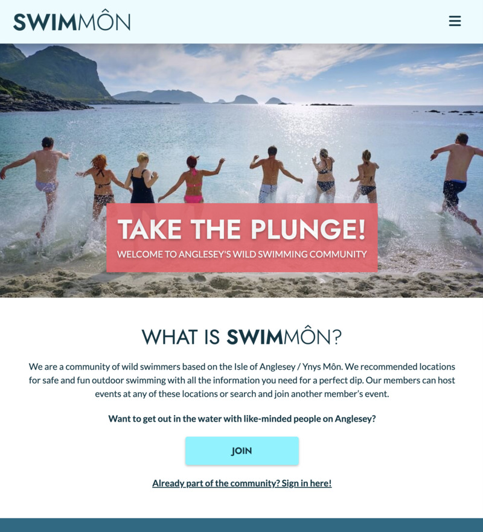
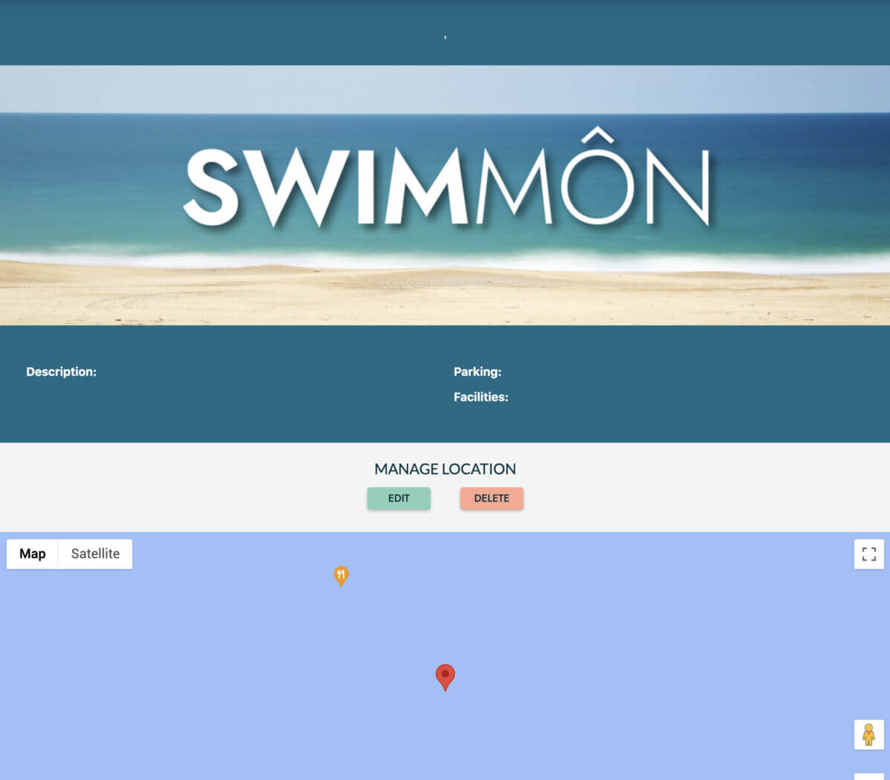

# SWIMMÔN Wild Swimming Events Website - Testing


This is the testing documentation for my web application: SWIMMÔN Wild Swimming Events Website. [Full README available here](README.md) 


The live Website can be found [here](https://swim-mon.herokuapp.com/).

---

## Table of Contents

- [Introduction](#introduction)
- [Validation](#validation)
    - [HTML Validation](#html-validation)
    - [CSS Validation](#css-validation)
    - [JavaScript Linting](#javascript-linting)
    - [Python Linting](#python-linting)
    - [Accessibility Testing](#accessibility)
    - [Performance Testing](#performance)
- [Feature Testing](#feature-testing)
    - [Responsiveness/Device Testing](#responsiveness--device-testing)
    - [Browser Compatibility](#browser-compatibility)
    - [Feature Testing Results](#feature-testing-results)
- [User Stories Testing](#user-stories-testing)
- [Bugs and Fixes](#bugs--fixes)


---


## Introduction

In my testing I developed a comprehensive testing plan to make sure that the site was functioning correctly. I used manual testing and automated validation to test the site. The site was tested throughout the process, both in the development and deployed version of the sites. All the test results detailed below are based on the [deployed site](https://emmahewson.github.io/mp2_travel_quiz/).

All information about any bugs encountered that were fixed or remain in the site can be found in the [README - Bugs & Fixes section](README.md/#bugs--fixes).

- - -


## Validation

### HTML Validation

I ran the code for all the pages through the [W3C HTML Validator](https://validator.w3.org/nu/). All pages passed the validation tests. For full results see the dropdowns below.


<details><summary>HTML Validation Results Table</summary>

| **Feature**      | **Expected Outcome**                  | **Test Performed**                            | **Result**                                                                                                | **Pass / Fail** |
|------------------|---------------------------------------|-----------------------------------------------|-----------------------------------------------------------------------------------------------------------|-----------------|
| HOME             | Page passes validation with no errors | Ran page through https://validator.w3.org/nu/ | 1 error - fix - type attribute removed from JavaScript Materialize script tag                             | PASS            |
| JOIN             | Page passes validation with no errors | Ran page through https://validator.w3.org/nu/ | No errors                                                                                                 | PASS            |
| SIGN IN          | Page passes validation with no errors | Ran page through https://validator.w3.org/nu/ | No errors                                                                                                 | PASS            |
| EVENTS           | Page passes validation with no errors | Ran page through https://validator.w3.org/nu/ | No errors                                                                                                 | PASS            |
| EVENT            | Page passes validation with no errors | Ran page through https://validator.w3.org/nu/ | No errors                                                                                                 | PASS            |
| ADD EVENT        | Page passes validation with no errors | Ran page through https://validator.w3.org/nu/ | No errors                                                                                                 | PASS            |
| EDIT EVENT       | Page passes validation with no errors | Ran page through https://validator.w3.org/nu/ | No errors                                                                                                 | PASS            |
| PROFILE          | Page passes validation with no errors | Ran page through https://validator.w3.org/nu/ | No errors                                                                                                 | PASS            |
| LOCATION         | Page passes validation with no errors | Ran page through https://validator.w3.org/nu/ | No errors                                                                                                 | PASS            |
| MANAGE LOCATIONS | Page passes validation with no errors | Ran page through https://validator.w3.org/nu/ | No errors                                                                                                 | PASS            |
| ADD LOCATION     | Page passes validation with no errors | Ran page through https://validator.w3.org/nu/ | Errors - stray </div> tag (removed) & character ref not closed with semi-colon (added). No errors remain. | PASS            |
| EDIT LOCATION    | Page passes validation with no errors | Ran page through https://validator.w3.org/nu/ | Errors - stray </div> tag (removed) & character ref not closed with semi-colon (added). No errors remain. | PASS            |
| 404              | Page passes validation with no errors | Ran page through https://validator.w3.org/nu/ | No errors                                                                                                 | PASS            |
| 413              | Page passes validation with no errors | Ran page through https://validator.w3.org/nu/ | No errors                                                                                                 | PASS            |
| 415              | Page passes validation with no errors | Ran page through https://validator.w3.org/nu/ | No errors                                                                                                 | PASS            |
| 500              | Page passes validation with no errors | Ran page through https://validator.w3.org/nu/ | No errors                                                                                                 | PASS            |


</details>


<details><summary>HTML Validation Results Screenshot</summary>


_Due to the site having user authentication & log in as well as using Jinja templating to build the page I had to test the HTML using the validator's text-input. Therefore all the results images look identical. Above is a sample of what all the results looked like._

</details>


- - -


### CSS Validation

I ran the CSS code through the [W3C CSS Validator](https://jigsaw.w3.org/css-validator/#validate_by_input). All code passed the validation tests. For full results see the dropdowns below.


<details><summary>CSS Validation Results Table</summary>

| **Feature**    | **Expected Outcome**                  | **Test Performed**                                   | **Result**                                                                                                              | **Pass / Fail** |
|----------------|---------------------------------------|------------------------------------------------------|-------------------------------------------------------------------------------------------------------------------------|-----------------|
| CSS Validation | Page passes validation with no errors | Ran CSS through https://jigsaw.w3.org/css-validator/ | Error on transform value on location picker map transition. Adjustments made to transform values (changed from % value to decimal) and CSS passed with no errors. | PASS            |


</details>


<details><summary>CSS Validation Results Screenshot</summary>


</details>


- - -

### JavaScript Linting

I ran the JavaScript code through [JSHint](https://jshint.com/). There were some minor errors & warnings which are detailed in the notes below. Based on the research done in to these errors, and the fact that they are mostly due to errors on the part of the validator or external code over which I have no control I have accepted them and marked the tests as passed for the purposes and scope of this project. For full results see the dropdowns below.


<details><summary>JavaScript Results Table</summary>

| **Feature**        | **Expected Outcome**                  | **Test Performed**                         | **Result**                                                                                                                          | **Pass / Fail** |
|--------------------|---------------------------------------|--------------------------------------------|-------------------------------------------------------------------------------------------------------------------------------------|-----------------|
| back.js            | Page passes validation with no errors | Ran JavaScript through https://jshint.com/ | Minor errors including missing semi-colons and undeclared variables. All fixed. No errors remaining                                 | PASS            |
| event-form.js      | Page passes validation with no errors | Ran JavaScript through https://jshint.com/ | Minor errors including missing semi-colons and undeclared variables. All fixed. No errors remaining                                 | PASS            |
| file-validation.js | Page passes validation with no errors | Ran JavaScript through https://jshint.com/ | Minor errors including missing semi-colons. All fixed. No errors remaining                                                          | PASS            |
| map-event.js       | Page passes validation with no errors | Ran JavaScript through https://jshint.com/ | Warnings about undefined/unused variables - all are called elsewhere by Google Maps API. No other errors.                           | PASS            |
| map-location.js    | Page passes validation with no errors | Ran JavaScript through https://jshint.com/ | Warnings about undefined/unused variables - all are called elsewhere by Google Maps API. No other errors.                           | PASS            |
| map-picker.js      | Page passes validation with no errors | Ran JavaScript through https://jshint.com/ | Fixed 1 spelling mistake. Warnings about undefined/unused variables - all are called elsewhere by Google Maps API. No other errors. | PASS            |
| map.js             | Page passes validation with no errors | Ran JavaScript through https://jshint.com/ | Warnings about undefined/unused variables - all are called elsewhere by Google Maps API. No other errors.                           | PASS            |
| popover.js         | Page passes validation with no errors | Ran JavaScript through https://jshint.com/ | Fixed 1 missing semi-colon. No errors remaining.                                                                                    | PASS            |
| script.js          | Page passes validation with no errors | Ran JavaScript through https://jshint.com/ | Fixed 1 missing semi-colon. No errors remaining.                                                                                    | PASS            |
| scroll-top.js      | Page passes validation with no errors | Ran JavaScript through https://jshint.com/ | Fixed 2 semi-colons. No errors remaining.                                                                                           | PASS            |
| search.js          | Page passes validation with no errors | Ran JavaScript through https://jshint.com/ | Minor errors including missing semi-colons and undeclared variables. All fixed. No errors remaining                                 | PASS            |


</details>


<details><summary>JavaScript Results Screenshots</summary>

<details><summary>back.js</summary>

</details>

<details><summary>event-form.js</summary>

</details>

<details><summary>file-validation.js</summary>

</details>

<details><summary>map-event.js</summary>

</details>

<details><summary>map-location.js</summary>

</details>

<details><summary>map-picker.js</summary>

</details>

<details><summary>map.js</summary>

</details>

<details><summary>no-events.js</summary>

</details>

<details><summary>no-locations.js</summary>

</details>

<details><summary>popover.js</summary>

</details>


<details><summary>script.js</summary>

</details>

<details><summary>scroll-top.js</summary>

</details>

<details><summary>search.js</summary>

</details>

</details>


- - -

### Python Linting

I ran the app.py code through [https://pep8ci.herokuapp.com/](https://pep8ci.herokuapp.com/) to check the Syntax. Code Anywhere also has a built in Python Linter which was used throughout the development process. All code passed the validation tests. For full results see the dropdowns below.


<details><summary>Python Results Table</summary>

| **Feature**    | **Expected Outcome**       | **Test Performed**                                             | **Result**                 | **Pass / Fail** |
|----------------|----------------------------|----------------------------------------------------------------|----------------------------|-----------------|
| Python Linting | Code passes with no errors | Ran app.py through https://pep8ci.herokuapp.com/ | Code passes with no errors | PASS            |


</details>


<details><summary>Python Results Screenshots</summary>


</details>


- - -


### Accessibility

I ran the site through the [Wave Web Accessibility Evaulation Tool](https://wave.webaim.org/). There were some minor errors & warnings which I was unable to rectify which are detailed in the notes below. Based on the research done in to these errors, and the fact that they are mostly due to errors on the part of the validator or external code over which I have no control I have accepted them and marked the tests as passed for the purposes and scope of this project. For full results see the dropdowns below.


<details><summary>Accessibility Results Table</summary>

| **Feature**      | **Expected Outcome**                  | **Test Performed**                        | **Results - Fixed**                                                                                                                                | **Results - issues remaining (see notes)**                                   | **Pass / Fail** |
|------------------|---------------------------------------|-------------------------------------------|----------------------------------------------------------------------------------------------------------------------------------------------------|------------------------------------------------------------------------------|-----------------|
| HOME             | Page passes validation with no errors | Ran page through https://wave.webaim.org/ | Contrast error (increased contrast of pink elements across site)                                                                                   | Recurring warnings. Map errors/warnings.                                     | PASS            |
| JOIN             | Page passes validation with no errors | Ran page through https://wave.webaim.org/ | No Errors                                                                                                                                          | Recurring warnings.                                                          | PASS            |
| SIGN IN          | Page passes validation with no errors | Ran page through https://wave.webaim.org/ | No Errors                                                                                                                                          | Recurring warnings.                                                          | PASS            |
| EVENTS           | Page passes validation with no errors | Ran page through https://wave.webaim.org/ | Contrast errors: increased contrast of edit/delete buttons across site. Same-page link warnings on modal close: replaced a element with p element. | Recurring warnings.                                                          | PASS            |
| EVENT            | Page passes validation with no errors | Ran page through https://wave.webaim.org/ | Warning - suspicious alt text: removed 'image of' text in alt description                                                                          | Recurring warnings. Map errors/warnings.                                     | PASS            |
| ADD EVENT        | Page passes validation with no errors | Ran page through https://wave.webaim.org/ | Timepicker empty button error:  reinstated clear button                                                                                            | Recurring warnings.  Dropdown select menu label error. Datepicker Tab index. | PASS            |
| EDIT EVENT       | Page passes validation with no errors | Ran page through https://wave.webaim.org/ | Timepicker empty button error:  reinstated clear button                                                                                            | Recurring warnings. Dropdown select menu label error. Datepicker Tab index.  | PASS            |
| PROFILE          | Page passes validation with no errors | Ran page through https://wave.webaim.org/ | Empty link on cards: added sr-only text to empty links. Warning - suspicious alt text: removed 'image of' text in alt description.                 | Recurring warnings.                                                          | PASS            |
| LOCATION         | Page passes validation with no errors | Ran page through https://wave.webaim.org/ | Empty link on cards: added sr-only text to empty links. Warning - suspicious alt text: removed 'image of' text in alt description.                 | Recurring warnings. Map errors/warnings.                                     | PASS            |
| MANAGE LOCATIONS | Page passes validation with no errors | Ran page through https://wave.webaim.org/ | Empty link on cards: added sr-only text to empty links. Warning - suspicious alt text: removed 'image of' text in alt description.                 | Recurring warnings.                                                          | PASS            |
| ADD LOCATION     | Page passes validation with no errors | Ran page through https://wave.webaim.org/ | N/A                                                                                                                                                | Recurring warnings. Map errors/warnings.                                     | PASS            |
| EDIT LOCATION    | Page passes validation with no errors | Ran page through https://wave.webaim.org/ | N/a                                                                                                                                                | Recurring warnings. Map errors/warnings.                                     | PASS            |
| Error Pages x4   | Pages pass validation with no errors  | Ran page through https://wave.webaim.org/ | No Errors                                                                                                                                          | Recurring warnings.                                                          | PASS            |


</details>


<details><summary>Accessibility Results Screenshots</summary>


<details><summary>HOME</summary>

</details>

<details><summary>JOIN</summary>

</details>

<details><summary>SIGN-IN</summary>

</details>

<details><summary>PROFILE</summary>

</details>

<details><summary>EVENTS</summary>

</details>

<details><summary>EVENT</summary>

</details>

<details><summary>ADD-EVENT</summary>

</details>

<details><summary>EDIT-EVENT</summary>

</details>

<details><summary>LOCATION</summary>

</details>

<details><summary>MANAGE LOCATIONS</summary>

</details>

<details><summary>ADD-LOCATION</summary>

</details>

<details><summary>EDIT-LOCATION</summary>

</details>

<details><summary>ERROR</summary>

</details>

</details>


__Notes on Accessibility Results__

There were a number of errors and warnings highlighted by the validation process. Many of these I was able to fix and the details of those are in the table. However a number of these were issues stemming from either Materialize or from Google Maps API which I have been unable to remedy as these are external resources. There were also a couple of recurring warnings which I was able to safely disregard.

__Recurring Warnings__

Wave threw up a couple of minor warnings on every page which linked to to the nav & the footer:
- Underlined Text: the email link in the footer threw up a warning that underlined text indicated a link, however as this text was in fact a link no warning was necessary and I disregarded it.
- Redundant Link: a warning about 2 adjacent items in the nav link going to the same place, in this case the logo and the first nav item, as this was my intention I disregarded this warning.


__Google Map Errors/Warnings__

Google Maps threw up a number of errors and warnings in the accessibility checks. These were:
- Error - Image map area missing alternative text:
    - I researched what was causing this and it is a consistent error on Google Maps that has no known fix that wouldn't in fact make the map less accessible. Because of this I have left the site as it is and the accessibility flagged error remains. More information here: https://stackoverflow.com/questions/59326196/google-map-missing-alt-of-image-causing-lower-accessibility
- Warnings - various, including orphaned form label, very small text, redundant title text, layout table
    - I am unable to make any changes to counteract these warnings as they all relate to Google Maps' own styling and layout and as they are only warnings and not errors I have left the map as it is.

__Error: Label for Dropdown Menu on Forms__

On the forms containing dropdown menus Wave threw up an error about there not being an associated label for the input. However I had included a label with a matching 'for' attribute. Looking in to this problem further I discovered that the issue was caused by the Materialize JavaScript code creating a new input element when it populated the dropdown. Unfortunately in order to fix this I would have to re-write the entire code for the dropdown from scratch and so I was unable to fix this error. [See Bug 13 - No label for select dropdown menus on forms - Links to README](README.md/#13-accessibility---no-label-for-select-dropdown-menus-on-forms)

__Datepicker Tab Index__

The Materialize Datepicker has a tab index which threw a warning on Wave. However as this was a warning and not an error I decided to leave it as it was rather than trying to rebuild the whole Datepicker.

- - -


### Performance

I ran the site through Google Chrome Dev Tools' Lighthouse to check on its performance scores. All pages passed the validation tests. For full results see the dropdowns below.


<details><summary>Lighthouse Results Table</summary>

| **Feature**      | **Expected Outcome**                                                | **Test Performed**                                 | **Result**     | **Pass / Fail** |
|------------------|---------------------------------------------------------------------|----------------------------------------------------|----------------|-----------------|
| HOME             | Page get acceptable performance scores with no major flagged issues | Ran page through Chrome Dev Tools Lighthouse tests | All scores 90+ | PASS            |
| JOIN             | Page get acceptable performance scores with no major flagged issues | Ran page through Chrome Dev Tools Lighthouse tests | All scores 90+ | PASS            |
| SIGN IN          | Page get acceptable performance scores with no major flagged issues | Ran page through Chrome Dev Tools Lighthouse tests | All scores 90+ | PASS            |
| EVENTS           | Page get acceptable performance scores with no major flagged issues | Ran page through Chrome Dev Tools Lighthouse tests | All scores 90+ | PASS            |
| EVENT            | Page get acceptable performance scores with no major flagged issues | Ran page through Chrome Dev Tools Lighthouse tests | All scores 90+ | PASS            |
| ADD EVENT        | Page get acceptable performance scores with no major flagged issues | Ran page through Chrome Dev Tools Lighthouse tests | All scores 90+ | PASS            |
| EDIT EVENT       | Page get acceptable performance scores with no major flagged issues | Ran page through Chrome Dev Tools Lighthouse tests | All scores 90+ | PASS            |
| PROFILE          | Page get acceptable performance scores with no major flagged issues | Ran page through Chrome Dev Tools Lighthouse tests | All scores 90+ | PASS            |
| LOCATION         | Page get acceptable performance scores with no major flagged issues | Ran page through Chrome Dev Tools Lighthouse tests | All scores 90+ | PASS            |
| MANAGE LOCATIONS | Page get acceptable performance scores with no major flagged issues | Ran page through Chrome Dev Tools Lighthouse tests | All scores 90+ | PASS            |
| ADD LOCATION     | Page get acceptable performance scores with no major flagged issues | Ran page through Chrome Dev Tools Lighthouse tests | All scores 90+ | PASS            |
| EDIT LOCATION    | Page get acceptable performance scores with no major flagged issues | Ran page through Chrome Dev Tools Lighthouse tests | All scores 90+ | PASS            |


</details>


<details><summary>Lighthouse Results Screenshots</summary>

<details><summary>HOME</summary>

</details>

<details><summary>JOIN</summary>

</details>

<details><summary>SIGN-IN</summary>

</details>

<details><summary>PROFILE</summary>

</details>

<details><summary>EVENTS</summary>

</details>

<details><summary>EVENT</summary>

</details>

<details><summary>ADD-EVENT</summary>

</details>

<details><summary>EDIT-EVENT</summary>

</details>

<details><summary>LOCATION</summary>

</details>

<details><summary>MANAGE LOCATIONS</summary>

</details>

<details><summary>ADD-LOCATION</summary>

</details>

<details><summary>EDIT-LOCATION</summary>

</details>

</details>


- - -

## Feature Testing

The whole site and all its features were tested thoroughly throughout the development process and at the end of development. This testing covered content, style, interactive feature functionality as well as making sure all backend processes worked as expected including testing of all CRUD functionality and routing.

### **Responsiveness / Device Testing**

The site was tested on the following devices
* Apple Macbook Pro 16inch
* LG Ultrafine Display 27inch External Monitor
* Apple iMac 5K 27-inch
* Apple iPhone SE 2020
* Apple iPhone SE 2022
* Google Chrome Developer Tools - simulator for all different device options as well as using the adjustable sizing options

### **Browser Compatibility**

The site was tested on the following browsers.
* Google Chrome
* Mozilla Firefox
* Apple Safari

#### **Links to Bugs found specific to device & browser testing**

* [Materialize Dropdown not working correctly on iPhone - Links to README](README.md/#14-materialize-select-dropdown-on-iphone)

__ __

### **Feature Testing Results**


<details><summary>WHOLE SITE (base.html)</summary>

| **Feature**                    | **Expected Outcome**                                                                                                 | **Test Performed**                                                                                        | **Result**  | **Pass / Fail** |
|--------------------------------|----------------------------------------------------------------------------------------------------------------------|-----------------------------------------------------------------------------------------------------------|-------------|-----------------|
| Site width                     | Max width 1750px with blue background                                                                                | Expand window & use dev tools to check size                                                               | As expected | PASS            |
| Favicon                        | Appears in browser tab                                                                                               | Check favicon appears in multiple browsers                                                                | As expected | PASS            |
| Navbar - contents              | Contains logo and nav links. All links lead to correct pages.                                                        | Check nav contents. Click on all links.                                                                   | As expected | PASS            |
| Navbar - dropdown              | Account dropdown is clickable and displays nav links                                                                 | Click on dropdown menu & dropdown links                                                                   | As expected | PASS            |
| Navbar - sticky                | Stays at the top of the browser page                                                                                 | Scroll to bottom of page                                                                                  | As expected | PASS            |
| Navbar - logo                  | Clickable and links to homepage                                                                                      | Click on logo                                                                                             | As expected | PASS            |
| Navbar - hover                 | Hover effect with transition                                                                                         | Hover over nav links                                                                                      | As expected | PASS            |
| Navbar - responsive            | On smaller devices nav links change to a burger menu which is clickable and contains a side nav containing all links | Use dev tools to simulate smaller screen & check on mobile devices. Click on burger menu & dropdown links | As expected | PASS            |
| Navbar - logged out            | "Visible links: Home, Join, Sign In"                                                                                 | Sign out of site & check nav bar                                                                          | As expected | PASS            |
| Navbar - logged in (non-admin) | "Visible links: Home, Events, Add Event, Profile, Sign Out"                                                          | Sign in to site as non-admin & check nav bar                                                              | As expected | PASS            |
| Navbar - logged in (admin)     | "Visible links: Home, Events, Add Event, Manage Locations, Profile, Sign Out"                                        | Sign in to site as admin & check nav bar                                                                  | As expected | PASS            |
| Footer - contents              | "Contains email link, social icons, name & copyright, disclaimer text"                                               | Check footer on all pages                                                                                 | As expected | PASS            |
| Footer - responsive            | Contents stack on smaller devices & margins adjust                                                                   | Use dev tools to simulate different screen sizes & check on smaller devices                               | As expected | PASS            |
| Footer - email link            | Click opens email to site email address                                                                              | Click on link                                                                                             | As expected | PASS            |
| Footer - year                  | Displays the current year                                                                                            | Check footer contents & original code to check it is being set with JavaScript                            | As expected | PASS            |
| Footer - social links          | Open correct pages in separate tab                                                                                   | Click on links                                                                                            | As expected | PASS            |
| Footer - social links          | Hover effect with transition                                                                                         | Hover over links                                                                                          | As expected | PASS            |


</details>

<details><summary>HOME</summary>

| **Feature**                   | **Expected Outcome**                                                                                    | **Test Performed**                                                                                               | **Result**   | **Pass / Fail** |
|-------------------------------|---------------------------------------------------------------------------------------------------------|------------------------------------------------------------------------------------------------------------------|--------------|-----------------|
| Console Errors                | No console errors appear                                                                                | Leave console open whilst checking the page                                                                      | As expected. | PASS            |
| Page Contents                 | "Hero section, 'what is' section, locations intro text & map appear correctly"                          | Scroll down page & check contents                                                                                | As expected  | PASS            |
| Responsiveness                | All page contents are fully responsive on all standard screen sizes                                     | Using dev tools and small devices check page contents.                                                           | As expected  | PASS            |
| Hero Section                  | "Loads, is fully visible & contains pink text box with correct contents"                                | Load page and check contents                                                                                     | As expected  | PASS            |
| Hero Image - sizes            | Correct size of image loads on different screen sizes                                                   | Use dev tools to change device size & inspect elements                                                           | As expected  | PASS            |
| WHAT IS SWIMMÔN? - logged out | Correct content appears: Join button & link to sign-in                                                  | Sign out & load page                                                                                             | As expected  | PASS            |
| WHAT IS SWIMMÔN? - logged in  | Correct content appears: See Events button & link to add-events                                         | Sign in & load page                                                                                              | As expected  | PASS            |
| WHAT IS SWIMMÔN?              | All buttons and links go to correct pages                                                               | Click on links when signed in & signed out                                                                       | As expected  | PASS            |
| Map                           | Calls the API correctly with no errors                                                                  | Load the page & scroll down to map                                                                               | As expected  | PASS            |
| Map                           | Zoom level is correct for different screen sizes to show the whole of Anglesey                          | Load page on different screen sizes and devices                                                                  | As expected  | PASS            |
| Map                           | Shows the correct location                                                                              | Load page and scroll down to map                                                                                 | As expected  | PASS            |
| Map                           | "All Google Maps inbuilt functionality works correctly (zoom, street view, full screen, map/satellite)" | "Click on layers, full screen button, zoom controls. Drag street view man on to map. Drag zoom & pan on mobile." | As expected  | PASS            |
| Map - Markers                 | Shows markers of all locations in database in correct locations                                         | Check database locations collection and compare with map markers.                                                | As expected  | PASS            |
| Map - InfoWindow              | Markers are clickable and open InfoWindow with correct content                                          | Click on markers                                                                                                 | As expected  | PASS            |
| Map - InfoWindow              | Map Scrolls to show full InfoWindow                                                                     | Click on markers                                                                                                 | As expected  | PASS            |
| Map - InfoWindow              | Other InfoWindows close on marker click                                                                 | Click on multiple markers                                                                                        | As expected  | PASS            |
| Map - InfoWindow              | Info window closes when clicking on cross or clicking outside window                                    | Click on info window cross & outside info window                                                                 | As expected  | PASS            |
| Map - InfoWindow              | Hover effect on InfoWindow works correctly                                                              | Hover over info windows                                                                                          | As expected  | PASS            |
| Map - InfoWindow              | Clicking on InfoWindow leads to correct location page                                                   | Click on multiple info windows & check page contents                                                             | As expected  | PASS            |


</details>

<details><summary>JOIN</summary>

| **Feature**                           | **Expected Outcome**                                                                       | **Test Performed**                                                                                    | **Result**  | **Pass / Fail** |
|---------------------------------------|--------------------------------------------------------------------------------------------|-------------------------------------------------------------------------------------------------------|-------------|-----------------|
| Console Errors                        | No console errors appear                                                                   | Leave console open whilst checking the page                                                           | As expected | PASS            |
| Page Contents                         | "Intro text, form & link appear correctly"                                                 | Scroll down page & check contents                                                                     | As expected | PASS            |
| Responsiveness                        | All page contents are fully responsive on all standard screen sizes                        | Using dev tools and small devices check page contents.                                                | As expected | PASS            |
| Form                                  | "Contains 3 inputs - Username, Password & Repeat password. All can be edited by the user." | Check contents and type in inputs                                                                     | As expected | PASS            |
| Top input field                       | Top input is automatically 'focused' on page load                                          | Load page and type without selecting input                                                            | As expected | PASS            |
| All Inputs                            | Input can only be 5-15 letters/numbers                                                     | Type number of characters outside of range & attempt to submit                                        | As expected | PASS            |
| Form Validation                       | Validation styling appears correctly                                                       | "Type an invalid username / password, then a valid one"                                               | As expected | PASS            |
| Form Button                           | Has hover effect with transition & contains appropriate text                               | Hover on button & check contents                                                                      | As expected | PASS            |
| Submission - empty/incorrect contents | Form cannot be submitted with empty inputs or forbidden characters                         | Attempt to submit form with empty inputs & incorrect characters                                       | As expected | PASS            |
| Submission - Mismatched Passwords     | No user created & flash message displays                                                   | Input mismatched passwords. Check flash message & check new user hasn't been created in the database. | As expected | PASS            |
| Submission - Username already exists  | No user created & flash message                                                            | Input existing user data. Check new user hasn't been created in the database                          | As expected | PASS            |
| Submission - successful               | User is added to session cookie                                                            | Submit valid form & check 'application' tab on Dev Tools for session exists in the 'cookies' item.    | As expected | PASS            |
| Submission - successful               | Flash message displays correctly                                                           | Submit valid form                                                                                     | As expected | PASS            |
| Submission - successful               | Redirects to 'Events' page                                                                 | Submit valid form                                                                                     | As expected | PASS            |
| Submission - successful               | New user is added to users                                                                 | Check users collection in database                                                                    | As expected | PASS            |
| Submission - successful               | Password is hashed and not readable                                                        | Check password in new user in users collection in database                                            | As expected | PASS            |
| Sign In Link                          | Leads to sign in page                                                                      | Click on link                                                                                         | As expected | PASS            |


</details>

<details><summary>SIGN IN</summary>

| **Feature**                                     | **Expected Outcome**                                                                             | **Test Performed**                                                                                                        | **Result**  | **Pass / Fail** |
|-------------------------------------------------|--------------------------------------------------------------------------------------------------|---------------------------------------------------------------------------------------------------------------------------|-------------|-----------------|
| Console Errors                                  | No console errors appear                                                                         | Leave console open whilst checking the page                                                                               | As expected | PASS            |
| Page Contents                                   | "Intro text, form & link appear correctly"                                                       | Scroll down page & check contents                                                                                         | As expected | PASS            |
| Responsiveness                                  | All page contents are fully responsive on all standard screen sizes                              | Using dev tools and small devices check page contents.                                                                    | As expected | PASS            |
| Form                                            | Contains 2 inputs - Username & Password                                                          | Check contents and type in inputs                                                                                         | As expected | PASS            |
| All Inputs                                      | Input can only be 5-15 letters/numbers                                                           | Type number of characters outside of range & attempt to submit                                                            | As expected | PASS            |
| Form Validation                                 | Validation styling appears correctly                                                             | "Type an invalid username / password, then a valid one"                                                                   | As expected | PASS            |
| Form Button                                     | Has hover effect with transition & contains appropriate text                                     | Hover over button                                                                                                         | As expected | PASS            |
| Attempted Submission - empty/incorrect contents | Form cannot be submitted with empty inputs or forbidden characters                               | Attempt to submit form with empty inputs & incorrect characters                                                           | As expected | PASS            |
| Submission - Username doesn't exist             | User not logged in & flash message                                                               | Attempt to submit with a non-existent username. Check session cookie doesn't exist.                                       | As expected | PASS            |
| Submission - Username & password don't match    | User not logged in & flash message                                                               | Attempt to submit with a mismatched username & password. Check session cookie doesn't exist.                              | As expected | PASS            |
| Submission - successful                         | User is added to session cookie                                                                  | Submit valid form & check 'application' tab on Dev Tools for session exists in the 'cookies' item.                        | As expected | PASS            |
| Submission - successful                         | Flash message displays correctly                                                                 | Submit valid form                                                                                                         | As expected | PASS            |
| Submission - successful                         | Redirects to 'Profile' page or to page that user attempted to visit previously whilst signed out | Submit valid form. Attempt to visit other sites  (for logged in users only) by inputting URL in manually and then log in. | As expected | PASS            |
| Join Link                                       | Leads to join page                                                                               | Click on link                                                                                                             | As expected | PASS            |


</details>

<details><summary>SIGN OUT</summary>

| **Feature**             | **Expected Outcome**                                                                                       | **Test Performed**                                                                                      | **Result**  | **Pass / Fail** |
|-------------------------|------------------------------------------------------------------------------------------------------------|---------------------------------------------------------------------------------------------------------|-------------|-----------------|
| Routing tests - sign in | Attempting to visit this page when logged out will redirect user to 'sign in' page. Flash message appears. | Attempt to visit by direct URL input.                                                                   | As expected | PASS            |
| Sign Out                | Removes user from session cookie                                                                           | Sign out & check 'application' tab on Dev Tools for session exists in the 'cookies' item.               | As expected | PASS            |
| Sign Out                | Removes any url value from session cookie                                                                  | Visit 'event' page to store page in session cookie. Sign out and check 'cookies' item has been removed. | As expected | PASS            |
| Sign Out                | Flash message displays correctly                                                                           | Sign out of site                                                                                        | As expected | PASS            |
| Sign Out                | Redirects to sign-in                                                                                       | Sign out of site                                                                                        | As expected | PASS            |


</details>

<details><summary>EVENTS</summary>

| **Feature**                | **Expected Outcome**                                                                                                                                              | **Test Performed**                                                                                     | **Result**  | **Pass / Fail** |
|----------------------------|-------------------------------------------------------------------------------------------------------------------------------------------------------------------|--------------------------------------------------------------------------------------------------------|-------------|-----------------|
| Console Errors             | No console errors appear                                                                                                                                          | Leave console open whilst checking the page                                                            | As expected | PASS            |
| Routing tests - sign in    | Attempting to visit this page when logged out will redirect user to 'sign in' page. Flash message shows. After sign in user is redirected back here.              | Sign out of site and attempt to visit page. Then sign in.                                              | As expected | PASS            |
| Routing tests - edit       | After editing event (when edit-event is accessed via this page) user is redirected back here.                                                                     | Click on edit event from this page & submit form.                                                      | As expected | PASS            |
| Routing tests - delete     | After deleting event (when delete-event is accessed via this page) user is redirected back here                                                                   | Create test event. Click on delete event from this page & 'delete' on modal.                           | As expected | PASS            |
| Page Contents              | "Intro text, search filters, event cards & back to top button appear correctly"                                                                                   | Scroll down page & check contents                                                                      | As expected | PASS            |
| Responsiveness             | All page contents are fully responsive on all standard screen sizes                                                                                               | Using dev tools and small devices check page contents.                                                 | As expected | PASS            |
| Add Event Button           | Hover effect with transition                                                                                                                                      | Hover over button                                                                                      | As expected | PASS            |
| Add Event Button           | Links to Add Event Page                                                                                                                                           | Click on link                                                                                          | As expected | PASS            |
| Event Cards                | Event cards show all events in the database with a date/time from current date/time onwards                                                                       | Compare event cards to events on database. Check that they're all in the future.                       | As expected | PASS            |
| Event Cards - no results   | No results' & link display if no results are found                                                                                                                | Add temporary filter to database find request that will return no results e.g. {“name”: “fake-name”}   | As expected | PASS            |
| Event Cards - no results   | Link goes to 'add-event' page                                                                                                                                     | click on link                                                                                          | As expected | PASS            |
| Event Cards                | Cards stack and display correctly on smaller devices                                                                                                              | Check cards on dev tools and small devices                                                             | As expected | PASS            |
| Event Cards - order        | In ascending chronological order                                                                                                                                  | Check dates on cards                                                                                   | As expected | PASS            |
| Event Cards - contents     | Contain the correct event information to match events on database                                                                                                 | Compare database and card contents                                                                     | As expected | PASS            |
| Event Cards - contents     | Contain the correct location information & image to match relevant location on database                                                                           | Compare database and card contents                                                                     | As expected | PASS            |
| Event Cards - image        | Any missing images are replaced with placeholder image                                                                                                            | Temporarily change an image url on the database to one that will return no image.                      | As expected | PASS            |
| Event Cards - link         | Hover effect with transition on image & info section                                                                                                              | Hover over cards                                                                                       | As expected | PASS            |
| Event Cards - link         | Clickable and link to correct event page                                                                                                                          | Click on a random selection of cards                                                                   | As expected | PASS            |
| Event Cards - Date/Time    | In DD/MM/YY & HH:MM AM/PM format                                                                                                                                  | Scroll through cards                                                                                   | As expected | PASS            |
| Event Cards - Categories   | Who-for & challenge have correct colour backgrounds                                                                                                               | Scroll through cards                                                                                   | As expected | PASS            |
| Event Cards - Edit/Delete  | Buttons are only visible to event creator / admin                                                                                                                 | "Sign in as a non-admin user, create event, sign in as a different user. Sign in as admin."            | As expected | PASS            |
| Event Cards - Edit/Delete  | Hover effect with transition                                                                                                                                      | Hover over buttons                                                                                     | As expected | PASS            |
| Event Cards - Edit         | Links to Edit Event page & populates form with that card's event's details                                                                                        | Click on 'edit' button & compare contents                                                              | As expected | PASS            |
| Event Cards - Delete       | Triggers confirmation modal                                                                                                                                       | Click on 'delete'                                                                                      | As expected | PASS            |
| Event Cards - Delete Modal | "Has correct contents (Text, cancel button, delete button, dark background) and animates on"                                                                      | Click on 'delete'                                                                                      | As expected | PASS            |
| Event Cards - Delete Modal | Cancel button closes modal and doesn't delete event                                                                                                               | Click on 'delete' then 'cancel' - check page still exists & database collection contains this event    | As expected | PASS            |
| Event Cards - Delete Modal | Clicking outside modal closes modal and doesn't delete event                                                                                                      | Click on 'delete' then outside box - check page still exists & database collection contains this event | As expected | PASS            |
| Event Cards - Delete Modal | Delete button triggers delete event functionality for this event                                                                                                  | Create test event. Click on 'delete' then 'delete'                                                     | As expected | PASS            |
| Filters - collapsible      | Collapsible is closed on page load                                                                                                                                | Load page                                                                                              | As expected | PASS            |
| Filters - title            | “Filter by” text has hover effect with transition                                                                                                                 | Hover over text                                                                                        | As expected | PASS            |
| Filters - title            | Clicking when closed triggers collapsible open (animated)                                                                                                         | Click on text when closed                                                                              | As expected | PASS            |
| Filters - title            | Clicking when open triggers collapsible close (animated)                                                                                                          | Click on text when open                                                                                | As expected | PASS            |
| Filters - collapsible      | "Contains all location, who-for & challenge buttons to match the database collections & 'reset all' button"                                                       | Compare buttons against database collections                                                           | As expected | PASS            |
| Filters - buttons          | Hover effect with transition (disabled on non-hover devices)                                                                                                      | Hover over buttons & check on non-hover devices                                                        | As expected | PASS            |
| Filters - buttons          | Click toggles colour to indicate button is 'selected' or 'deselected'                                                                                             | Click on buttons multiple times                                                                        | As expected | PASS            |
| Filters - buttons          | Triggers event filtering                                                                                                                                          | Click on any filter button & check card results                                                        | As expected | PASS            |
| Filters - buttons          | Selecting a single button in a category shows events that match only that button                                                                                  | Click on a button in a single category & check results                                                 | As expected | PASS            |
| Filters - buttons          | Selecting multiple buttons in a category shows events that match either of those buttons                                                                          | Click on multiple button in a single category & check results                                          | As expected | PASS            |
| Filters - buttons          | Selecting buttons in 2 categories shows events that match one of the selected buttons in each 'active' category but any button in the remaining inactive category | Click on buttons in 2 categories & check results                                                       | As expected | PASS            |
| Filters - buttons          | Selecting buttons in 3 categories shows events that match one of the selected buttons in each category                                                            | Click on buttons in 3 categories & check results                                                       | As expected | PASS            |
| Filters - buttons          | Deselecting buttons removes that filter from the search results                                                                                                   | Set some filters then deselect a button & check results                                                | As expected | PASS            |
| Filters - buttons          | Deselecting all buttons makes all the event reappear                                                                                                              | Deselect all buttons & check results                                                                   | As expected | PASS            |
| Filters - no results       | If there are no results text appears in the cards container to indicate this                                                                                      | Select filters than produce no results                                                                 | As expected | PASS            |
| Filters - reset all button | Hover effect with transition                                                                                                                                      | Hover over button                                                                                      | As expected | PASS            |
| Filters - reset all button | Removes 'selected' colour from all buttons and all event cards reappear                                                                                           | Click on button                                                                                        | As expected | PASS            |
| Back to Top Button         | Hover effect with transition                                                                                                                                      | Hover over button                                                                                      | As expected | PASS            |
| Back to Top Button         | Triggers smooth scroll to the top of the page                                                                                                                     | Click on button                                                                                        | As expected | PASS            |


</details>

<details><summary>EVENT</summary>

| **Feature**                                 | **Expected Outcome**                                                                                                                                           | **Test Performed**                                                                                               | **Result**  | **Pass / Fail** |
|---------------------------------------------|----------------------------------------------------------------------------------------------------------------------------------------------------------------|------------------------------------------------------------------------------------------------------------------|-------------|-----------------|
| Console Errors                              | No console errors appear                                                                                                                                       | Leave console open whilst checking the page                                                                      | As expected | PASS            |
| Routing tests - sign in                     | Attempting to visit this page when logged out will redirect user to 'sign in' page. Flash message shows. After sign in user is redirected back here.           | Sign out of site and attempt to visit page. Then sign in.                                                        | As expected | PASS            |
| Routing tests - edit                        | After editing event (when edit-event is accessed via this page) user is redirected back here                                                                   | Click on edit event from this page & submit form.                                                                | As expected | PASS            |
| Routing tests - delete                      | Delete button redirects to the 'events' page                                                                                                                   | Create test event. Click on delete event from this page & 'delete' on modal.                                     | As expected | PASS            |
| Routing tests - database returns no results | If attempting to visit page with an event id that doesn't exist site will abort & reroute to 404 page with a flash message                                                          | Add fake id number to URL & attempt to visit page                                                                | As expected | PASS            |
| URL                                         | Page URL ends in event/<event_id>                                                                                                                              | Check URL against database object                                                                                | As expected | PASS            |
| Page Contents                               | "Location header image, event info, location info, location map, link to location page & manage event buttons (event creator/admin only) all appear correctly" | Scroll down page & check contents                                                                                | As expected | PASS            |
| Responsiveness                              | All page contents are fully responsive on all standard screen sizes                                                                                            | Using dev tools and small devices check page contents.                                                           | As expected | PASS            |
| Layout                                      | Page content width is limited to 1200px                                                                                                                        | Check on wide browser window & inspect with dev tools                                                            | As expected | PASS            |
| Header Image                                | Matches the event's location                                                                                                                                   | Compare to object on database                                                                                    | As expected | PASS            |
| Header Image                                | A missing image is replaced with placeholder image                                                                                                             | Temporarily change an image url on the database to one that will return no image.                                | As expected | PASS            |
| Event info - contents                       | Contains correct event content and matches the event content in the database                                                                                   | Compare to object on database                                                                                    | As expected | PASS            |
| Event Cards - Date/Time                     | In DD/MM/YY & HH:MM AM/PM format                                                                                                                               | Check date / time contents                                                                                       | As expected | PASS            |
| Event Cards - Categories                    | Who-for & challenge have correct colour backgrounds                                                                                                            | Check category contents                                                                                          | As expected | PASS            |
| Location info                               | "On smaller screens contents of location info stack in reverse order (text at top, map at bottom)"                                                             | Check using dev tools & on small devices                                                                         | As expected | PASS            |
| Location info - contents                    | Contains correct location content and matches the correct location for the event in the database                                                               | Compare to object on database                                                                                    | As expected | PASS            |
| Location info - co-ordinates                | Truncated to 6 decimal places                                                                                                                                  | Check co-ordinate contents                                                                                       | As expected | PASS            |
| Location info - link                        | Hover effect with transition                                                                                                                                   | Hover over link                                                                                                  | As expected | PASS            |
| Location info - link                        | Links to the correct location page                                                                                                                             | "Click on link, compare contents"                                                                                | As expected | PASS            |
| Location info - map                         | Calls the API correctly with no errors                                                                                                                         | Load page & check console/contents                                                                               | As expected | PASS            |
| Location info - map                         | Shows the correct location & zoom level                                                                                                                        | Compare map to location information. Check on different devices & using dev tools.                               | As expected | PASS            |
| Location info - map                         | "All Google Maps inbuilt functionality works correctly (zoom, street view, full screen, map/satellite)"                                                        | "Click on layers, full screen button, zoom controls. Drag street view man on to map. Drag zoom & pan on mobile." | As expected | PASS            |
| Edit/Delete Buttons                         | Buttons are only visible to event creator / admin                                                                                                              | "Sign in as non-admin, view event created by another user, view own event. Sign in as admin."                    | As expected | PASS            |
| Edit/Delete Buttons                         | Hover effect with transition                                                                                                                                   | Hover over buttons                                                                                               | As expected | PASS            |
| Edit Button                                 | Links to Edit Event page & populates form with this event's details                                                                                            | Click on 'edit event' button & compare contents                                                                  | As expected | PASS            |
| Delete Button                               | Triggers confirmation modal                                                                                                                                    | Click on 'delete'                                                                                                | As expected | PASS            |
| Delete Modal                                | "Has correct contents (Text, cancel button, delete button, dark background) and animates on"                                                                   | Click on 'delete'                                                                                                | As expected | PASS            |
| Delete Modal                                | Cancel button closes modal and doesn't delete event                                                                                                            | Click on 'delete' then 'cancel' - check page still exists & database collection contains this event              | As expected | PASS            |
| Delete Modal                                | Clicking outside modal closes modal and doesn't delete event                                                                                                   | Click on 'delete' then outside box - check page still exists & database collection contains this event           | As expected | PASS            |
| Delete Modal                                | Delete button triggers delete event functionality for this event                                                                                               | Create test event. Click on 'delete event' then 'delete'                                                         | As expected | PASS            |


</details>

<details><summary>ADD EVENT</summary>

| **Feature**                           | **Expected Outcome**                                                                                                                                                     | **Test Performed**                                                                                                                                                       | **Result**                                                                                                                                                                                                          | **Pass / Fail** |
|---------------------------------------|--------------------------------------------------------------------------------------------------------------------------------------------------------------------------|--------------------------------------------------------------------------------------------------------------------------------------------------------------------------|---------------------------------------------------------------------------------------------------------------------------------------------------------------------------------------------------------------------|-----------------|
| Console Errors                        | No console errors appear                                                                                                                                                 | Leave console open whilst checking the page                                                                                                                              | As expected                                                                                                                                                                                                         | PASS            |
| Routing tests - sign in               | Attempting to visit this page when logged out will redirect user to 'sign in' page. Flash message shows. After sign in user is redirected back here.                     | Sign out of site and attempt to visit page. Then sign in.                                                                                                                | As expected                                                                                                                                                                                                         | PASS            |
| Routing tests - form submission       | Redirects to 'Events' page                                                                                                                                               | Submit valid form.                                                                                                                                                       | As expected                                                                                                                                                                                                         | PASS            |
| Page Contents                         | Intro text & form appear correctly                                                                                                                                       | Scroll down page & check contents                                                                                                                                        | As expected                                                                                                                                                                                                         | PASS            |
| Responsiveness                        | All page contents are fully responsive on all standard screen sizes                                                                                                      | Using dev tools and small devices check page contents.                                                                                                                   | As expected                                                                                                                                                                                                         | PASS            |
| Form                                  | "Contains 7 inputs - Event name, location dropdown, event description, date, time, who for dropdown, challenge level dropdown"                                           | Scroll down form                                                                                                                                                         | As expected                                                                                                                                                                                                         | PASS            |
| Form Validation                       | Validation styling appears correctly on non-dropdown items                                                                                                               | Fill in form with correct & incorrect inputs and check validation styling                                                                                                | As expected                                                                                                                                                                                                         | PASS            |
| Form Button                           | Has hover effect with transition & contains appropriate text                                                                                                             | Hover over button and check contents                                                                                                                                     | As expected                                                                                                                                                                                                         | PASS            |
| Top input field                       | Top input is automatically 'focused' on page load                                                                                                                        | Load page and begin typing                                                                                                                                               | As expected                                                                                                                                                                                                         | PASS            |
| Dropdown Menus                        | Dropdown menus contain all entries from relevant collections                                                                                                             | Check against database collections                                                                                                                                       | As expected                                                                                                                                                                                                         | PASS            |
| Dropdown Menus                        | Selecting an item from menu populates the input with that text                                                                                                           | Click on dropdown item                                                                                                                                                   | As expected                                                                                                                                                                                                         | PASS            |
| Dropdown Menus                        | Inputs are not directly editable (user cannot type in their own answer)                                                                                                  | Click on input and attempt to type & paste text                                                                                                                          | As expected                                                                                                                                                                                                         | PASS            |
| Popovers                              | Hovering or clicking on ? Triggers the popover to animate on                                                                                                             | Hover over ? (Click on non-hover device)                                                                                                                                 | As expected                                                                                                                                                                                                         | PASS            |
| Popovers                              | Contains correct content for input                                                                                                                                       | Hover over and check contents against input                                                                                                                              | As expected                                                                                                                                                                                                         | PASS            |
| Popover - location                    | Contains clickable link that opens an email client with a pre-populated email                                                                                            | Hover over location popover trigger and click on email link                                                                                                              | As expected                                                                                                                                                                                                         | PASS            |
| Event Name                            | Can only be 5-50 characters                                                                                                                                              | "Add text of less than 5 characters & check form validation & submission. Generate 50 characters using online text generator. Paste in to input, attempt to add more."   | As expected                                                                                                                                                                                                         | PASS            |
| Event Description                     | Can only be 5-1000 characters                                                                                                                                            | "Add text of less than 5 characters & check form validation & submission. Generate 1000 characters using online text generator. Paste in to input, attempt to add more." | As expected                                                                                                                                                                                                         | PASS            |
| Date Input                            | Click triggers date picker to open with animation                                                                                                                        | Click on date input                                                                                                                                                      | As expected                                                                                                                                                                                                         | PASS            |
| Datepicker                            | Shows current month (if no date previously selected)                                                                                                                     | Click on date input                                                                                                                                                      | As expected                                                                                                                                                                                                         | PASS            |
| Datepicker                            | User cannot select a day in the past                                                                                                                                     | Attempt to click on day in the past                                                                                                                                      | As expected                                                                                                                                                                                                         | PASS            |
| Datepicker                            | Shows 3 years ahead                                                                                                                                                      | Click on year box & check range                                                                                                                                          | As expected                                                                                                                                                                                                         | PASS            |
| Datepicker                            | Selecting cancel closes the date picker without selecting a date                                                                                                         | Click on cancel without setting a date                                                                                                                                   | As expected                                                                                                                                                                                                         | PASS            |
| Datepicker                            | Clicking outside the date picker closes it without selecting a date                                                                                                      | Click outside picker without setting a date                                                                                                                              | As expected                                                                                                                                                                                                         | PASS            |
| Datepicker                            | Selecting a date closes the date picker & populates the input with the chosen date                                                                                       | Select a date and check form input                                                                                                                                       | As expected                                                                                                                                                                                                         | PASS            |
| Datepicker                            | If a date is already selected the date picker displays that date as selected on opening                                                                                  | "Select a date, reopen date picker"                                                                                                                                      | As expected                                                                                                                                                                                                         | PASS            |
| Datepicker                            | If a date is already selected & the user selects 'ok' the modal closes and that selected date shows in the input box                                                     | "Select a date, reopen date picker, select 'ok'"                                                                                                                         | As expected                                                                                                                                                                                                         | PASS            |
| Time Input                            | Click triggers time picker to open with animation                                                                                                                        | Click on time input                                                                                                                                                      | As expected                                                                                                                                                                                                         | PASS            |
| Timepicker                            | Shows current time (if no time previously selected)                                                                                                                      | Click on time input                                                                                                                                                      | As expected                                                                                                                                                                                                         | PASS            |
| Timepicker                            | Shows time in AM/PM format                                                                                                                                               | Click on time input                                                                                                                                                      | As expected                                                                                                                                                                                                         | PASS            |
| Timepicker                            | Selecting cancel closes the time picker without selecting a time                                                                                                         | Click on cancel without setting a time                                                                                                                                   | As expected                                                                                                                                                                                                         | PASS            |
| Timepicker                            | Clicking outside the time picker closes it without selecting a time                                                                                                      | Click outside picker without setting a time                                                                                                                              | As expected                                                                                                                                                                                                         | PASS            |
| Timepicker                            | Selecting an hour automatically opens the minutes selector                                                                                                               | Select hours                                                                                                                                                             | As expected                                                                                                                                                                                                         | PASS            |
| Timepicker                            | Selecting a minute automatically closes the time picker and populates the input with the chosen time                                                                     | Select minutes & check form input                                                                                                                                        | As expected                                                                                                                                                                                                         | PASS            |
| Timepicker                            | If a time is already selected the time picker displays that time on opening                                                                                              | "Select a time, reopen picker"                                                                                                                                           | As expected                                                                                                                                                                                                         | PASS            |
| Timepicker                            | If a time is already selected on opening & the user selects 'ok' the modal closes and that selected time shows in the input box                                          | "Select a time, reopen picker, click ok"                                                                                                                                 | As expected                                                                                                                                                                                                         | PASS            |
| Date & Time Inputs                    | If user selects the current day & a time in the past an error message appears and the submit button is disabled                                                          | "Select today's date, select a time in the past"                                                                                                                         | As expected                                                                                                                                                                                                         | PASS            |
| Date & Time Inputs                    | If user has selected current day & a time in the past then changes them to a time or date in the future the error message disappears and the submit button is re-enabled | "Select a time in the past, reopen date picker and select a date in the future / reopen time picker & select a time in the future"                                       | As expected                                                                                                                                                                                                         | PASS            |
| Date & Time Inputs                    | Inputs are not directly editable (user cannot type in their own answer)                                                                                                  | Click and tab to input and attempt to type or paste text                                                                                                                 | Was able to paste in text if using 'tab' which caused an error. Fixed bug by adding a temporary 'readonly' attribute - [see bug16](README.md/#16-possible-to-paste-data-in-to-inputs-populated-by-timedate-picker--map-picker) | PASS            |
| Submission - empty/incorrect contents | Form cannot be submitted with empty inputs                                                                                                                               | Attempt to submit form with empty inputs                                                                                                                                 | As expected                                                                                                                                                                                                         | PASS            |
| Submission - successful               | Flash message displays correctly                                                                                                                                         | Submit valid form                                                                                                                                                        | As expected                                                                                                                                                                                                         | PASS            |
| Submission - database                 | Event is added to database                                                                                                                                               | Check database                                                                                                                                                           | As expected                                                                                                                                                                                                         | PASS            |
| Submission - database                 | Event fields match form contents                                                                                                                                         | Check database event fields                                                                                                                                              | As expected                                                                                                                                                                                                         | PASS            |
| Submission - database                 | Time & Date are converted to correct UTC format                                                                                                                          | Check date field on database                                                                                                                                             | As expected                                                                                                                                                                                                         | PASS            |
| Submission - database                 | Created_by field matches current user                                                                                                                                    | Check created_by field on database                                                                                                                                       | As expected                                                                                                                                                                                                         | PASS            |
| Submission - database                 | Location_id field matches correct location                                                                                                                               | Check location_id field and cross reference with locations collection                                                                                                    | As expected                                                                                                                                                                                                         | PASS            |
| Submission - event appears on site    | "Event card appears on the 'events', 'profile' & correct 'location' pages and leads to event page with correct information to match form inputs"                         | Check all pages for event information                                                                                                                                    | As expected                                                                                                                                                                                                         | PASS            |


</details>

<details><summary>EDIT EVENT</summary>

| **Feature**                                 | **Expected Outcome**                                                                                                                                                     | **Test Performed**                                                                                                                                                       | **Result**                                                                                                                                                                                                          | **Pass / Fail** |
|---------------------------------------------|--------------------------------------------------------------------------------------------------------------------------------------------------------------------------|--------------------------------------------------------------------------------------------------------------------------------------------------------------------------|---------------------------------------------------------------------------------------------------------------------------------------------------------------------------------------------------------------------|-----------------|
| Console Errors                              | No console errors appear                                                                                                                                                 | Leave console open whilst checking the page                                                                                                                              | As expected                                                                                                                                                                                                         | PASS            |
| Routing tests - sign in                     | Attempting to visit this page when logged out will redirect user to 'sign in' page. Flash message shows. After sign in user is redirected back here.                     | Sign out of site and attempt to visit page. Then sign in as either event creator or admin.                                                                               | As expected                                                                                                                                                                                                         | PASS            |
| Routing tests - sign in (not user event)    | Attempting to visit this page if not current user's event will redirect user to 'my-profile' page. Flash message shows.                                                  | Attempt to visit page when signed in as a different user.                                                                                                                | As expected                                                                                                                                                                                                         | PASS            |
| Routing tests - database returns no results | If attempting to visit page with an event id that doesn't exist site will abort & reroute to 404 page with a flash message                                                                   | Add fake id number to URL & attempt to visit page                                                                                                                        | As expected                                                                                                                                                                                                         | PASS            |
| Routing tests - form submission             | After submission user is directed back to the page they clicked 'edit' on or to 'events' page                                                                            | "Access the edit-event page from all points of access, submit form"                                                                                                      | As expected                                                                                                                                                                                                         | PASS            |
| URL                                         | Page URL ends in edit-event/<event_id>                                                                                                                                   | Check URL against database object                                                                                                                                        | As expected                                                                                                                                                                                                         | PASS            |
| Page Contents                               | Intro text & form appear correctly                                                                                                                                       | Scroll down page                                                                                                                                                         | As expected                                                                                                                                                                                                         | PASS            |
| Responsiveness                              | All page contents are fully responsive on all standard screen sizes                                                                                                      | Using dev tools and small devices check page contents.                                                                                                                   | As expected                                                                                                                                                                                                         | PASS            |
| Form                                        | "Contains 7 inputs - Event name, location dropdown, event description, date, time, who for dropdown, challenge level dropdown"                                           | Scroll down form                                                                                                                                                         | As expected                                                                                                                                                                                                         | PASS            |
| Form                                        | Form is populated with correct event data                                                                                                                                | Compare form data with selected event data.                                                                                                                              | As expected                                                                                                                                                                                                         | PASS            |
| Form Validation                             | Validation styling appears correctly on non-dropdown items                                                                                                               | "Empty inputs, add incorrect data, replace with correct data - check validation"                                                                                         | As expected                                                                                                                                                                                                         | PASS            |
| Form Button                                 | Has hover effect with transition & contains appropriate text                                                                                                             | Hover over button and check contents                                                                                                                                     | As expected                                                                                                                                                                                                         | PASS            |
| Dropdown Menus                              | Dropdown menus contain all entries from relevant collections                                                                                                             | Check against database collections                                                                                                                                       | As expected                                                                                                                                                                                                         | PASS            |
| Dropdown Menus                              | Selecting an item from menu populates the input with that text                                                                                                           | Click on dropdown item                                                                                                                                                   | As expected                                                                                                                                                                                                         | PASS            |
| Dropdown Menus                              | Inputs are not directly editable (user cannot type in their own answer)                                                                                                  | Click on input and attempt to type & paste text                                                                                                                          | As expected                                                                                                                                                                                                         | PASS            |
| Popovers                                    | Hovering or clicking on ? Triggers the popover to animate on                                                                                                             | Hover over ? (Click on non-hover device)                                                                                                                                 | As expected                                                                                                                                                                                                         | PASS            |
| Popovers                                    | Contains correct content for input                                                                                                                                       | Hover over and check contents against input                                                                                                                              | As expected                                                                                                                                                                                                         | PASS            |
| Popover - location                          | Contains clickable link that opens an email client with a pre-populated email                                                                                            | Hover over location popover trigger and click on email link                                                                                                              | As expected                                                                                                                                                                                                         | PASS            |
| Event Name                                  | Can only be 5-50 characters                                                                                                                                              | "Add text of less than 5 characters & check form validation & submission. Generate 50 characters using online text generator. Paste in to input, attempt to add more."   | As expected                                                                                                                                                                                                         | PASS            |
| Event Description                           | Can only be 5-1000 characters                                                                                                                                            | "Add text of less than 5 characters & check form validation & submission. Generate 1000 characters using online text generator. Paste in to input, attempt to add more." | As expected                                                                                                                                                                                                         | PASS            |
| Date Input                                  | Click triggers date picker to open with animation                                                                                                                        | Click on date input                                                                                                                                                      | As expected                                                                                                                                                                                                         | PASS            |
| Datepicker                                  | The date picker displays the currently selected event date on opening                                                                                                    | Click on date input                                                                                                                                                      | As expected                                                                                                                                                                                                         | PASS            |
| Datepicker                                  | If the user selects 'ok' the modal closes and that selected date shows in the input box                                                                                  | Select ok & check input contents                                                                                                                                         | As expected                                                                                                                                                                                                         | PASS            |
| Datepicker                                  | User cannot select a day in the past                                                                                                                                     | Attempt to click on day in the past                                                                                                                                      | As expected                                                                                                                                                                                                         | PASS            |
| Datepicker                                  | Shows 3 years ahead                                                                                                                                                      | Click on year box & check range                                                                                                                                          | As expected                                                                                                                                                                                                         | PASS            |
| Datepicker                                  | Selecting cancel closes the date picker without changing the selected date                                                                                               | Click on cancel without setting a date                                                                                                                                   | As expected                                                                                                                                                                                                         | PASS            |
| Datepicker                                  | Clicking outside the date picker closes it without changing the selected date                                                                                            | Click outside picker without setting a date                                                                                                                              | As expected                                                                                                                                                                                                         | PASS            |
| Datepicker                                  | Selecting a date closes the date picker & populates the input with the chosen date                                                                                       | Select a date and check form input                                                                                                                                       | As expected                                                                                                                                                                                                         | PASS            |
| Time Input                                  | Click triggers time picker to open with animation                                                                                                                        | Click on time input                                                                                                                                                      | As expected                                                                                                                                                                                                         | PASS            |
| Timepicker                                  | Shows selected event time on opening                                                                                                                                     | Click on time input                                                                                                                                                      | As expected                                                                                                                                                                                                         | PASS            |
| Timepicker                                  | Shows time in AM/PM format                                                                                                                                               | Click on time input                                                                                                                                                      | As expected                                                                                                                                                                                                         | PASS            |
| Timepicker                                  | Selecting cancel closes the time picker without changing the selected time                                                                                               | Click on cancel without setting a time                                                                                                                                   | As expected                                                                                                                                                                                                         | PASS            |
| Timepicker                                  | Clicking outside the time picker closes it without changing the selected                                                                                                 | Click outside picker without setting a time                                                                                                                              | As expected                                                                                                                                                                                                         | PASS            |
| Timepicker                                  | Selecting an hour automatically opens the minutes selector                                                                                                               | Select hours                                                                                                                                                             | As expected                                                                                                                                                                                                         | PASS            |
| Timepicker                                  | Selecting a minute automatically closes the time picker and populates the input with the chosen time                                                                     | Select minutes & check form input                                                                                                                                        | As expected                                                                                                                                                                                                         | PASS            |
| Timepicker                                  | If a time is already selected on opening & the user selects 'ok' the modal closes and that selected time shows in the input box                                          | "Select a time, reopen picker, click ok"                                                                                                                                 | As expected                                                                                                                                                                                                         | PASS            |
| Date & Time Inputs                          | If user selects the current day & a time in the past an error message appears and the submit button is disabled                                                          | "Select today's date, select a time in the past"                                                                                                                         | As expected                                                                                                                                                                                                         | PASS            |
| Date & Time Inputs                          | If user has selected current day & a time in the past then changes them to a time or date in the future the error message disappears and the submit button is re-enabled | "Select a time in the past, reopen date picker and select a date in the future / reopen time picker & select a time in the future"                                       | As expected                                                                                                                                                                                                         | PASS            |
| Date & Time Inputs                          | Inputs are not directly editable (user cannot type in their own answer)                                                                                                  | Click and tab to input and attempt to type or paste text                                                                                                                 | Was able to paste in text if using 'tab' which caused an error. Fixed bug by adding a temporary 'readonly' attribute - [see bug16](README.md/#16-possible-to-paste-data-in-to-inputs-populated-by-timedate-picker--map-picker) | PASS            |
| Submission - empty/incorrect contents       | Form cannot be submitted with empty inputs                                                                                                                               | Attempt to submit form with empty inputs                                                                                                                                 | As expected                                                                                                                                                                                                         | PASS            |
| Submission - successful                     | Flash message displays correctly                                                                                                                                         | Submit valid form                                                                                                                                                        | As expected                                                                                                                                                                                                         | PASS            |
| Submission - database                       | Event is updated on database                                                                                                                                             | Check database                                                                                                                                                           | As expected                                                                                                                                                                                                         | PASS            |
| Submission - database                       | Event fields match form contents                                                                                                                                         | Check database                                                                                                                                                           | As expected                                                                                                                                                                                                         | PASS            |
| Submission - database                       | Time & Date are converted to correct UTC format                                                                                                                          | Check date field on database                                                                                                                                             | As expected                                                                                                                                                                                                         | PASS            |
| Submission - database                       | Created_by field matches current user                                                                                                                                    | Check created_by field on database                                                                                                                                       | As expected                                                                                                                                                                                                         | PASS            |
| Submission - database                       | Location_id field matches correct location                                                                                                                               | Check location_id field and cross reference with locations collection                                                                                                    | As expected                                                                                                                                                                                                         | PASS            |
| Submission - event appears on site          | "Event card contents are updated on the 'events', 'profile' & correct 'location' pages and leads to event page with correct information to match updated form inputs"    | Check all pages for event information                                                                                                                                    | As expected                                                                                                                                                                                                         | PASS            |


</details>

<details><summary>DELETE EVENT</summary>

| **Feature**                                 | **Expected Outcome**                                                                                                                                                                   | **Test Performed**                                                                         | **Result**  | **Pass / Fail** |
|---------------------------------------------|----------------------------------------------------------------------------------------------------------------------------------------------------------------------------------------|--------------------------------------------------------------------------------------------|-------------|-----------------|
| Console Errors                              | No console errors appear                                                                                                                                                               | Leave console open whilst checking the page                                                | As expected | PASS            |
| Routing tests - sign in                     | Attempting to enter the 'delete-event' url with event id when logged out will redirect user to 'sign in' page. Flash message shows. After sign in user is redirected to 'events' page. | Sign out of site and attempt to visit page. Then sign in as either event creator or admin. | As expected | PASS            |
| Routing tests - not user event              | Attempting to visit this page if not current user's event will redirect user to 'my-profile' page. Flash message shows.                                                                | Attempt to visit page when signed in as a different user.                                  | As expected | PASS            |
| Routing tests - other                       | After event is successfully deleted user is directed back to the page they clicked 'delete' on (if 'events' or 'location' page) or to 'events' page                                    | Access the delete-event page from all points of access                                     | As expected | PASS            |
| Routing tests - database returns no results | If attempting to visit page with an event id that doesn't exist site will abort & reroute to 404 page with a flash message                                                                                 | Add fake id number to URL & attempt to visit page                                          | As expected | PASS            |
| Delete - successful                         | Flash message displays correctly                                                                                                                                                       | Delete an event                                                                            | As expected | PASS            |
| Submission - database                       | Event is removed from database                                                                                                                                                         | Check database                                                                             | As expected | PASS            |
| Submission - event no longer on site        | Event no longer appears on site                                                                                                                                                        | Check all pages for event information                                                      | As expected | PASS            |


</details>

<details><summary>MY PROFILE</summary>

| **Feature**                | **Expected Outcome**                                                                                                                                 | **Test Performed**                                                                                         | **Result**  | **Pass / Fail** |
|----------------------------|------------------------------------------------------------------------------------------------------------------------------------------------------|------------------------------------------------------------------------------------------------------------|-------------|-----------------|
| Console Errors             | No console errors appear                                                                                                                             | Leave console open whilst checking the page                                                                | As expected | PASS            |
| Routing tests - sign in    | Attempting to visit this page when logged out will redirect user to 'sign in' page. Flash message shows. After sign in user is redirected back here. | Sign out of site and attempt to visit page. Then sign in.                                                  | As expected | PASS            |
| Routing tests - edit       | After editing event (when edit-event is accessed via this page) user is redirected back here                                                         | Click on edit event from this page & submit form.                                                          | As expected | PASS            |
| Routing tests - delete     | After deleting event (when delete-event is accessed via this page) user is redirected back here                                                      | Create test event. Click on delete event from this page & 'delete' on modal.                               | As expected | PASS            |
| URL                        | Page URL ends in my-profile/<current username>                                                                                                       | Check URL against database object                                                                          | As expected | PASS            |
| URL                        | Attempting to enter another user's profile by typing their name in to the URL will still display the current user's information on the page          | Replace username in URL with another username                                                              | As expected | PASS            |
| Page Contents              | "Intro text, add-event button, event cards & back to top button appear correctly"                                                                    | Scroll down page & check contents                                                                          | As expected | PASS            |
| Responsiveness             | All page contents are fully responsive on all standard screen sizes                                                                                  | Using dev tools and small devices check page contents.                                                     | As expected | PASS            |
| Add Event Button           | Hover effect with transition                                                                                                                         | Hover over button                                                                                          | As expected | PASS            |
| Add Event Button           | Links to Add Event Page                                                                                                                              | Click on button                                                                                            | As expected | PASS            |
| Event Cards                | Event cards show any events in the database created by the current user with a date/time from current date/time onwards                              | Check cards against database. Make sure created by value is for current user.                              | As expected | PASS            |
| Event Cards - no results   | No results' & link display if no results are found                                                                                                   | Add temporary filter to database find request that will return no results e.g. {“created_by”: “fake-name”} | As expected | PASS            |
| Event Cards - no results   | Link goes to 'add-event' page                                                                                                                        | click on link                                                                                              | As expected | PASS            |
| Event Cards                | Cards stack and display correctly on smaller devices                                                                                                 | Check cards on dev tools and small devices                                                                 | As expected | PASS            |
| Event Cards - order        | In ascending chronological order                                                                                                                     | Check dates on cards                                                                                       | As expected | PASS            |
| Event Cards - contents     | Contain the correct event information to match events on database                                                                                    | Compare database and card contents                                                                         | As expected | PASS            |
| Event Cards - contents     | Contain the correct location information & image to match relevant location on database                                                              | Compare database and card contents                                                                         | As expected | PASS            |
| Event Cards - image        | Any missing images are replaced with placeholder image                                                                                               | Temporarily change an image url on the database to one that will return no image.                          | As expected | PASS            |
| Event Cards - link         | Hover effect with transition on image & info section                                                                                                 | Hover over cards                                                                                           | As expected | PASS            |
| Event Cards - link         | Clickable and link to correct event page                                                                                                             | Click on a random selection of cards                                                                       | As expected | PASS            |
| Event Cards - Date/Time    | In DD/MM/YY & HH:MM AM/PM format                                                                                                                     | Scroll through cards                                                                                       | As expected | PASS            |
| Event Cards - Categories   | Who-for & challenge have correct colour backgrounds                                                                                                  | Scroll through cards                                                                                       | As expected | PASS            |
| Event Cards - Edit/Delete  | Buttons are only visible to event creator / admin                                                                                                    | Only user events show                                                                                      | As expected | PASS            |
| Event Cards - Edit/Delete  | Hover effect with transition                                                                                                                         | Hover over buttons                                                                                         | As expected | PASS            |
| Event Cards - Edit         | Links to Edit Event page & populates form with that card's event's details                                                                           | Click on 'edit' button & compare contents                                                                  | As expected | PASS            |
| Event Cards - Delete       | Triggers confirmation modal                                                                                                                          | Click on 'delete'                                                                                          | As expected | PASS            |
| Event Cards - Delete Modal | "Has correct contents (Text, cancel button, delete button, dark background) and animates on"                                                         | Click on 'delete'                                                                                          | As expected | PASS            |
| Event Cards - Delete Modal | Cancel button closes modal and doesn't delete event                                                                                                  | Click on 'delete' then 'cancel' - check page still exists & database collection contains this event        | As expected | PASS            |
| Event Cards - Delete Modal | Clicking outside modal closes modal and doesn't delete event                                                                                         | Click on 'delete' then outside box - check page still exists & database collection contains this event     | As expected | PASS            |
| Event Cards - Delete Modal | Delete button triggers delete event functionality for this event                                                                                     | Create test event. Click on 'delete' then 'delete'                                                         | As expected | PASS            |
| Back to Top Button         | Hover effect with transition                                                                                                                         | Hover over button                                                                                          | As expected | PASS            |
| Back to Top Button         | Triggers smooth scroll to the top of the page                                                                                                        | Click on button                                                                                            | As expected | PASS            |


</details>

<details><summary>LOCATION</summary>

| **Feature**                                 | **Expected Outcome**                                                                                                                   | **Test Performed**                                                                                               | **Result**  | **Pass / Fail** |
|---------------------------------------------|----------------------------------------------------------------------------------------------------------------------------------------|------------------------------------------------------------------------------------------------------------------|-------------|-----------------|
| Console Errors                              | No console errors appear                                                                                                               | Leave console open whilst checking the page                                                                      | As expected | PASS            |
| Routing tests - edit                        | After editing event or location (when edit-event/location is accessed via this page) user is redirected back here                      | Click on edit event from this page & submit form. Click on edit location from this page & submit form.           | As expected | PASS            |
| Routing tests - delete location             | After deleting location (when delete-location is accessed via this page) user is redirected to the 'manage-locations' page             | Create test location. Delete from this page.                                                                     | As expected | PASS            |
| Routing tests - delete event                | After deleting event (when delete-event is accessed via this page) user is redirected back here                                        | Create test event. Delete from this page.                                                                        | As expected | PASS            |
| Routing tests - database returns no results | If attempting to visit page with a location id that doesn't exist site will abort & reroute to 404 page with a flash message                     | Add fake id number to URL & attempt to visit page                                                                | As expected | PASS            |
| URL                                         | Page URL ends in location/<location_id>                                                                                                | Check URL against database object                                                                                | As expected | PASS            |
| Page Contents                               | "Location info, header image, location map, manage location buttons (admin only), add event button & event cards all appear correctly" | Scroll down page & check contents                                                                                | As expected | PASS            |
| Responsiveness                              | All page contents are fully responsive on all standard screen sizes                                                                    | Using dev tools and small devices check page contents.                                                           | As expected | PASS            |
| Layout                                      | Page content width is limited to 1200px                                                                                                | Check on wide browser window & inspect with dev tools                                                            | As expected | PASS            |
| Location info - contents                    | Contains correct location content and matches the correct location in the database                                                     | Check against location in database                                                                               | As expected | PASS            |
| Location info - co-ordinates                | Truncated to 6 decimal places                                                                                                          | Check co-ordinates content                                                                                       | As expected | PASS            |
| Header Image                                | A missing image is replaced with placeholder image                                                                                     | Temporarily change an image url on the database to one that will return no image.                                | As expected | PASS            |
| Edit/Delete Location Buttons                | Buttons are only visible to event admin                                                                                                | "Sign out, sign in as non-admin & as admin & check buttons"                                                      | As expected | PASS            |
| Edit/Delete Location Buttons                | Hover effect with transition                                                                                                           | Hover over buttons                                                                                               | As expected | PASS            |
| Edit Location Button                        | Links to Edit Location page & populates form with this location's details                                                              | Click on edit button & check form contents match location info                                                   | As expected | PASS            |
| Delete Location Button                      | Triggers confirmation modal                                                                                                            | Click on 'delete'                                                                                                | As expected | PASS            |
| Delete Location Modal                       | "Has correct contents (Text, warning about associated events deletion, cancel button, delete button, dark background) and animates on" | Click on 'delete'                                                                                                | As expected | PASS            |
| Delete Location Modal                       | Cancel button closes modal and doesn't delete location                                                                                 | Click on 'delete' then 'cancel' - check page still exists & database collection contains this location           | As expected | PASS            |
| Delete Location Modal                       | Clicking outside modal closes modal and doesn't delete location                                                                        | Click on 'delete' then outside box - check page still exists & database collection contains this location        | As expected | PASS            |
| Delete Location Modal                       | Delete button triggers delete location functionality for this location                                                                 | Create test location. Click on 'delete' then 'delete'                                                            | As expected | PASS            |
| Location info - map                         | Calls the API correctly with no errors                                                                                                 | Load page & check console/contents                                                                               | As expected | PASS            |
| Location info - map                         | Shows the correct location & zoom level                                                                                                | Compare map to location information. Check on different devices & using dev tools.                               | As expected | PASS            |
| Location info - map                         | "All Google Maps inbuilt functionality works correctly (zoom, street view, full screen, map/satellite)"                                | "Click on layers, full screen button, zoom controls. Drag street view man on to map. Drag zoom & pan on mobile." | As expected | PASS            |
| Event Cards Section                         | Only visible to users who are logged in                                                                                                | Sign in & check page.                                                                                            | As expected | PASS            |
| Event Cards - not logged in                 | Users who are not logged in see alternative text & a CTA button that links to 'JOIN'                                                   | Sign out & check page. Click on button.                                                                          | As expected | PASS            |
| Add Event Button                            | Hover effect with transition                                                                                                           | Hover over button                                                                                                | As expected | PASS            |
| Add Event Button                            | Links to Add Event Page                                                                                                                | Click on button                                                                                                  | As expected | PASS            |
| Event Cards                                 | Event cards show all events at the current location in the database with a date/time from current date/time onwards                    | Check event cards against database. Make sure location matches current location.                                 | As expected | PASS            |
| Event Cards - no results                    | No results' & link display if no results are found                                                                                     | Create a new location with no events.                                                                            | As expected | PASS            |
| Event Cards - no results                    | Link goes to 'add-event' page                                                                                                          | Click on link.                                                                                                   | As expected | PASS            |
| Event Cards                                 | Cards stack and display correctly on smaller devices                                                                                   | Check cards on dev tools and small devices                                                                       | As expected | PASS            |
| Event Cards - order                         | In ascending chronological order                                                                                                       | Check dates on cards                                                                                             | As expected | PASS            |
| Event Cards - contents                      | Contain the correct event information to match events on database                                                                      | Compare database and card contents                                                                               | As expected | PASS            |
| Event Cards - contents                      | Contain the correct location information & image to match relevant location on database                                                | Compare database and card contents                                                                               | As expected | PASS            |
| Event Cards - image                         | Any missing images are replaced with placeholder image                                                                                 | Temporarily change an image url on the database to one that will return no image.                                | As expected | PASS            |
| Event Cards - link                          | Hover effect with transition on image & info section                                                                                   | Hover over cards                                                                                                 | As expected | PASS            |
| Event Cards - link                          | Clickable and link to correct event page                                                                                               | Click on a random selection of cards                                                                             | As expected | PASS            |
| Event Cards - Date/Time                     | In DD/MM/YY & HH:MM AM/PM format                                                                                                       | Scroll through cards                                                                                             | As expected | PASS            |
| Event Cards - Categories                    | Who-for & challenge have correct colour backgrounds                                                                                    | Scroll through cards                                                                                             | As expected | PASS            |
| Event Cards - Edit/Delete                   | Buttons are only visible to event creator / admin                                                                                      | Only user events show                                                                                            | As expected | PASS            |
| Event Cards - Edit/Delete                   | Hover effect with transition                                                                                                           | Hover over buttons                                                                                               | As expected | PASS            |
| Event Cards - Edit                          | Links to Edit Event page & populates form with that card's event's details                                                             | Click on 'edit' button & compare contents                                                                        | As expected | PASS            |
| Event Cards - Delete                        | Triggers confirmation modal                                                                                                            | Click on 'delete'                                                                                                | As expected | PASS            |
| Event Cards - Delete Modal                  | "Has correct contents (Text, cancel button, delete button, dark background) and animates on"                                           | Click on 'delete'                                                                                                | As expected | PASS            |
| Event Cards - Delete Modal                  | Cancel button closes modal and doesn't delete event                                                                                    | Click on 'delete' then 'cancel' - check page still exists & database collection contains this event              | As expected | PASS            |
| Event Cards - Delete Modal                  | Clicking outside modal closes modal and doesn't delete event                                                                           | Click on 'delete' then outside box - check page still exists & database collection contains this event           | As expected | PASS            |
| Event Cards - Delete Modal                  | Delete button triggers delete event functionality for this event                                                                       | Create test event. Click on 'delete' then 'delete'                                                               | As expected | PASS            |
| Back to Top Button                          | Hover effect with transition                                                                                                           | Hover over button                                                                                                | As expected | PASS            |
| Back to Top Button                          | Triggers smooth scroll to the top of the page                                                                                          | Click on button                                                                                                  | As expected | PASS            |


</details>

<details><summary>MANAGE LOCATIONS</summary>

| **Feature**                     | **Expected Outcome**                                                                                                                                 | **Test Performed**                                                                                        | **Result**  | **Pass / Fail** |
|---------------------------------|------------------------------------------------------------------------------------------------------------------------------------------------------|-----------------------------------------------------------------------------------------------------------|-------------|-----------------|
| Console Errors                  | No console errors appear                                                                                                                             | Leave console open whilst checking the page                                                               | As expected | PASS            |
| Routing tests - sign in         | Attempting to visit this page when logged out will redirect user to 'sign in' page. Flash message shows. After sign in user is redirected back here. | Sign out of site and attempt to visit page. Then sign in.                                                 | As expected | PASS            |
| Routing tests - admin only      | Attempting to visit this page as a non-admin will redirect user to 'profile' page. Flash message shows.                                              | Sign in as non-admin & attempt to visit page.                                                             | As expected | PASS            |
| Routing tests - edit            | After editing location (when edit-/location is accessed via this page) user is redirected back here                                                  | Click on edit location from this page & submit form.                                                      | As expected | PASS            |
| Routing tests - delete location | After deleting location user is redirected back here                                                                                                 | Create test location. Click delete on this page.                                                          | As expected | PASS            |
| Page Contents                   | "Intro text, add-location button, location cards & back to top button appear correctly"                                                              | Scroll down page & check contents                                                                         | As expected | PASS            |
| Responsiveness                  | All page contents are fully responsive on all standard screen sizes                                                                                  | Using dev tools and small devices check page contents.                                                    | As expected | PASS            |
| Add Location Button             | Hover effect with transition                                                                                                                         | Hover over button                                                                                         | As expected | PASS            |
| Add Location Button             | Links to Add Location Page                                                                                                                           | Click on button                                                                                           | As expected | PASS            |
| Location Cards                  | Cards show all locations in the database                                                                                                             | Compare cards to database contents                                                                        | As expected | PASS            |
| Location Cards - no results     | No results' & link display if no results are found                                                                                                   | Add temporary filter to database find request that will return no results e.g. {“name”: “fake-name”}      | As expected | PASS            |
| Location Cards - no results     | Link goes to 'add-event' page                                                                                                                        | click on link                                                                                             | As expected | PASS            |
| Location Cards                  | Cards stack and display correctly on smaller devices                                                                                                 | Scroll through content on small screen device                                                             | As expected | PASS            |
| Location Cards - contents       | Contain the correct location information & image to match locations on database                                                                      | Compare cards to database contents                                                                        | As expected | PASS            |
| Location Cards - image          | Any missing images are replaced with placeholder image                                                                                               | Temporarily change an image url on the database to one that will return no image.                         | As expected | PASS            |
| Location Cards - link           | Hover effect with transition on image & info section                                                                                                 | Hover over cards                                                                                          | As expected | PASS            |
| Location Cards - link           | Clickable and link to correct location page                                                                                                          | Click on cards and compare contents                                                                       | As expected | PASS            |
| Location Cards - Edit/Delete    | Hover effect with transition                                                                                                                         | Hover over buttons                                                                                        | As expected | PASS            |
| Location Cards - Edit           | Links to Edit Location page & populates form with this location's details                                                                            | Click on 'edit' button and compare contents                                                               | As expected | PASS            |
| Location Cards - Delete         | Triggers confirmation modal                                                                                                                          | Click on 'delete'                                                                                         | As expected | PASS            |
| Location Cards - Delete Modal   | "Has correct contents (Text, warning about associated events deletion, cancel button, delete button, dark background) and animates on"               | Click on 'delete'                                                                                         | As expected | PASS            |
| Location Cards - Delete Modal   | Cancel button closes modal and doesn't delete location                                                                                               | Click on 'delete' then 'cancel' - check page still exists & database collection contains this location    | As expected | PASS            |
| Location Cards - Delete Modal   | Clicking outside modal closes modal and doesn't delete location                                                                                      | Click on 'delete' then outside box - check page still exists & database collection contains this location | As expected | PASS            |
| Location Cards - Delete Modal   | Delete button triggers delete location functionality for this location                                                                               | Create test location. Click on 'delete' then 'delete'                                                     | As expected | PASS            |
| Back to Top Button              | Hover effect with transition                                                                                                                         | Hover over button                                                                                         | As expected | PASS            |
| Back to Top Button              | Triggers smooth scroll to the top of the page                                                                                                        | Click on button                                                                                           | As expected | PASS            |


</details>

<details><summary>ADD LOCATION</summary>

| **Feature**                           | **Expected Outcome**                                                                                                                                                                                                                                                                                   | **Test Performed**                                                                                                                                                       | **Result**                                                                                                                                                                                                              | **Pass / Fail** |
|---------------------------------------|--------------------------------------------------------------------------------------------------------------------------------------------------------------------------------------------------------------------------------------------------------------------------------------------------------|--------------------------------------------------------------------------------------------------------------------------------------------------------------------------|-------------------------------------------------------------------------------------------------------------------------------------------------------------------------------------------------------------------------|-----------------|
| Console Errors                        | No console errors appear                                                                                                                                                                                                                                                                               | Leave console open whilst checking the page                                                                                                                              | As expected                                                                                                                                                                                                             | PASS            |
| Routing tests - sign in               | Attempting to visit this page when logged out will redirect user to 'sign in' page. Flash message shows. After sign in user is redirected back here.                                                                                                                                                   | Sign out of site and attempt to visit page. Then sign in.                                                                                                                | As expected                                                                                                                                                                                                             | PASS            |
| Routing tests - admin only            | Attempting to visit this page as a non-admin will redirect user to 'profile' page. Flash message shows.                                                                                                                                                                                                | Sign in as non-admin & attempt to visit page.                                                                                                                            | As expected                                                                                                                                                                                                             | PASS            |
| Routing tests - form submission       | Redirects to 'Manage-Locations' page                                                                                                                                                                                                                                                                   | Fill in form & submit.                                                                                                                                                   | As expected                                                                                                                                                                                                             | PASS            |
| Page Contents                         | Intro text & form appear correctly                                                                                                                                                                                                                                                                     | Scroll down page & check contents                                                                                                                                        | As expected                                                                                                                                                                                                             | PASS            |
| Responsiveness                        | All page contents are fully responsive on all standard screen sizes                                                                                                                                                                                                                                    | Using dev tools and small devices check page contents.                                                                                                                   | As expected                                                                                                                                                                                                             | PASS            |
| Form                                  | "Contains 7 inputs - Location name, latitude, longitude, description, parking, facilities, location image"                                                                                                                                                                                             | Scroll down page & check contents                                                                                                                                        | As expected                                                                                                                                                                                                             | PASS            |
| Form Validation                       | Validation styling appears correctly on all input boxes except lat/long                                                                                                                                                                                                                                | Fill in form with correct & incorrect inputs and check validation styling                                                                                                | As expected                                                                                                                                                                                                             | PASS            |
| Form Button                           | Has hover effect with transition & contains appropriate text                                                                                                                                                                                                                                           | Hover over button & check contents                                                                                                                                       | As expected                                                                                                                                                                                                             | PASS            |
| Top input field                       | Top input is automatically 'focused' on page load                                                                                                                                                                                                                                                      | Load page & start typing                                                                                                                                                 | As expected                                                                                                                                                                                                             | PASS            |
| Location Name                         | Can only be 5-25 characters                                                                                                                                                                                                                                                                            | "Add text of less than 5 characters & check form validation & submission. Generate 25 characters using online text generator. Paste in to input, attempt to add more."   | As expected                                                                                                                                                                                                             | PASS            |
| Latitude / Longitude Inputs           | Click triggers map picker to open                                                                                                                                                                                                                                                                      | Click on lat & long inputs                                                                                                                                               | As expected                                                                                                                                                                                                             | PASS            |
| Latitude / Longitude Inputs           | Inputs are not directly editable (user cannot type in their own answer)                                                                                                                                                                                                                                | Click and tab to input and attempt to type or paste text                                                                                                                 | Was able to type in text whilst picker was open by using 'tab' key. Fixed bug by adding a temporary 'readonly' attribute - [see bug16](README.md/#16-possible-to-paste-data-in-to-inputs-populated-by-timedate-picker--map-picker) | PASS            |
| Location Picker                       | "Contains explanatory text, close button, map, reset button and save button"                                                                                                                                                                                                                           | Click on lat & long inputs                                                                                                                                               | As expected                                                                                                                                                                                                             | PASS            |
| Location Picker                       | Calls the API correctly with no errors                                                                                                                                                                                                                                                                 | Click on lat & long inputs                                                                                                                                               | As expected                                                                                                                                                                                                             | PASS            |
| Location Picker                       | "Google Maps inbuilt functionality works correctly (zoom, street view, map/satellite) No full screen option on this map."                                                                                                                                                                              | "Click on layers, full screen button, zoom controls. Drag street view man on to map. Drag zoom & pan on mobile."                                                         | As expected                                                                                                                                                                                                             | PASS            |
| Location Picker                       | Map centred on Anglesey or previously selected location                                                                                                                                                                                                                                                | Click on lat & long inputs                                                                                                                                               | As expected                                                                                                                                                                                                             | PASS            |
| Location Picker                       | Zoom level changes on smaller screens so that the whole island is visible                                                                                                                                                                                                                              | Open map on different size devices and using dev tools                                                                                                                   | As expected                                                                                                                                                                                                             | PASS            |
| Location Picker                       | User can drag marker to anywhere within the approved lat/long range                                                                                                                                                                                                                                    | "Drag marker to different locations around Anglesey, check outer edges of island."                                                                                       | As expected                                                                                                                                                                                                             | PASS            |
| Location Picker                       | If user drags marker to a location outside the approved range it is reset to the centre of Anglesey and a message appears temporarily                                                                                                                                                                  | Drag marker off Anglesey                                                                                                                                                 | As expected                                                                                                                                                                                                             | PASS            |
| Location Picker                       | The reset button will reset the map to the centre of Anglesey                                                                                                                                                                                                                                          | Click on reset button                                                                                                                                                    | As expected                                                                                                                                                                                                             | PASS            |
| Location Picker                       | "Once the marker has been moved, clicking the save button sets the lat/long input boxes to the current marker location co-ordinates and close the map."                                                                                                                                                | Select a location by dragging marker & click save                                                                                                                        | As expected                                                                                                                                                                                                             | PASS            |
| Location Picker                       | Clicking outside the map will close it without setting the input values to the current marker location                                                                                                                                                                                                 | Click outside of the map picker                                                                                                                                          | As expected                                                                                                                                                                                                             | PASS            |
| Location Picker - close icon          | Hover effect with transition                                                                                                                                                                                                                                                                           | Hover over close icon                                                                                                                                                    | As expected                                                                                                                                                                                                             | PASS            |
| Location Picker - close icon          | Clicking on the cross will close the map without setting the input values to the current marker location                                                                                                                                                                                               | Click on close icon                                                                                                                                                      | As expected                                                                                                                                                                                                             | PASS            |
| Location Description                  | Can only be 5-1000 characters                                                                                                                                                                                                                                                                          | "Add text of less than 5 characters & check form validation & submission. Generate 1000 characters using online text generator. Paste in to input, attempt to add more." | As expected                                                                                                                                                                                                             | PASS            |
| Location Parking                      | Can only be 5-500 characters                                                                                                                                                                                                                                                                           | "Add text of less than 5 characters & check form validation & submission. Generate 500 characters using online text generator. Paste in to input, attempt to add more."  | As expected                                                                                                                                                                                                             | PASS            |
| Location Facilities                   | Can only be 5-500 characters                                                                                                                                                                                                                                                                           | "Add text of less than 5 characters & check form validation & submission. Generate 500 characters using online text generator. Paste in to input, attempt to add more."  | As expected                                                                                                                                                                                                             | PASS            |
| Popovers                              | Hovering or clicking on ? Triggers the popover to animate on                                                                                                                                                                                                                                           | Hover over ? (Click on non-hover device)                                                                                                                                 | As expected                                                                                                                                                                                                             | PASS            |
| Popovers                              | Contains correct content for input                                                                                                                                                                                                                                                                     | Hover over and check contents against input                                                                                                                              | As expected                                                                                                                                                                                                             | PASS            |
| Location Image                        | Clicking on 'Choose File' opens a file directory window for the user's device                                                                                                                                                                                                                          | Click on 'Choose File' on all devices                                                                                                                                    | As expected                                                                                                                                                                                                             | PASS            |
| Location Image                        | "The text beside the 'Choose File' shows the currently selected file, or 'No file chosen' text"                                                                                                                                                                                                        | Check text before & after selecting a file                                                                                                                               | As expected                                                                                                                                                                                                             | PASS            |
| Location Image                        | "The user cannot select any files in formats that aren't approved (JPG, PNG, HEIC)"                                                                                                                                                                                                                    | Attempt to select a different file (e.g. PDF)                                                                                                                            | As expected                                                                                                                                                                                                             | PASS            |
| Location Image                        | If user selects a file over 5MB an error message appears and the submit button is disabled                                                                                                                                                                                                             | Select a file over 5MB                                                                                                                                                   | As expected                                                                                                                                                                                                             | PASS            |
| Location Image                        | If user has previously selected a file over 5MB then selects one under 5MB the error message disappears and the submit button is re-enabled                                                                                                                                                            | Select a file over 5MB then click on 'choose file' again and select a file under 5MB                                                                                     | As expected                                                                                                                                                                                                             | PASS            |
| Location Image                        | If the user manages to bypass front end security and upload an image over 5MB the form will not be submitted and they will be redirected to the 413 error page                                                                                                                                         | Remove front end security temporarily & submit file over 5MB                                                                                                             | As expected                                                                                                                                                                                                             | PASS            |
| Location Image                        | If the user manages to bypass front end security and upload an image in a format that isn't approved the form will not be submitted and they will be redirected to the 415 error page                                                                                                                  | Remove front end security temporarily & submit PDF file                                                                                                                  | As expected                                                                                                                                                                                                             | PASS            |
| Submission - empty/incorrect contents | Form cannot be submitted with empty inputs                                                                                                                                                                                                                                                             | Attempt to submit form with empty inputs                                                                                                                                 | As expected                                                                                                                                                                                                             | PASS            |
| Submission - successful               | Flash message displays correctly                                                                                                                                                                                                                                                                       | Submit valid form                                                                                                                                                        | As expected                                                                                                                                                                                                             | PASS            |
| Submission - database                 | Location is added to database                                                                                                                                                                                                                                                                          | Submit valid form & compare with database                                                                                                                                | As expected                                                                                                                                                                                                             | PASS            |
| Submission - database                 | Location fields match location contents                                                                                                                                                                                                                                                                | Submit valid form & compare with database                                                                                                                                | As expected                                                                                                                                                                                                             | PASS            |
| Submission - location appears on site | "Location appears on the 'manage-location' page, in the 'add/edit-event' form dropdown location list, in the 'events' page filter buttons, on the home page map with the marker in the correct location and Info-Window contents & on the 'location' page. All data in must match submitted form data" | Submit valid form & all relevant parts of site.                                                                                                                          | As expected                                                                                                                                                                                                             | PASS            |


</details>

<details><summary>EDIT LOCATION</summary>

| **Feature**                                 | **Expected Outcome**                                                                                                                                                                                                                                                                                   | **Test Performed**                                                                                                                                                       | **Result**                                                                                                                                                                                                              | **Pass / Fail** |
|---------------------------------------------|--------------------------------------------------------------------------------------------------------------------------------------------------------------------------------------------------------------------------------------------------------------------------------------------------------|--------------------------------------------------------------------------------------------------------------------------------------------------------------------------|-------------------------------------------------------------------------------------------------------------------------------------------------------------------------------------------------------------------------|-----------------|
| Console Errors                              | No console errors appear                                                                                                                                                                                                                                                                               | Leave console open whilst checking the page                                                                                                                              | As expected                                                                                                                                                                                                             | PASS            |
| Routing tests - sign in                     | Attempting to visit this page when logged out will redirect user to 'sign in' page. Flash message shows. After sign in user is redirected back here.                                                                                                                                                   | Sign out of site and attempt to visit page. Then sign in.                                                                                                                | As expected                                                                                                                                                                                                             | PASS            |
| Routing tests - admin only                  | Attempting to visit this page as a non-admin will redirect user to 'profile' page. Flash message shows.                                                                                                                                                                                                | Sign in as non-admin & attempt to visit page.                                                                                                                            | As expected                                                                                                                                                                                                             | PASS            |
| Routing tests - database returns no results | If attempting to visit page with a location id that doesn't exist site will abort & reroute to 404 page with a flash message                                                                                                                                                                                               | Add fake id number to URL & attempt to visit page                                                                                                                        | As expected                                                                                                                                                                                                             | PASS            |
| Routing tests - form submission             | Redirects to 'Manage-Locations' page                                                                                                                                                                                                                                                                   | Submit form                                                                                                                                                              | As expected                                                                                                                                                                                                             | PASS            |
| Page Contents                               | Intro text & form appear correctly                                                                                                                                                                                                                                                                     | Scroll down page & check contents                                                                                                                                        | As expected                                                                                                                                                                                                             | PASS            |
| Responsiveness                              | All page contents are fully responsive on all standard screen sizes                                                                                                                                                                                                                                    | Using dev tools and small devices check page contents.                                                                                                                   | As expected                                                                                                                                                                                                             | PASS            |
| Form                                        | "Contains 7 inputs - Location name, latitude, longitude, description, parking, facilities, location image"                                                                                                                                                                                             | Scroll down page & check contents                                                                                                                                        | As expected                                                                                                                                                                                                             | PASS            |
| Form                                        | Form is populated with correct location data (except for image upload)                                                                                                                                                                                                                                 | Compare form data to selected location                                                                                                                                   | As expected                                                                                                                                                                                                             | PASS            |
| Form Validation                             | Validation styling appears correctly on all input boxes except lat/long                                                                                                                                                                                                                                | Fill in form with correct & incorrect inputs and check validation styling                                                                                                | As expected                                                                                                                                                                                                             | PASS            |
| Form Button                                 | Has hover effect with transition & contains appropriate text                                                                                                                                                                                                                                           | Hover over button                                                                                                                                                        | As expected                                                                                                                                                                                                             | PASS            |
| Location Name                               | Can only be 5-25 characters                                                                                                                                                                                                                                                                            | "Add text of less than 5 characters & check form validation & submission. Generate 25 characters using online text generator. Paste in to input, attempt to add more."   | As expected                                                                                                                                                                                                             | PASS            |
| Latitude / Longitude Inputs                 | Click triggers map picker to open                                                                                                                                                                                                                                                                      | Click on lat & long inputs                                                                                                                                               | As expected                                                                                                                                                                                                             | PASS            |
| Latitude / Longitude Inputs                 | Inputs are not directly editable (user cannot type in their own answer)                                                                                                                                                                                                                                | Click and tab to input and attempt to type or paste text                                                                                                                 | Was able to type in text whilst picker was open by using 'tab' key. Fixed bug by adding a temporary 'readonly' attribute - [see bug16](README.md/#16-possible-to-paste-data-in-to-inputs-populated-by-timedate-picker--map-picker) | PASS            |
| Location Picker                             | "Contains explanatory text, close button, map, reset button and save button"                                                                                                                                                                                                                           | Click on lat & long inputs                                                                                                                                               | As expected                                                                                                                                                                                                             | PASS            |
| Location Picker                             | Calls the API correctly with no errors                                                                                                                                                                                                                                                                 | Click on lat & long inputs                                                                                                                                               | As expected                                                                                                                                                                                                             | PASS            |
| Location Picker                             | "Google Maps inbuilt functionality works correctly (zoom, street view, map/satellite) No full screen option on this map."                                                                                                                                                                              | "Click on layers, full screen button, zoom controls. Drag street view man on to map. Drag zoom & pan on mobile."                                                         | As expected                                                                                                                                                                                                             | PASS            |
| Location Picker                             | Map centred on previously selected location                                                                                                                                                                                                                                                            | Click on lat & long inputs & check the marker is at the location's current co-ordinates                                                                                  | As expected                                                                                                                                                                                                             | PASS            |
| Location Picker                             | Zoom level changes on smaller screens so that the whole island is visible                                                                                                                                                                                                                              | Open map on different size devices and using dev tools                                                                                                                   | As expected                                                                                                                                                                                                             | PASS            |
| Location Picker                             | User can drag marker to anywhere within the approved lat/long range                                                                                                                                                                                                                                    | "Drag marker to different locations around Anglesey, check outer edges of island."                                                                                       | As expected                                                                                                                                                                                                             | PASS            |
| Location Picker                             | If user drags marker to a location outside the approved range it is reset to the centre of Anglesey and a message appears temporarily                                                                                                                                                                  | Drag marker off Anglesey                                                                                                                                                 | As expected                                                                                                                                                                                                             | PASS            |
| Location Picker                             | The reset button will reset the map to the location's existing co-ordinates                                                                                                                                                                                                                            | Click on reset button                                                                                                                                                    | As expected                                                                                                                                                                                                             | PASS            |
| Location Picker                             | "Once the marker has been moved, clicking the save button sets the lat/long input boxes to the current marker location co-ordinates and close the map."                                                                                                                                                | Move marker and click save. Check input boxes have updated.                                                                                                              | As expected                                                                                                                                                                                                             | PASS            |
| Location Picker                             | Clicking outside the map will close it without setting the input values to the current marker location                                                                                                                                                                                                 | Select a new location without clicking 'save'. Click outside the map box and check input boxes haven't updated.                                                          | As expected                                                                                                                                                                                                             | PASS            |
| Location Picker - close icon                | Hover effect with transition                                                                                                                                                                                                                                                                           | Hover over close icon                                                                                                                                                    | As expected                                                                                                                                                                                                             | PASS            |
| Location Picker - close icon                | Clicking on the cross will close the map without setting the input values to the current marker location                                                                                                                                                                                               | Click on close icon                                                                                                                                                      | As expected                                                                                                                                                                                                             | PASS            |
| Location Description                        | Can only be 5-1000 characters                                                                                                                                                                                                                                                                          | "Add text of less than 5 characters & check form validation & submission. Generate 1000 characters using online text generator. Paste in to input, attempt to add more." | As expected                                                                                                                                                                                                             | PASS            |
| Location Parking                            | Can only be 5-500 characters                                                                                                                                                                                                                                                                           | "Add text of less than 5 characters & check form validation & submission. Generate 500 characters using online text generator. Paste in to input, attempt to add more."  | As expected                                                                                                                                                                                                             | PASS            |
| Location Facilities                         | Can only be 5-500 characters                                                                                                                                                                                                                                                                           | "Add text of less than 5 characters & check form validation & submission. Generate 500 characters using online text generator. Paste in to input, attempt to add more."  | As expected                                                                                                                                                                                                             | PASS            |
| Popovers                                    | Hovering or clicking on ? Triggers the popover to animate on                                                                                                                                                                                                                                           | Hover over ? (Click on non-hover device)                                                                                                                                 | As expected                                                                                                                                                                                                             | PASS            |
| Popovers                                    | Contains correct content for input                                                                                                                                                                                                                                                                     | Hover over and check contents against input                                                                                                                              | As expected                                                                                                                                                                                                             | PASS            |
| Location Image                              | Clicking on 'Choose File' opens a file directory window for the user's device                                                                                                                                                                                                                          | Click on 'choose file'                                                                                                                                                   | As expected                                                                                                                                                                                                             | PASS            |
| Location Image                              | "The text beside the 'Choose File' shows the currently selected file, or 'No file chosen' text"                                                                                                                                                                                                        | Check text before & after selecting a file                                                                                                                               | As expected                                                                                                                                                                                                             | PASS            |
| Location Image                              | "The user cannot select any files in formats that aren't approved (JPG, PNG, HEIC)"                                                                                                                                                                                                                    | Attempt to select a different file (e.g. PDF)                                                                                                                            | As expected                                                                                                                                                                                                             | PASS            |
| Location Image                              | If user selects a file over 5MB an error message appears and the submit button is disabled                                                                                                                                                                                                             | Select a file over 5MB                                                                                                                                                   | As expected                                                                                                                                                                                                             | PASS            |
| Location Image                              | If user has previously selected a file over 5MB then selects one under 5MB the error message disappears and the submit button is re-enabled                                                                                                                                                            | Select a file over 5MB then click on 'choose file' again and select a file under 5MB                                                                                     | As expected                                                                                                                                                                                                             | PASS            |
| Location Image                              | If the user manages to bypass front end security and upload an image over 5MB the form will not be submitted and they will be redirected to the 413 error page                                                                                                                                         | Remove front end security temporarily & submit file over 5MB                                                                                                             | As expected                                                                                                                                                                                                             | PASS            |
| Location Image                              | If the user manages to bypass front end security and upload an image in a format that isn't approved the form will not be submitted and they will be redirected to the 415 error page                                                                                                                  | Remove front end security temporarily & submit PDF file                                                                                                                  | As expected                                                                                                                                                                                                             | PASS            |
| Submission - empty/incorrect contents       | Form cannot be submitted with empty inputs except the image upload (to keep the old image)                                                                                                                                                                                                             | Attempt to submit form with empty inputs.                                                                                                                                | As expected                                                                                                                                                                                                             | PASS            |
| Submission - old image                      | If form is submitted without an image selected the location retains its old image                                                                                                                                                                                                                      | Attempt to submit form without uploaded a new photo. Check location photo.                                                                                               | As expected                                                                                                                                                                                                             | PASS            |
| Submission - successful                     | Flash message displays correctly                                                                                                                                                                                                                                                                       | Submit valid form                                                                                                                                                        | As expected                                                                                                                                                                                                             | PASS            |
| Submission - database                       | Location is updated on database                                                                                                                                                                                                                                                                        | Submit valid form & compare with database                                                                                                                                | As expected                                                                                                                                                                                                             | PASS            |
| Submission - database                       | Location fields match location contents                                                                                                                                                                                                                                                                | Submit valid form & compare with database                                                                                                                                | As expected                                                                                                                                                                                                             | PASS            |
| Submission - location appears on site       | "Location appears on the 'manage-location' page, in the 'add/edit-event' form dropdown location list, in the 'events' page filter buttons, on the home page map with the marker in the correct location and Info-Window contents & on the 'location' page. All data in must match submitted form data" | Submit valid form & all relevant parts of site.                                                                                                                          | As expected                                                                                                                                                                                                             | PASS            |


</details>

<details><summary>DELETE LOCATION</summary>

| **Feature**                                      | **Expected Outcome**                                                                                                                                                                                   | **Test Performed**                                                                                                                              | **Result**  | **Pass / Fail** |
|--------------------------------------------------|--------------------------------------------------------------------------------------------------------------------------------------------------------------------------------------------------------|-------------------------------------------------------------------------------------------------------------------------------------------------|-------------|-----------------|
| Console Errors                                   | No console errors appear                                                                                                                                                                               | Leave console open whilst checking the page                                                                                                     | As expected | PASS            |
| Routing tests - sign in                          | Attempting to enter the 'delete-location' url with location id when logged out will redirect user to 'sign in' page. Flash message shows. After sign in user is redirected to 'manage-locations' page. | Sign out of site and attempt to visit page. Then sign in.                                                                                       | As expected | PASS            |
| Routing tests - admin only                       | Attempting to visit this page as a non-admin will redirect user to 'profile' page. Flash message shows.                                                                                                | Sign in as non-admin & attempt to visit page.                                                                                                   | As expected | PASS            |
| Routing tests - database returns no results      | If attempting to visit page with a location id that doesn't exist site will abort & reroute to 404 page with a flash message                                                                                                | Add fake id number to URL & attempt to visit page                                                                                               | As expected | PASS            |
| Routing tests - other                            | After location is successfully deleted user is directed to 'manage-locations'                                                                                                                          | Delete a location                                                                                                                               | As expected | PASS            |
| Delete - successful                              | Flash message displays correctly                                                                                                                                                                       | Delete a location from manage-locations & location page                                                                                         | As expected | PASS            |
| Submission - database                            | Location is removed from database                                                                                                                                                                      | Check database                                                                                                                                  | As expected | PASS            |
| Submission - database                            | All events with deleted location's id as the 'location_id' field are also deleted from database                                                                                                        | "Create a test location, create a test event at that location. Delete the location & check events cards & events collection on database."       | As expected | PASS            |
| Submission - location no longer on site          | Location no longer appears on site                                                                                                                                                                     | "Check 'manage-location' page, in the 'add/edit-event' form dropdown location list, in the 'events' page filter buttons, on the home page map." | As expected | PASS            |
| Submission - associated events no longer on site | Deleted associated events no longer appear on site                                                                                                                                                     | Check 'events' & 'my-profile' pages                                                                                                             | As expected | PASS            |


</details>

<details><summary>404 ERROR</summary>

| **Feature**    | **Expected Outcome**                                                | **Test Performed**                                     | **Result**  | **Pass / Fail** |
|----------------|---------------------------------------------------------------------|--------------------------------------------------------|-------------|-----------------|
| Console Errors | No console errors appear                                            | Leave console open whilst checking the page            | As expected | PASS            |
| Routing        | User is redirected here when they try and visit a non-existent page | Type a URL in that doesn't exist                       | As expected | PASS            |
| Page Contents  | "Error number, graphic, text & link button appear correctly"        | Scroll down page & check contents                      | As expected | PASS            |
| Responsiveness | All page contents are fully responsive on all standard screen sizes | Using dev tools and small devices check page contents. | As expected | PASS            |
| Error number   | Error number is correct                                             | Scroll down page & check contents                      | As expected | PASS            |
| Graphic        | Cartoon graphic loads correctly                                     | Scroll down page & check contents                      | As expected | PASS            |
| Text           | The correct text appears for the error                              | Scroll down page & check contents                      | As expected | PASS            |
| Button         | Hover effect with transition                                        | Hover over button                                      | As expected | PASS            |
| Button         | Links to homepage                                                   | Click on button                                        | As expected | PASS            |


</details>

<details><summary>413 ERROR</summary>

| **Feature**    | **Expected Outcome**                                                                                              | **Test Performed**                                           | **Result**  | **Pass / Fail** |
|----------------|-------------------------------------------------------------------------------------------------------------------|--------------------------------------------------------------|-------------|-----------------|
| Console Errors | No console errors appear                                                                                          | Leave console open whilst checking the page                  | As expected | PASS            |
| Routing        | User is redirected here when they try and upload an image larger than 5MB                                         | Remove front end security temporarily & submit file over 5MB | As expected | PASS            |
| Page Contents  | "Error number, graphic, text & link button appear correctly"                                                      | Scroll down page & check contents                            | As expected | PASS            |
| Responsiveness | All page contents are fully responsive on all standard screen sizes                                               | Using dev tools and small devices check page contents.       | As expected | PASS            |
| Error number   | Error number is correct                                                                                           | Scroll down page & check contents                            | As expected | PASS            |
| Graphic        | Cartoon graphic loads correctly                                                                                   | Scroll down page & check contents                            | As expected | PASS            |
| Text           | The correct text appears for the error                                                                            | Scroll down page & check contents                            | As expected | PASS            |
| Button         | Hover effect with transition                                                                                      | Hover over button                                            | As expected | PASS            |
| Button         | Takes user back to the previous page - either add or edit location form populated with the data that they entered | Click on button                                              | As expected | PASS            |


</details>

<details><summary>415 ERROR</summary>

| **Feature**    | **Expected Outcome**                                                                                              | **Test Performed**                                      | **Result**  | **Pass / Fail** |
|----------------|-------------------------------------------------------------------------------------------------------------------|---------------------------------------------------------|-------------|-----------------|
| Console Errors | No console errors appear                                                                                          | Leave console open whilst checking the page             | As expected | PASS            |
| Routing        | User is redirected here when they try and upload an image in a non-accepted format                                | Remove front end security temporarily & submit PDF file | As expected | PASS            |
| Page Contents  | "Error number, graphic, text & link button appear correctly"                                                      | Scroll down page & check contents                       | As expected | PASS            |
| Responsiveness | All page contents are fully responsive on all standard screen sizes                                               | Using dev tools and small devices check page contents.  | As expected | PASS            |
| Error number   | Error number is correct                                                                                           | Scroll down page & check contents                       | As expected | PASS            |
| Graphic        | Cartoon graphic loads correctly                                                                                   | Scroll down page & check contents                       | As expected | PASS            |
| Text           | The correct text appears for the error                                                                            | Scroll down page & check contents                       | As expected | PASS            |
| Button         | Hover effect with transition                                                                                      | Hover over button                                       | As expected | PASS            |
| Button         | Takes user back to the previous page - either add or edit location form populated with the data that they entered | Click on button                                         | As expected | PASS            |


</details>

<details><summary>500 ERROR</summary>

| **Feature**    | **Expected Outcome**                                                | **Test Performed**                                                                                             | **Result**  | **Pass / Fail** |
|----------------|---------------------------------------------------------------------|----------------------------------------------------------------------------------------------------------------|-------------|-----------------|
| Console Errors | No console errors appear                                            | Leave console open whilst checking the page                                                                    | As expected | PASS            |
| Routing        | User is redirected here when there is a server error                | "Change line 6 in event.html to ``, turn debug to false and load event page." | As expected | PASS            |
| Page Contents  | "Error number, graphic, text & link button appear correctly"        | Scroll down page & check contents                                                                              | As expected | PASS            |
| Responsiveness | All page contents are fully responsive on all standard screen sizes | Using dev tools and small devices check page contents.                                                         | As expected | PASS            |
| Error number   | Error number is correct                                             | Scroll down page & check contents                                                                              | As expected | PASS            |
| Graphic        | Cartoon graphic loads correctly                                     | Scroll down page & check contents                                                                              | As expected | PASS            |
| Text           | The correct text appears for the error                              | Scroll down page & check contents                                                                              | As expected | PASS            |
| Button         | Hover effect with transition                                        | Hover over button                                                                                              | As expected | PASS            |
| Button         | Links to homepage                                                   | Click on button                                                                                                | As expected | PASS            |


</details>


The only additional thing of note was that the console threw some warnings about passive event listeners from the materialize.min.js file. This was related to event listeners not being set to passive, but as it was referring to code that I had not written myself and being reluctant to change the Materialize code incase it caused other errors I didn't want to pursue this warning further, especially as the site didn't technically fail the console tests as it was only a warning and not an error.


---

## User Stories Testing

The site was built from the outset with user stories at its core. The site was tested against each of the user stories, running through the steps a user would take to achieve their goal. The results can be found below.

|  | **User type**                 | **User Story**                                                                                                                                         | **How is it achieved**                                                                                                                                                                                                                                                                                                                                                                                                                              |
|------|-------------------------------|--------------------------------------------------------------------------------------------------------------------------------------------------------|-----------------------------------------------------------------------------------------------------------------------------------------------------------------------------------------------------------------------------------------------------------------------------------------------------------------------------------------------------------------------------------------------------------------------------------------------------|
| 1.1  | As a user                     | I want to be able to find what I need immediately and for the navigation to be easy to follow & intuitive                                             | Nav menu displayed on all pages with relevant nav links. All nav links go to correct pages. All sign-in/out available in nav when appropriate. User is led through site in an intuitive way, with appropriate links where they might want them e.g. 'location' page on the 'event' page, 'add-event' on the 'events' page                                                                                                                        |
| 1.2  | As a user                     | I want to be able to view the site on any device and for it to be fully responsive                                                                     | The site is fully responsive and tested on a range of devices. As well as layout changes there are additional changes e.g. maps where the zoom level changes based on screen size, a side nav on mobile, hover effects disabled where appropriate on non-hover devices. All modals, pop-ups and hover items work and are fully visible on mobile.                                                                                                 |
| 1.3  | As a user                     | I want to be able to contact the site to suggest additional swim locations or ask questions                                                           | There is an email link in the footer which is clickable and opens the user's email client to contact the site. This is visible on all pages.                                                                                                                                                                                                                                                                                                        |
| 1.4  | As a user                     | I want to be able to return to the main site without having to use the browser buttons if I end up on a non-existent page or the site throws an error | The error pages contain either a 'go home' button on the 404 & 500 pages which takes them to the home page or a 'go back' button on the 413 & 415 pages which takes them back to their completed form. Nav links are also visible on all error pages.                                                                                                                                                                                               |
| 2.1  | As a user without an account: | I want to understand the purpose of the site immediately upon entering                                                                                 | The home page clearly states what & who the site is for on the home page in both the pink call to action box & in the short info section below.                                                                                                                                                                                                                                                                                                     |
| 2.2  | As a user without an account: | I want to be able to view information about places to go wild swimming on Anglesey                                                                     | The home page contains a clickable map with markers for each swimming location which are clickable and bring up an info window with a summary and image of the location. The info windows are clickable and lead to the location page which has more information about the location.                                                                                                                                                                |
| 2.3  | As a user without an account: | I want to be able to set up an account so that I can view and create events                                                                            | The home page contains a link visible to non-logged in users which leads to the 'join' page, they can also access this page via the nav bar and from the location page. They can fill in a form and set up an account which leads to the events page.                                                                                                                                                                                           |
| 3.1  | As a user with an account:    | I want to be able to sign in to my account                                                                                                             | The home page has a link to the sign in page, there is also a link in the nav bar. From here the users can fill in their username and password and log in to the site.                                                                                                                                                                                                                                                                            |
| 3.2  | As a user with an account:    | I want to be able to browse wild swimming events and find all the information I need to join one                                                       | The events page contains summary cards for all future events. These are in chronological order and have colour coded categories for challenge level and who-for (men, women, all). These cards are clickable to the event page where the user can see more information about the event and its location.                                                                                                                                          |
| 3.3  | As a user with an account:    | I want to be able to search & filter wild swimming events to find one that suits me                                                                    | The event cards on the events page are filterable and will live update with every filter selected without the need to refresh the page. They can be filtered by multiple categories and multiple options within a category can be selected e.g. 2 locations at once.                                                                                                                                                                                |
| 3.4  | As a user with an account:    | I want to be able to set up a new event                                                                                                                | There are multiple links to the 'add-event' page including on the home page, events page, profile page & location page as well as the nav. From here the user can fill in a form to add an event. The form is really user-friendly with a time & date picker and clear instructions on what to do. The user doesn't need to fill in information about the location as this is automatically populated when they select one of the site locations. |
| 3.5  | As a user with an account:    | I want to be able to view, edit and delete the events I have set up                                                                                 | Once the user has created an event they can click on the event card to view the full information page, they can edit & delete it via the links on the event page, or on the event cards on the 'events', 'profile' or 'location' page.                                                                                                                                                                                                           |
| 3.6  | As a user with an account:    | I want to be able to log out of my account easily                                                                                                      | "The nav bar contains a link for a user to sign-out, visible to users who are signed in.                                                                                                                                                                                                                                                                                                                                                           |
| 4.1  | As an admin of the site:      | I want to be able to add, edit or delete swimming locations for members to choose between for their event                                           | The admin has access to the 'manage-locations' page where they'll find location cards for all the locations which are clickable and link to the location info page. The admin is able to edit & delete these from either the location page or from the manage-locations page.                                                                                                                                                                       |
| 4.2  | As an admin of the site:      | I want to be able to edit or delete events created by other users for site management purposes                                                         | The admin can see edit & delete controls for all events from both the event cards and the event info page, the admin can edit & delete all events no matter who created them.                                                                                                                                                                                                                                                                     |


### User Stories Testing Screen Recordings / Images


<details><summary>User Story 1.1</summary>


https://github.com/emmahewson/mp3-swimmon/assets/116887840/a8e4cf6b-979e-485e-b214-ce4acda8dadf


</details>


<details><summary>User Story 1.2</summary>


https://github.com/emmahewson/mp3-swimmon/assets/116887840/d8c3cae2-5c83-469c-b6c7-1bcb9f558e14


</details>

<details><summary>User Story 1.3</summary>


https://github.com/emmahewson/mp3-swimmon/assets/116887840/1c96fad4-d381-4c7b-ae16-04c942040e65


</details>


<details><summary>User Story 1.4</summary>


https://github.com/emmahewson/mp3-swimmon/assets/116887840/894b78d7-435b-4846-a2f6-24d7b0e1da0d


</details>


<details><summary>User Story 2.1</summary>



</details>


<details><summary>User Story 2.2</summary>


https://github.com/emmahewson/mp3-swimmon/assets/116887840/6f012446-793d-4dc9-b88f-04e54fdc17da


</details>


<details><summary>User Story 2.3</summary>


https://github.com/emmahewson/mp3-swimmon/assets/116887840/247f4178-b2ac-469c-812c-cd593facbb2a


</details>


<details><summary>User Story 3.1</summary>


https://github.com/emmahewson/mp3-swimmon/assets/116887840/474f3ff4-dc82-4e99-baf5-4a06577869c3


</details>


<details><summary>User Story 3.2</summary>


https://github.com/emmahewson/mp3-swimmon/assets/116887840/256046f1-230c-4e56-8fb2-493c580936ea


</details>


<details><summary>User Story 3.3</summary>


https://github.com/emmahewson/mp3-swimmon/assets/116887840/b4654db5-fbb4-4dc9-9ebf-a4768436f6bc


</details>


<details><summary>User Story 3.4</summary>


https://github.com/emmahewson/mp3-swimmon/assets/116887840/dd75dbfb-7764-412f-849f-09935eaea3a8


</details>


<details><summary>User Story 3.5</summary>


https://github.com/emmahewson/mp3-swimmon/assets/116887840/28cca522-6ec1-4de8-ba80-9e7135d5a048


</details>


<details><summary>User Story 3.6</summary>


https://github.com/emmahewson/mp3-swimmon/assets/116887840/c5346878-2de4-421f-84d7-dc5e1b2df7d9


</details>


<details><summary>User Story 4.1</summary>


https://github.com/emmahewson/mp3-swimmon/assets/116887840/672984b0-7557-4057-b84d-bed69ec57cd2


</details>


<details><summary>User Story 4.2</summary>


https://github.com/emmahewson/mp3-swimmon/assets/116887840/f3519e4c-20b5-444d-af78-6b810f0588b7


</details>


---


## Bugs & Fixes

During development and testing I encountered the a number of bugs, all the details of these can be found below.

__All bugs were fixed apart from the following:__

- [2: Popover (hover info box) on mobile not scrolling](#2-popover-hover-info-box-on-mobile-not-scrolling)
- [13: Accessibility - No label for select dropdown menus on forms](#13-accessibility---no-label-for-select-dropdown-menus-on-forms)


#### **1: Dropdown Search Bar `<a>` link not displaying properly**

The 'reset all' button at the bottom of the events search-bar (within the dropdown menu) was not displaying properly and getting cut off by the div padding. This appeared to be caused by the way the dropdown menu worked, not recognising the `<a>`'s full height. I fixed this by changing the `<a>` to a `<p>` element and playing with the positioning slightly by setting it to relative and moving it up away from the bottom of the div, which solved the problem.

<details><summary>Screengrabs</summary>


_Before & After_

</details>

#### **2: Popover (hover info box) on mobile not scrolling**

When creating the info boxes on the form I that would appear on hover I set up a `scrollIntoView()` function on clicking the '?' circle for smaller screens to make sure that the popover was visible. This worked fine on both the development and deployed site (including in Dev Tool's mobile mockups) but during testing on an iPhone SE 2020 I found that on one of the elements the scroll didn't work on any of the installed browsers on the first click, but did on the 2nd. However it worked perfectly on other identical popover trigger elements.

I troubleshooted this issue for a long time, it appears to be related to the hover/focus on mobile and how it translates to a touchscreen device. I tried using a 'touchstart' event rather than click - which fixed the scroll but would also not consistently bring up the infobox. I also tried refactor the code, adding `setTimeout()` to allow the box to appear first and attempting to scroll using an `<a>` with an href that pointed to the correct ID but all of these caused further issues or didn't solve the problem. I was unable to find a solution to this and the bug remains.

<details><summary>Screen Recordings</summary>


https://github.com/emmahewson/mp3-swimmon/assets/116887840/ceda54b9-65da-4a61-a903-99c462ccb3bc


_Working on Dev Tools' Mobile Mockup_


https://github.com/emmahewson/mp3-swimmon/assets/116887840/c0ab6ec1-7c72-44df-810f-b77aaef48680


_Not working on a mobile_

</details>


#### **3: Google Maps info windows - multiple windows opening at once**

I encountered a bug on the homepage map (with all the locations represented by markers and associated info windows on click). I found that after clicking on the first marker, any clicks on subsequent markers would result in multiple info windows being open at once, unless the user specifically closed the windows by clicking on the cross on outside the info window. I felt this was a bad user experience as it required more user clicks. I solved this with a simple & neat solution I found [here](https://www.aspsnippets.com/Articles/Google-Maps-API-V3-Open-Show-only-one-InfoWindow-at-a-time-and-close-other-InfoWindow.aspx). By declaring the infoWindow element outside of the For Loop and then populating it inside the for loop it meant that only 1 info window existed (originally I had declared it within the for loop so each marker had its own Info-Window.) With only 1 info window element it meant that it was impossible for more than 1 to be open at a time.

<details><summary>Screen Recordings</summary>


https://github.com/emmahewson/mp3-swimmon/assets/116887840/73a3ab53-293e-4a35-aaca-526b5b9687e8


_Before_


https://github.com/emmahewson/mp3-swimmon/assets/116887840/3a72d1ce-f5d4-4c51-bdf2-eccf0acac483


_After_


</details>


#### **4: Location Picker Map - Mobile keyboard popup**

When testing the deployed site on a mobile device I discovered an issue with the location picker on the add/edit location form. Clicking on the input (which opens the location picker modal) also opened the mobile keyboard as it was detecting a 'number' input being clicked. This was not a good user experience as it obscured the map, caused a flashing cursor to appear over the map and would be confusing for a user. I initially disabled the mobile keyboard by making the inputs 'readonly' so that the click on the boxes only triggered the location picker modal and not the keyboard as the mobile device would not detect a event where the user would be expected to type anything.


However I then discovered that by making the inputs readonly this disabled the 'required' attribute and it was possible for a user to submit a location with no co-ordinates. I found a workaround to this by removing the readonly attribute from the HTML and adding a clickable invisible div on top of the inputs that triggered the location-picker modal so a user on a mobile would be clicking on the new div, rather than the input, which would mean they keyboard wasn't triggered.

<details><summary>Screen Grabs / Recordings</summary>


https://github.com/emmahewson/mp3-swimmon/assets/116887840/0f280d19-1e19-4dd3-b160-3d28a42b50b4


_Keyboard popping & flashing cursor up on mobile_


https://github.com/emmahewson/mp3-swimmon/assets/116887840/62d79c26-3601-4e21-8d23-b7c654465e04
  
_After readonly attribute added to inputs - mobile_


https://github.com/emmahewson/mp3-swimmon/assets/116887840/e7e45d1d-164c-4307-a341-0458595772d1


_After readonly attribute added to inputs - desktop_

</details>

I later encountered a related bug affecting these inputs & the time/date inputs on the add-event form. [See bug 16](#16-possible-to-paste-data-in-to-inputs-populated-by-timedate-picker--map-picker).


#### **5: Broken Dynamic Image Links**

In my original plan for the site I had admins inputting a text-based url for the location image. Whilst I amended this ([see bug 6](#6-image-url---not-reliable-with-missing-images)) I also wanted to provide a better user experience by providing a fall-back image that loaded if an image was missing or failed to load. Even after moving across to the user-upload to Cloudinary system (where missing images should be less likely) I kept the placeholder image incase there was a breakdown between the site and Cloudinary.

I did this by adding an 'onerror' attribute to the dynamic images in the HTML files which supplied a URL to a local image with a SwimMon logo. I found I was unable to use the normal method of loading using url_for `{{ url_for('static', filename='js/scroll-top.js') }}` as it didn't recognise the url this way. My workaround was to link directly to the hosted image on the deployed site, thereby covering a failure to connect to the Cloudinary media store. Whilst linking to this image this way would presumably not be best practice it worked for the purposes and scope of this project to improve the user experience and look of the site which was my main aim. This was based on a technique from [Daily Dev Tips](https://dev.to/dailydevtips1/html-fallback-images-on-error-1aka).

<details><summary>Screen Grabs</summary>


_Error_


_Before_


_After_

</details>

#### **6: Image URL - poor user experience and missing images**

Originally when I built the add / edit locations forms I decided that the best solution was to have the user input an text-based image url for the image. I felt that having a file upload was beyond my current skill set and pushing at the edges of the scope of this project. However I found that the images I was loading in to the site caused console errors when they failed to load, which I wasn't happy with and this was something that was happening too much to ignore. I also felt that asking an admin to source and upload a suitable quality image was a poor user experience and left too much space for things to go wrong and errors to occur. I made the decision to include a file upload input field by using Cloudinary's media storage and basic file upload functionality. This meant that all the location image files were stored somewhere safe that I had control of and so wouldn't be removed or changed without me knowing.

The Cloudinary process is as follows:

- a user uploads an image to my Cloudinary cloud-based storage
- Cloudinary then returns a url as a text string which is sent to MongoDB, and the image is accessed in exactly the same way as before

<details><summary>Code Extract: handling the add_location form submission</summary>

```
    if request.method == "POST":

        image = request.files['location_image']
        image_upload = cloudinary.uploader.upload(image)

        location = {
            "name": request.form.get("location_name").lower(),
            "lat": request.form.get("latitude"),
            "long": request.form.get("longitude"),
            "description": request.form.get("location_description"),
            "facilities": request.form.get("location_facilities"),
            "parking": request.form.get("location_parking"),
            "image_url": image_upload["secure_url"]
        }

        mongo.db.locations.insert_one(location)
        flash("Location Successfully Added")
        return redirect(url_for("manage_locations"))

```

</details>

As part of this I also had to change the @app route for edit_location as I couldn't find a way to pre-populate the location image input with the previously selected image, this meant that a user had to re-upload the old image or not be able to submit the form, which was a very bad user experience. I overcame this issue by removing the 'required' attribute from the input, with explanatory text in a popover element to tell the user to ignore the field if they didn't want to update the image. I then added some code in the app route to check if the user had uploaded a new file, if so the new image url would replace the old, if not the old image url would be used.

<details><summary>Code Extract: handling the form population & submission in edit_location</summary>

```
    location = mongo.db.locations.find_one(
        {"_id": ObjectId(location_id)})

    if request.method == "POST":
        image = request.files['location_image']
        old_image = location["image_url"]

        if image:
            image_upload = cloudinary.uploader.upload(image)
            updated_image_url = image_upload["secure_url"]
        else:
            updated_image_url = old_image

        submit = {
                "name": request.form.get("location_name").lower(),
                "lat": request.form.get("latitude"),
                "long": request.form.get("longitude"),
                "description": request.form.get("location_description"),
                "facilities": request.form.get("location_facilities"),
                "parking": request.form.get("location_parking"),
                "image_url": updated_image_url
            }

        mongo.db.locations.update_one(
            {"_id": ObjectId(location_id)}, {"$set": submit})
        flash("Location Successfully Updated")
        return redirect(url_for("manage_locations"))
```

</details>

Should there be an error connecting to the Cloudinary media store for some reason the site could feasibly throw up missing image errors. However I feel that in switching away from using external urls to the user-upload Cloudinary process and by adding a fall-back image ([see bug 5](#5-broken-dynamic-image-links)) I have made the site as robust as possible within the scope of the project.

#### **7: Search producing incorrect results when 3 categories chosen**

I found a bug after I had initially created the search functionality on events.html using JavaScript in search.js. I found that, when selecting a filter in 3 categories and the 3rd filter was one with no matching events, that rather than showing me no results as expected, it showed me events that matched the other 2 categories' filters. So for example in the screen recording below, the 'location' filter I selected produced results, then the 'who-for' filter I selected also produced results that matched the first filter, but the 'challenge' filter I selected didn't produce any results (in this case there were no events at all with a challenge level of 'fun'). This should have meant no results appeared in the box, but in fact the results from the first 2 selected filters remained.

I revisited my code and discovered that I had made a logical error when writing the calculate matching cards function. I had neglected to add a check that all of the categories' filters were actually producing results. I added an if statement to check that the number of categories with selected buttons matched the number of categories which produced 1 or more results, and only if they did would it check for matching results. This solved the bug

<details><summary>Screen Recordings</summary>


https://github.com/emmahewson/mp3-swimmon/assets/116887840/0a43837b-b82a-4e99-9686-2270e5a40596


_Before_


https://github.com/emmahewson/mp3-swimmon/assets/116887840/b0b63ded-0c6a-43c6-9284-7d51d723daf2


_After_


</details>

#### **8: Map Location Picker - inputs emptied on edit location form if user doesn't drag marker**

During testing I found that when opening the edit-location form, if the user clicked on the already populated lat/long input boxes to open the location picker map, then pressed 'save' without dragging the marker anywhere, it would remove the values from the input boxes. This was due to the value of the lat/lng being set based on the position set on the 'dragend' event listener. In order to fix this bug I declared values of these lat/lng variables based on the current map location (which was taken from the values in the form input boxes) prior to the dragend event listener (which could be over-written by any dragend events that happen afterwards). I also added an if statement around this part of the code to stop them being set if the marker was in its opening position in the centre of Anglesey, so that it only saves if the location has previously been set.

<details><summary>Screen Recordings</summary>


https://github.com/emmahewson/mp3-swimmon/assets/116887840/91520d87-828a-40ef-9293-997fb7b3dddc


_Before_


https://github.com/emmahewson/mp3-swimmon/assets/116887840/a85c2d91-6fdc-4778-9e8d-c49aa4eb3854


_After_


</details>

#### **9: Scroll to Top JS function - console error**

I initially set up all my JavaScript functions in a single script.js file which was linked via the base.html template. However I soon discovered that if a page was loaded that didn't include the elements referenced in the JS file that the console would throw an error. E.g. the `scrollToTop()` function was used on the events page but the element that it linked to didn't exist on the home page. I fixed this by splitting up any JavaScript functions that were causing these errors in to separate files with the relevant functions for each page and linking them via a `` at the bottom of their associated page.

<details><summary>Screen Grab</summary>


_Console Error on Home Page when JavaScript tries to call scrollToTop() function_

</details>

#### **10: Possible for a user to create an event in the past and lose access to it**

When creating or editing an event I had set the datepicker to only allow users to select from the today onwards. This functionality worked correctly, however I discovered that it would be technically possible to select today on the datepicker but then a time in the past on the timepicker. This provided a bad user experience because a user would find that their event didn't appear anywhere on the site as the events have been filtered to only show future events, this would mean they wouldn't be able to go in and edit their event to rectify the problem and would have to start from scratch.

I decided the best way to tackle this problem was with some additional front end validation on the form. I added some JavaScript code which converted the date & time strings to a date-time string that JavaScript could understand, then checked if this inputted date was earlier than the current time and date and if so a warning message would appear and the form's submit button would be disabled. This required a couple of workarounds to make sure the validation styling matched the materialize styling I had used on the rest of the form, but by utilizing Materialize's valid & invalid classes within my own functions I was able to make sure that the boxes matched the other validation styling on the site.

<details><summary>Screen Recordings</summary>


https://github.com/emmahewson/mp3-swimmon/assets/116887840/e40b2cf0-1520-4f75-b40a-30d77853a058


_Before_


https://github.com/emmahewson/mp3-swimmon/assets/116887840/a419aec3-e6af-4145-b537-abe163257cc1


_After_


</details>

#### **11: Previous username showing on URL on profile**

I came across an interesting bug during testing where if I was logged in as e.g. 'user1' and on the user's profile page when I signed out, then I signed back in as a different user e.g. 'user2' that the profile would display the correct information for user2 but the url would still contain the user name 'user1'. Working through step by step using print statements I isolated the problem to the `session["url"]` which I was passing in to the session cookie on the profile page to make sure that they were redirected back there once they had finished editing any events they had accessed via the profile page. When combined with the redirect I had included after sign-in that took users back to the page they were trying to access when signed out, this meant this `session["url"]` from the profile page was being used to create the url, though the page was being populated with the correct user.

I felt that this was a security issue as it revealed another user's username, so I fixed it by adding `session.pop("url")` to the sign-out route, which removed any stored urls from the session on sign-out.

<details><summary>Screengrabs</summary>


_Before Username in URL doesn't match current user_


_After_

</details>

#### **12: Timepicker console errors on touchscreen devices**

When testing the site using Dev Tools' device toolbar and simulating a touchscreen device Materialize's Timepicker on the add-event form threw up multiple errors about a passive event listener being unable to preventDefault. Upon investigation it appeared to relate to the Materialize JavaScript code which I was connecting to using a CDN. Despite the timepicker working correctly I wanted to try and get rid of the error so I downloaded the Materialize files and hosted them locally rather than via a CDN, this meant I was able to edit Materialize's code by removing the preventDefault command in the offending function. I fully tested the Timepicker with the amended code and it had no impact on its functionality and so the bug & error code were fixed.


<details><summary>Screengrab</summary>


Console Errors triggered by time-picker on touchscreen devices


</details>


#### **13: Accessibility - No label for select dropdown menus on forms**

During validation in WAVE Web AIM I discovered that due to the way that Materialize creates its dropdown select inputs that the label to go with the input was no longer labelling the input, this was because Materialize uses JavaScript to build a new text input to replace the select input which doesn't have the correct ID. There was no way to solve this problem without completely rebuilding the dropdown form input and due to time restraints this wasn't possible. This is unfortunate as it reduces the accessibility of the form and I would think about building my own next time to avoid this.


<details><summary>Screengrab</summary>


Code as rendered in dev tools - the `<select>` has the correct ID but an additional `<input>` has been created which is causing the error


</details>


#### **14: Materialize Select Dropdown on iPhone**

During device testing I discovered that the Materialize `<select>` input didn't work correctly on the iPhone. It would either not select the correct option or not select anything at all and trigger something else on the page. Through online research I found this was a consistent problem with Materialize on iPhone and was a known bug from IOS 13+. However Materialize had released a patch .js file that fixed the problem thankfully and I was able to add this in to the pages containing the `<select>` elements and it fixed the problem.


<details><summary>Screen Recordings</summary>


https://github.com/emmahewson/mp3-swimmon/assets/116887840/d65eb98a-3c34-4678-a800-ce37f08eefea


_Before_


https://github.com/emmahewson/mp3-swimmon/assets/116887840/598cdf6b-7dc3-45a0-8dbd-73482cc75bd5


_After_


</details>


#### **15: No routing to 404 after event/location deletion when user tries to re-visit page**

During testing I discovered that if a user were to try and revisit a page using the id of a deleted or non-existent event or location (e.g. by deleting the event from the 'event' page and then hitting the back button in the browser) rather than directing to a 404 page as I expected it would go to an empty event or location page. This also happened if a user entered their own id number, or tried to navigate directly to an event or location that no longer existed. I decided that this was a bad user experience as it wouldn't be clear what had happened on the blank page and any Google Map would throw a console error as it would have no co-ordinates to use in the map.

I realised I had left out an important stage in the app routing which was to check if the database had produced a result and if not to re-direct the user to the 404 page. I added this in using a simple if statement checking whether the searched event, location or username was returning a result, and if not to abort to 404.

In addition to this I realised that it would be possible if there were no events or locations in the database for the pages showing the event or location cards to show nothing with no explanatory message about there being no events/locations. So I added a simple bit of JavaScript to display a message to the user if the database returned no results. On the 'events' page this was tied in with the search results so that the same message displayed if no results were shown after the filters were selected.


<details><summary>Screengrabs</summary>



_Empty Location Page_


_New 'no results' message - Event cards_


_New 'no results' message - Location cards_


</details>


#### **16: Possible to paste data in to inputs populated by time/date picker & map-picker**

During feature testing I discovered that it was possible to paste text in to the latitude & longitude inputs on the add/edit location form as well as the time & date picker inputs on the add/edit event form. This was a problem as both sets of data had to be in a very specific format in order to function in the website. I had previously overcome a related [bug on the map-picker](#4-location-picker-map---mobile-keyboard-popup) and attempted to make the inputs readonly then, (which would solve this problem), but discovered that it stopped the 'required' attribute working and the form could be submitted without these inputs being filled in.

I came up with a solution to allow a user to click or tab to the input but then use JavaScript on the clickEvent to make the input temporarily readonly, whilst the modal (map, time or date picker) was open, which meant it could still be populated using JavaScript but the user could not paste data in to it during that time. When the modal closed the readonly attribute was removed which meant that the inputs could be clicked or focused on again to change the values, and the form could not be submitted with empty inputs.

The implementation of this varied slightly between the 2 forms as the triggers functioned differently, on the time & date pickers the code was being controlled by Materialize which was moving the focus around, but it lacked a trigger to open the pickers on tab, which meant it was possible to paste in text in that way. The solution to this was to add an event listener for 'focus' to add a 'readonly' attribute, and another for 'blur' which removed it, so that as the user selected the input, whether through click or tab, it was made readonly, and this was reversed when the user clicked or tabbed to another input.

<details><summary>Time & Date Picker Bug Fix - Code Snippet</summary>

```
    // stops user pasting text in to input when focused
    let inputs = [dateInput, timeInput]
    for (let input of inputs) {
        input.addEventListener('focus', function(){
            this.setAttribute("readonly", "readonly");
        });
        input.addEventListener('blur', function(){
            this.removeAttribute("readonly");
        });
    }
```
</details>

The code in the map picker was slightly more complex as the 2 boxes worked in tandem and I had added functionality to trigger the picker with the tab key, as well as with the clickable div added as a fix to [bug 4](#4-location-picker-map---mobile-keyboard-popup) but the same principle applied, at the point the user clicks or tabs to an input or clickable div (triggering the map picker) the inputs are made readonly, which is reversed when they either close the map picker or select a location.

<details><summary>Map Picker Bug Fix - Code Snippets</summary>

_Triggering the map picker_
```
// Open Location Picker when user clicks on latitude / longitude input fields or div overlay (bug fix - readonly)
let boxes = [latBox, lngBox];
boxes.push(...overlayBoxes);
for (let box of boxes) {
    // opens the modal on user click & makes input readonly (bug 16 fix)
    box.addEventListener('click', function(){
        modal.classList.remove("hidden");
        latBox.setAttribute("readonly", "readonly");
        lngBox.setAttribute("readonly", "readonly");
    });
    // opens the modal on focus (for use of 'tab' key) & makes input readonly (bug 16 fix)
    box.addEventListener('focus', function(){
        modal.classList.remove("hidden");
        latBox.setAttribute("readonly", "readonly");
        lngBox.setAttribute("readonly", "readonly");
    });
}
```

_Closing the map picker without saving_
```
// Close location picker box (cross icon) & removes readonly attribute
document.getElementById("lp-close").addEventListener('click', function(){
    modal.classList.add("hidden");
    latBox.removeAttribute("readonly");
    lngBox.removeAttribute("readonly");
});

// Close location picker box (click outside box) & removes readonly attribute
window.onclick = function(event) {
    if (event.target == modal) {
        modal.classList.add("hidden");
        latBox.removeAttribute("readonly");
        lngBox.removeAttribute("readonly");
    }
};
```

_Saving the co-ordinate values & closing the map picker_
```
// Save button: closes box and fills form inputs with marker location & removes readonly attribute
    let saveBtn = document.getElementById("lp-save");
    saveBtn.addEventListener('click', function(){
        latBox.value = chosenLat;
        lngBox.value = chosenLng;
        modal.classList.add("hidden");
        latBox.removeAttribute("readonly");
        lngBox.removeAttribute("readonly");
    });
```
</details>


<details><summary>Screen Recordings</summary>


https://github.com/emmahewson/mp3-swimmon/assets/116887840/2a2eb3d6-909f-4046-a168-7af3b5da2604


_Form - before - pasting in text_


https://github.com/emmahewson/mp3-swimmon/assets/116887840/beda2135-a97a-4c9e-8296-c248731ed957


_Event Form - after_


https://github.com/emmahewson/mp3-swimmon/assets/116887840/10228fcb-3a23-4cdf-92a7-8dd559d8fc59


_Location Form - after_


</details>